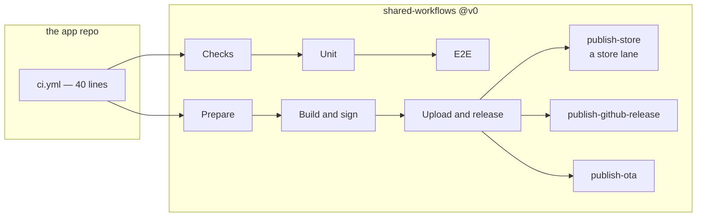

<div align="center">

# Shared Workflows

The shared engineering baseline: reusable GitHub Actions workflows for<br>
React Native (Expo) apps, and the developer tooling every repo installs.

[](https://github.com/blinkbitcoin/shared-workflows/actions/workflows/self-ci.yml?query=branch%3Amain)
[](https://github.com/blinkbitcoin/shared-workflows/actions/workflows/self-smoke.yml?query=branch%3Amain)
[](LICENSE)

<sub><!--count:reusable-workflows-->18<!--/count--> reusable workflows · <!--count:scripts-->137<!--/count--> scripts · <!--count:tests-->1785<!--/count--> tests · one pinned tag · one tooling package</sub>

</div>

---

<p align="center">
  
</p>

Continuous integration for a React Native app is not a config file. It is
<!--count:shell-scripts-->136<!--/count--> shell scripts: install an Android SDK, boot an emulator that does not
hang, wait for Metro, hash the native inputs so a build cache means something,
decode signing secrets without leaving them on disk, upload a build and then
prove that the artifact uploaded is the one that was built.

Kept here rather than copied into each app repo, where they drift apart and the
same bug gets fixed three times. An app repo carries a forty-line `ci.yml`
naming the workflows it calls; everything those workflows do lives here.

The same argument applies to the tooling that runs on a laptop — the hooks, the
linters, the pinned tool versions — so that lives here too, as
[`@blinkbitcoin/app-tooling`](packages/app-tooling). The workflows are React
Native and Expo specific; the package is not, and any repo can install it.
Under `expo/` it also holds the configuration every Expo app runs — Jest,
ESLint, Biome, Metro, Playwright, lefthook, fingerprint, TypeScript,
commitlint — as presets (`@blinkbitcoin/app-tooling/expo/<preset>`), so an
app's own config files keep only its paths and scopes.


```mermaid
flowchart LR
  subgraph consumer [the app repo]
    caller["ci.yml — 40 lines"]
  end
  subgraph here [shared-workflows @v0]
    checks[Checks] --> unit[Unit] --> e2e[E2E]
    prepare[Prepare] --> build[Build and sign] --> ship[Upload and release]
    ship --> lane["publish-store<br/>a store lane"]
    ship --> rel["publish-github-release"]
    ship --> ota["publish-ota"]
  end
  caller --> checks
  caller --> prepare
```

**Where to start.** Three ways through this repository:

- **Adopting it in an app repo** — [Calling it](#calling-it) is the caller to
  copy, [Pinning](#pinning) explains why `@v0` moves, [What a consumer
  provides](#what-a-consumer-provides) is the short list of settings. For an app
  that was **not** generated from the template,
  [adopting-an-existing-repo.md](docs/adopting-an-existing-repo.md) is the page.
- **Debugging a red run** — [Every workflow and its
  jobs](#every-workflow-and-its-jobs) says which job owns the failure,
  [forensics.md](docs/forensics.md) is what a failed E2E run left behind,
  [cache-keys.md](docs/cache-keys.md) is why the cache missed.
- **Changing this repo** — [Repository layout](#repository-layout) says where a
  change belongs, [CONTRIBUTING.md](CONTRIBUTING.md) covers worktrees and
  commits, [consumer-guide.md](docs/consumer-guide.md) is the contract callers
  rely on.

## Calling it

`.github/workflows/ci.yml` in the app repo:

```yaml
name: CI
on:
  push: { branches: [main] }
  pull_request: { types: [opened, synchronize, reopened] }
permissions:
  contents: read
concurrency:
  group: ci-${{ github.ref }}
  cancel-in-progress: ${{ github.ref != 'refs/heads/main' }}
jobs:
  checks:
    name: Checks
    uses: blinkbitcoin/shared-workflows/.github/workflows/check.yml@v0
  unit:
    name: Unit
    needs: checks
    if: ${{ needs.checks.outputs.unit-changed != 'false' }}
    uses: blinkbitcoin/shared-workflows/.github/workflows/test-unit.yml@v0
  e2e:
    name: E2E
    needs: [checks, unit]
    # A skipped unit (a flows-only change) must not skip E2E with it.
    if: >-
      !cancelled() && needs.checks.result == 'success' &&
      contains(fromJSON('["success", "skipped"]'), needs.unit.result) &&
      needs.checks.outputs.e2e-changed != 'false'
    uses: blinkbitcoin/shared-workflows/.github/workflows/test-e2e.yml@v0
```

That is the trimmed version. The full one — `workflow_dispatch`, the `labeled`
PR type with the `ios:` expression that is the only reason to have it, the
badge job and the E2E mock-API hooks — is [the consumer guide's
`ci.yml`](docs/consumer-guide.md#consumer-ciyml). It is byte-identical to
`test/fixtures/consumer-min/`'s caller and `test/consumer-contract.bats` keeps
it that way, so the example in the docs cannot drift from the one under test.

## How a job works

Every job checks the *consumer* repo out, then checks *this* repo out into
`.workflows/` at the exact ref that defines the running job, then runs its
scripts through `$WORKFLOWS_DIR`. A caller never references anything under
`scripts/` directly, and a job can never straddle two versions of this repo.

What runs inside is the consumer's own `package.json` script — `pnpm lint`
belongs to the app repo, and CI runs what a developer runs locally. Five gates
also have a fallback here for a consumer that ships no script of its own
(`check:generated`, `check:expo-health`, `check:audit`, `check:ci`, `check:secrets`), and
those log which of the two they picked. The rest have none: a missing script is
a failed gate, with a message saying so. See
[Script contract](docs/consumer-guide.md#script-contract).

## Every workflow and its jobs

Job names are what the Actions graph shows, so they are listed here next to
what makes them fail. A consumer's run renders `<caller job name> / <job name
below>` — `Checks / Dependencies`, `E2E / Build Android`.

### `check.yml` — the gates

| Job            | What it checks                                                               |
| -------------- | ---------------------------------------------------------------------------- |
| `Changes`      | Classifies the diff. `unit-changed`, `e2e-changed` and `docs-only` let callers skip a suite the change cannot affect |
| `Contract`     | Every requirement of this family the consumer does not meet, in one report  |
| `Code`         | Types, lint, format, unused code, spell — what `make check-code` runs        |
| `Generated`    | The i18n catalogs and the GraphQL documents match the sources they come from |
| `Docs`         | Doc freshness, command tables, table widths, mermaid blocks parse            |
| `Dependencies` | Expo SDK drift, vulnerability audit, lockfile provenance, licenses           |
| `App suites`   | The shared app suites against the app's own files (off until `app-suites: true`) |
| `Prebuild`     | Both platforms prebuild, and the config plugins emit what they claim         |
| `Release`      | Ruby syntax, fastlane lane parse, lane unit tests                            |
| `CI`           | actionlint, shellcheck and zizmor over the CI code                           |
| `Secrets`      | gitleaks over the whole history                                              |
| `Commits`      | commitlint over the PR's commits                                             |

### The rest, on a pull request or a push

| Workflow        | Jobs                                               | What it does                                                             |
| --------------- | -------------------------------------------------- | ------------------------------------------------------------------------ |
| `test-unit.yml`      | `Tests`                                            | Jest with coverage thresholds; uploads the report                        |
| `test-e2e.yml`       | `Build iOS` → `iOS`<br>`Build Android` → `Android` | A cached native build per platform, then boot, Metro, Maestro, forensics |
| `build-web.yml`       | `Changes`<br>`Build`<br>`E2E`<br>`Deploy`          | Expo web export, the browser suite against it, GitHub Pages              |
| `publish-badges.yml`    | `Publish`                                          | Unit, E2E and coverage badges pushed to `gh-pages/badges/<branch>/`      |
| `check-code-scanning.yml`    | `Changes`<br>`Code scanning`                       | CodeQL on the consumer's query suite. Informational, never required      |
| `check-security.yml`  | `Settings`<br>`Dependencies`<br>`Code`<br>`Policy`<br>`Bill of Materials`<br>`Bundle`<br>`Mobile`<br>`Binaries`<br>`Review`<br>`Review codebase`<br>`Verdict` | The security scanners, one job each, then one verdict that merges the SARIF and applies the threshold. Pull requests run the source scanners, the release pull request adds the bundle and the codebase review, and the production dispatch checks the built binaries |
| `pr-title.yml`  | `Title`                                            | Conventional Commits lint on the PR title                                |
| `pr-closed.yml` | `Cancel runs`<br>`Clean badges`                    | Cancels the closed PR's in-flight runs, deletes its badges               |

### On the way to a store

| Workflow                 | Jobs                 | What it does                                                                                                 |
| ------------------------ | -------------------- | ------------------------------------------------------------------------------------------------------------ |
| `pr-release.yml`   | `Release`        | Keeps release-please's release PR open, starts the caller's CI on it, and starts the follow-on workflows at a cut tag |
| `pr-store-notes.yml`     | `Draft`              | Drafts the store notes into the release PR body, once, for a human to review before the release is cut; a dry run renders them from a body file and edits nothing |
| `build-prepare.yml`       | `Prepare`            | Version, build number, native fingerprint, `build-info.json` and store notes, as one `build-info` artifact |
| `build-ios.yml`     | `Build`              | Prebuild, pods, `fastlane ios build` then `verify`; uploads the IPA and dSYMs                                |
| `build-android.yml` | `Build`              | Prebuild, `fastlane android build` then `verify`; uploads the AAB, APK and mapping                           |
| `publish-store.yml`      | `Store`              | One store operation: upload, promote, staged rollout or halt (a fastlane *lane*)                               |
| `publish-github-release.yml`     | `Publish`            | Creates or moves a release with a fixed asset set and `SHA256SUMS`                                           |
| `publish-ota.yml`   | `Publish`            | Publishes an OTA update only when the native fingerprint is unchanged                                        |
| `publish-retry.yml` | `Retry`   | Re-runs the failed jobs of a promotion the green gate gave up on, once the build it waited for goes green |

`build-prepare.yml` can also block until a named CI workflow is green for the
same sha, which is how a release refuses to build on a red `main`.

### This repo's own

| Workflow           | Jobs                              | What it does                                                                                   |
| ------------------ | --------------------------------- | ---------------------------------------------------------------------------------------------- |
| `self-ci.yml`      | `Changes`<br>`Checks / CI`<br>`Checks / Secrets`<br>`Checks / Versions`<br>`Checks / Spell`<br>`Checks / Commits`<br>`Unit / Tests`<br>`Unit / Package`<br>`Unit / Ruby`<br>`Store notes / Dry run / Draft`<br>`Store notes / Validate` | The gates of `make check`, a job each so a run names the one that failed, and the store notes dry run - this repository only. `Changes` skips CI, Versions and Package when the diff cannot affect them |
| `self-checks.yml`  | `CI`<br>`Secrets`<br>`Versions`<br>`Spell`<br>`Commits` | shellcheck, actionlint and zizmor; gitleaks; version agreement; typos; commitlint. Called by `self-ci.yml` |
| `self-unit.yml`    | `Tests`<br>`Package`              | The bats suite, and node:test over every package under `packages/`. Called by `self-ci.yml` |
| `self-store-notes.yml` | `Dry run`<br>`Validate` | `pr-store-notes.yml` run for real against the template in a dry run, then its `section` output checked. Called by `self-ci.yml` and `self-release.yml` |
| `self-smoke.yml`   | `Checks`<br>`Unit`<br>`E2E`       | Runs the family against a real consumer repo. Weekly, and on dispatch                          |
| `self-smoke-local.yml` | `Prepare`<br>`Build Android` | The Linux release jobs against the template, run on a laptop with act (`make test-smoke-local`). Dispatch-only, never run on GitHub |
| `self-release.yml` | `Release PR`<br>`Store notes`<br>`Major tag`<br>`Publish app-tooling` | release-please maintains the version PR; on release, the store notes dry run runs from the release commit, then `v0` and `v0.<minor>` move and the npm package publishes |

## Repository layout

| Path                   | Responsibility                                                                                                            |
| ---------------------- | ------------------------------------------------------------------------------------------------------------------------- |
| `.github/workflows/`   | The <!--count:workflows-->25<!--/count--> workflows above. Thin: a workflow wires inputs and calls a script                                                  |
| `.github/actions/`     | <!--count:actions-->5<!--/count--> composite actions — `setup`, `maestro`, `native-key`, `free-disk`, `forensics` — the steps repeated across workflows |
| `scripts/checks/`      | A gate each: audit, commits, expo-health, generated, secrets; plus the scripts that pick the consumer's over this repo's   |
| `scripts/ci/`          | Runner plumbing: Android SDK, KVM, disk pressure, pnpm store, badges, cancel-runs, tool versions                          |
| `scripts/e2e/`         | The E2E machine: simulator and emulator boot, Metro start and wait, Maestro run, timeouts, forensics collection           |
| `scripts/native/`      | Prebuild, pods, the iOS and Android build and packaging steps; `expo/` and `bare/` hold what differs per native stack     |
| `scripts/release/`     | Version resolution, fingerprints, build info, store notes (and their draft into the release PR), assets, hashes, secrets |
| `scripts/ota/`         | Fingerprint baseline and gate, export, publish, smoke                                                                     |
| `scripts/web/`         | Expo web export, Playwright install, cache keys, run                                                                      |
| `scripts/hooks/`       | Git hooks a consumer installs from the package: the reinstall when the lockfile moved                                     |
| `scripts/lib/`         | Shared bash: common helpers, env building and validation, the marker-delimited body section, git cleanliness, versions |
| `scripts/self/`        | This repo's own upkeep: version agreement, the major tag, the local smoke, the release-PR dispatch, the adoption-doc table, the store notes dry run's section check, the self-CI change classifier |
| `test/`                | <!--count:bats-files-->158<!--/count--> bats files, <!--count:tests-->1785<!--/count--> tests, plus `fixtures/consumer-min/` and `fixtures/consumer-bare/` — the callers the docs are held to |
| `packages/app-tooling/` | `@blinkbitcoin/app-tooling` — the pinned tool table, the contract a consumer is checked against, the repository guards, the badge renderer, the store notes generator, the Maestro suite runners for a laptop and the web preview server; under `expo/`, the presets an Expo app extends: Jest, ESLint, Biome, Metro, Playwright, lefthook, fingerprint, TypeScript, commitlint |
| `docs/`                | The consumer guide, the adoption page, and the three explainers                                                           |

## The pinned tool versions

CI is shared by reference; the tools a developer runs are not. A pre-commit
hook and a CI gate have to run the *same* `typos` binary or a commit passes
locally and fails on the runner — so the versions live in one place and every
other file is checked against it.

`packages/app-tooling/versions.json` is that place, published as
`@blinkbitcoin/app-tooling`. `check-tool-versions` asks each tool its own
version rather than reading a provisioner's config, so it works the same under
mise here and under a Nix flake elsewhere:

```sh
# --package, because the binary lives in a scoped package on GitHub Packages:
# a bare `npx check-tool-versions` resolves an unrelated name on public npm.
npx --package=@blinkbitcoin/app-tooling check-tool-versions
npx --package=@blinkbitcoin/app-tooling check-tool-versions typos shellcheck
```

`make check-version-pins` binds `versions.json` to `scripts/lib/versions.sh` and
`.mise.toml` for the seven tools the workflows install themselves (`actionlint`,
`shellcheck`, `yq`, `typos`, `lefthook`, `zizmor`, `gitleaks`), and one-way for `bats`, `node` and
`pnpm`. It is not a whole-file check: `act` is pinned in `.mise.toml` alone and
is checked by nothing.

## Pinning

Pin `@v0`. It is a moving tag that `self-release.yml` re-points at each
release, so fixes arrive without editing every caller file, and a breaking
change arrives as `@v1` rather than as a red build on a Monday morning. Pin a
full version instead when every change should be reviewed before it lands —
[Versioning](docs/consumer-guide.md#versioning) covers both.

## What a consumer provides

Run `npx --package=@blinkbitcoin/app-tooling check-contract` in your
repo for the list, checked rather than read: it reports every requirement of
the workflows your callers actually name, with a fix per finding.
`check.yml` runs the same check as its first job, so an adopting repository
gets one explanatory failure instead of nine parallel ones. See
[the contract check](docs/consumer-guide.md#the-contract-check).

**No secrets.** Every workflow here runs on `github.token`. Store credentials
only ever enter the release workflows a repo chooses to call, from that repo's
own secrets.

Two repo variables are worth setting. `E2E_IOS=true` runs the iOS suite on
every push to `main` — macOS bills at ten times the Linux rate on a private repo, free on a public one, so it is opt-in
per repo, and a PR runs it only with an `e2e:ios` label.
`MACOS_RUNNER` moves iOS off `macos-26` onto another label or a
self-hosted box.

Two optional secrets. `RELEASE_PLEASE_TOKEN`, because a PR opened with
`github.token` does not trigger CI, and release PRs should be checked before
merge. And `consumer-token`, only when the smoke target is private.

## Documentation

[**Adopting it in an existing app**](docs/adopting-an-existing-repo.md) is the
page for a repository that was not generated from the template: what it has to
provide, per workflow it calls, and the two ways to satisfy each gate.

[**Consumer guide**](docs/consumer-guide.md) is the contract: every input,
output and secret, the full caller examples, and the gotchas encoded here so
they do not have to be rediscovered. The rest explain the parts that surprise
people — [**cache keys**](docs/cache-keys.md) (what invalidates a cache),
[**forensics**](docs/forensics.md) (what a failed E2E run leaves behind),
[**runners**](docs/runners.md) (labels, billing, KVM, disk).

[`blinkbitcoin/react-native-mobile-template`](https://github.com/blinkbitcoin/react-native-mobile-template)
is the app repo these were built for, and the worked example of every caller.

## License

MIT — see [LICENSE](LICENSE).
