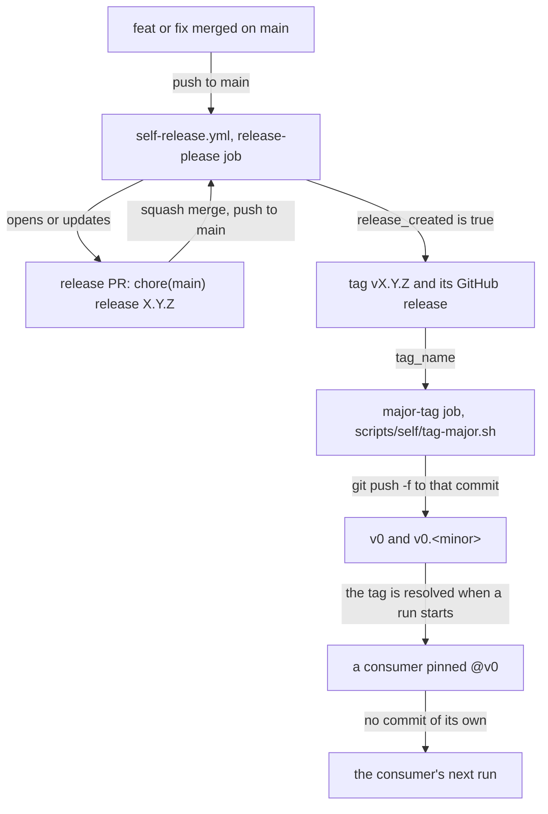
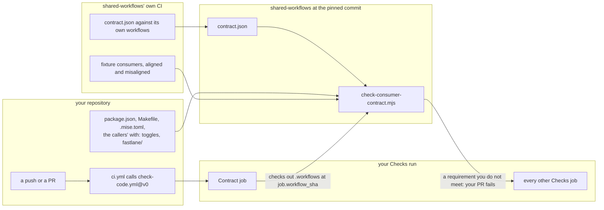
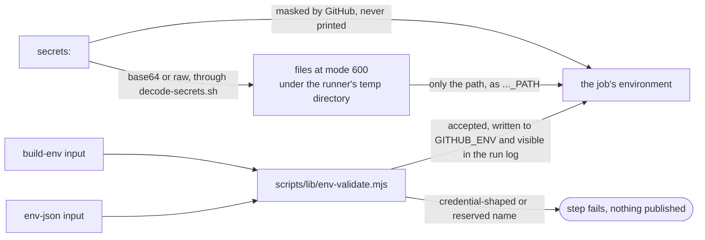
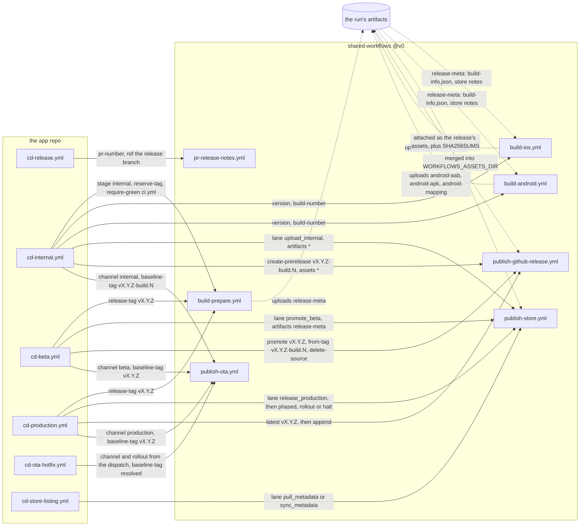
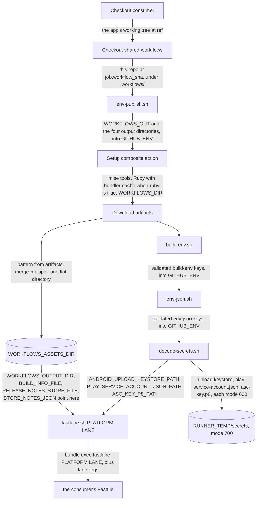

# Consumer guide

How a React Native (Expo) app consumes the reusable workflows and scripts in
this repo.

## 60-second start

0. Run `npx --package=@blinkbitcoin/dev-config check-consumer-contract` in your
   repo to see what this family will need from it — see [The contract
   check](#the-contract-check). `check-code.yml` runs the same thing on every push.
   If your app was **not** generated from the template, start at
   [adopting-an-existing-repo.md](adopting-an-existing-repo.md) instead.
1. Add `.github/workflows/ci.yml` (below) to your app repo.
2. Make sure your `package.json` has the scripts listed in [Script
   contract](#script-contract). Most of the toggles that call them default to
   **on**, so "optional" means "you can switch the gate off in your caller", not
   "you can leave it out and nothing happens": a repository with none of them
   goes red on nine checks at once. Step 0 tells you which, and `--skeleton`
   prints both ways out.
3. Push. `checks` and `unit` run on every PR; `e2e` (Android by default) runs
   after them.
4. Add `ci-web.yml`, `ci-pr-closed.yml`, `ci-pr-title.yml` if you want those too (all
   three below). They call `build-web.yml`, `pr-closed.yml` and `pr-title.yml`.

That's it — every job self-checks-out this repo into `.workflows/` and reaches its
scripts through `$WORKFLOWS_DIR`; you never reference anything under `scripts/` or
`.github/actions/` directly.

## Versioning

Pre-1.0: this repo is versioned by
[release-please](https://github.com/googleapis/release-please) starting at
`0.1.0`, and the moving major tag is **`v0`** (moved to the tip of each
`0.x.y` release by `self-release.yml`'s `major-tag` job / `scripts/self/tag-major.sh`).
Pin callers to `@v0` (or a full tag, e.g. `@v0.3.1`, for maximum
reproducibility) until this repo reaches `1.0.0`, at which point `@v1` becomes
available and is the recommended pin going forward. `@v0` and `@v1` behave
identically in kind — both are moving tags re-pointed on release — the only
difference is which major line you're tracking.

A release here is four steps and one force-pushed tag:



**A `v0` move can change an app's next continuous-delivery run with nothing
committed on the app's side.** The pin is resolved when a run starts, so the
first consumer run after a release here executes the new code — a push that
touches one line of copy can fail in a build step that changed in this
repository an hour earlier. Two consequences worth acting on: after a release
here, the family watches the template's `CD / Internal` run, which is the first
real execution of the reusable release workflows (no gate in this repository can
execute them — see `AGENTS.md`); and a repository that wants to decide when it
moves pins `@v0.<minor>` or a full commit sha instead of `@v0`, and moves the
pin as a reviewed commit.

### Moving to a version that added `docs-check`

`check-code.yml`'s `docs-check` input defaults to **on**, and `run-script.sh` fails
hard when the named script is absent. So adopting a version of this repo that
carries it means one of two things in the consumer: add a `"check:docs"`
script to `package.json`, or pass `docs-check: false` in the caller. This is
the first default-on toggle whose script name is a house invention rather than
a near-universal convention (`typecheck`, `lint`, `format:check`, `spell`), so
it is the one worth checking before you move the pin.

## The contract check

`check-code.yml`'s `Contract` job runs one script — `check-consumer-contract` — against
your repository and reports **everything** this family will need from it, before
any of the gates that would each die on their own.

It exists because the gates are good at explaining one failure and structurally
incapable of explaining nine. Each runs in its own job and stops at the first
thing it cannot find, so a repository that does not yet satisfy the contract
learns it serially: a screen of parallel reds, each correct, and then the next
missing piece one push later. The check collapses that into a single report.

```
FAIL  check:docs: no "check:docs" script in package.json. Fix: Add a "check:docs"
      script deciding what 'docs are in order' means for your repository, or pass
      docs-check: false in your caller.
warn  deps:audit: no "deps:audit" script in package.json. Fix: Without a
      "deps:audit" script, shared-workflows runs its own scripts/checks/audit.sh,
      which is `pnpm audit` alone - no lockfile provenance check.
```

Two levels, and the difference matters:

- **blocked** — a gate you asked for cannot run. The job fails.
- **degraded** — this repo has a fallback, so the gate still runs, just not the
  one you defined. The job does not fail. `deps:check`, `deps:audit`,
  `check:ci`, `i18n:check` and `codegen:check` are the five that degrade; see
  [Script contract](#script-contract) for why that seam exists.

**It is your repository that fails, never this one.** The check runs in your
CI, from the version of shared-workflows your caller pins, so moving to a new
`v0` is also when a new requirement starts to apply. shared-workflows' own CI
never checks out a consumer. It tests the checker against fixture consumers and
holds `contract.json` to its own workflows:



Beyond scripts and files, it holds two things together that only your
repository can see:

- **`make ci` and CI run the same gates**, in both directions. Every package
  script the checks and unit workflows run for your caller must be reachable
  from `make ci`. Every target `make ci` reaches with a recipe of its own must
  be run by CI, named like a script CI runs or running only pnpm scripts CI
  runs. No `Makefile` or no `ci` target, and both are skipped.
- **Your lanes read only the `APP_REVIEW_*` names `publish-store.yml` passes.**
  A name it does not pass is always empty on a runner.

**It only reports what applies to you.** It reads your own `.github/workflows/`
first: a repository that never calls `check-e2e.yml` is not told it is missing
`.maestro/`, and a gate you passed `false` for is not a finding.

A toggle wired to an expression — `typecheck: ${{ vars.TYPECHECK }}` — is
neither. This job gates the nine gate jobs in `check-code.yml`, so blocking all of
them because a repository variable could not be read here would be a false
failure, and staying quiet would hide a real one. Such a finding is reported as
degraded and never blocks, with the reason saying so.

It runs **before** the `setup` action, which is the point: a missing `.mise.toml`
or `pnpm-lock.yaml` is exactly the kind of thing that otherwise surfaces as
`missing command: pnpm`, several steps away from its cause. So it uses nothing
but the runner's own node — no pnpm, no installed dependencies.

### Running it yourself

It ships in [`@blinkbitcoin/dev-config`](../packages/dev-config), so you can get
the same report before you push:

```sh
pnpm add -D @blinkbitcoin/dev-config
pnpm exec check-consumer-contract              # this repository
pnpm exec check-consumer-contract --skeleton   # ...and the package.json and
                                               #    caller changes that clear it
```

`--json` gives the same findings machine-readably. `--profile checks,unit`
overrides the workflows it infers from your callers, which is what to use before
you have written a caller at all.

### Trying it against a real run

`check-consumer-contract` predicts; the [Smoke](../.github/workflows/self-smoke.yml)
workflow in this repository actually runs. It takes any repository and ref, so
you can point it at yours before you have committed a caller at all:

```sh
gh workflow run self-smoke.yml -R blinkbitcoin/shared-workflows \
  -f repository=your-org/your-app -f ref=main -f contract-only=true
```

`contract-only=true` stops after the contract check — seconds, and no runners
spent on gates that cannot pass yet. Drop it for the full suite (Checks, Unit
and the Android E2E). A private target needs a `SMOKE_TOKEN` secret; see
[Secrets policy](#secrets-policy).

### The contract is data

Every requirement lives in
[`packages/dev-config/contract.json`](../packages/dev-config/contract.json) —
what wants it, which input switches it off, whether a fallback exists, and the
fix. The tables in this document and the checker read the same file, so a
requirement cannot be true in one and absent from the other.

## When something is missing

Two shapes of failure, and which one you get is deliberate.

**The contract check** above reports everything at once, before any gate runs.
That is the one to read first.

**A gate that fails on its own** carries the fix with it. Where the cause is
something your repository does not provide, the annotation has three lines:

```
::error::consumer package.json has no "check:docs" script, and no check:docs binary in node_modules/.bin
Fix: add a "check:docs" script, or switch the gate that calls it off in your caller - run
check-consumer-contract for which input that is, and for everything else this repository is missing
Contract: .../docs/consumer-guide.md#script-contract
```

Four places used to fail without any of that, and no longer do:

| Was | Now |
| --- | --- |
| No mise config: `jdx/mise-action` installs nothing and succeeds, so the first symptom was `missing command: pnpm` two steps later | The `setup` action checks for a mise config, a `package.json` and a `pnpm-lock.yaml` **before** mise-action, and names whichever is absent |
| A lockfile out of date with `package.json`: pnpm's own `ERR_PNPM_OUTDATED_LOCKFILE`, which names nothing about this family | The same error, wrapped with what to run and why CI installs frozen |
| A `pnpm-lock.yaml` this family cannot read (anything but v9 at the repository root): `native-hash.sh` hashed **nothing** and produced a cache key that no longer tracked dependency versions — silently | Fatal, naming the shape it expected. A native dependency bump restoring a stale build is not a failure anyone would notice |
| `.github/codeql/codeql-config.yml` absent: `codeql-action/init` failed on a path it could not read | The config file is passed only when it exists. CodeQL still runs, on its own defaults, and the contract check reports the difference as degraded |

**Lane inputs are checked at the start of the job, not inside the lane.** All
five of `APP_VERSION`, `APP_BUILD_NUMBER`, `IOS_BUNDLE_ID`, `IOS_SCHEME` and
`ANDROID_PACKAGE` are `required: true` inputs, and that is weaker than it reads:
a caller passes them as `${{ vars.IOS_BUNDLE_ID }}`, an unset repository
variable interpolates to the empty string, and an empty string satisfies
`required`. The only thing that rejected an empty value was your own Fastfile's
`before_all` — which a repository adopting these workflows may not have at all,
and which on the iOS lane only runs after prebuild and pod install, on a runner
billing at ten times the Linux rate. `build-ios.yml`,
`build-android.yml` and `publish-store.yml` now assert all five as their
first step, naming the repository variable to set.

## Consumer `ci.yml`

```yaml
name: CI
on:
  push:
    branches: [main]
    # No paths-ignore: it would be a second, narrower docs rule that already
    # disagrees with the classifier's (it misses LICENSE and the issue/PR
    # templates). check-code.yml's `changes` job is the single source - it
    # classifies pushes too, so a docs-only merge still skips unit and e2e.
  pull_request:
    types: [opened, synchronize, reopened, labeled]
  workflow_dispatch:
permissions:
  contents: read
concurrency:
  group: ci-${{ github.ref }}
  cancel-in-progress: ${{ github.ref != 'refs/heads/main' }}
jobs:
  checks:
    name: Checks
    uses: blinkbitcoin/shared-workflows/.github/workflows/check-code.yml@v0
  unit:
    name: Unit
    needs: checks
    if: ${{ needs.checks.outputs.docs-only != 'true' }}
    uses: blinkbitcoin/shared-workflows/.github/workflows/check-unit.yml@v0
  e2e:
    name: E2E
    # `unit` as well as `checks`: a failed unit run then never reaches E2E.
    needs: [checks, unit]
    if: ${{ needs.checks.outputs.docs-only != 'true' }}
    uses: blinkbitcoin/shared-workflows/.github/workflows/check-e2e.yml@v0
    with:
      # iOS is opt-in because macOS bills at 10x on a private repo. On a
      # public repo standard runners are free, macOS included, so set the repo
      # variable E2E_IOS=true and take the coverage. Either way a single PR can
      # opt in with the `e2e:ios` label (the `labeled` trigger above is what
      # makes the label alone start a run). See docs/runners.md.
      ios: ${{ vars.E2E_IOS == 'true' || contains(github.event.pull_request.labels.*.name, 'e2e:ios') }}
      macos-runner: ${{ vars.WORKFLOWS_MACOS_RUNNER || 'macos-26' }}
      dev-client: true
      e2e-setup-script: scripts/e2e/ci-mock-api-up.sh
      e2e-teardown-script: scripts/e2e/ci-mock-api-down.sh
  badges:
    name: Badges
    needs: [checks, unit, e2e]
    # always(), so a red Unit still gets a red badge. A cancelled upstream job
    # says nothing about the branch, and a docs-only change never ran the jobs
    # the badges describe - in both cases the published badges stay as they are.
    # publish-badges.yml itself also skips release events and fork PRs (no push token).
    if: >-
      always() &&
      needs.checks.result != 'cancelled' &&
      needs.unit.result != 'cancelled' &&
      needs.e2e.result != 'cancelled' &&
      needs.checks.outputs.docs-only != 'true'
    permissions:
      contents: write # publish-badges.sh pushes the gh-pages branch
    uses: blinkbitcoin/shared-workflows/.github/workflows/publish-badges.yml@v0
    with:
      unit-result: ${{ needs.unit.result }}
      e2e-result: ${{ needs.e2e.result }}
      docs-only: ${{ needs.checks.outputs.docs-only }}
```

Notes:

- **No push+pull_request double trigger.** `push` is scoped to `branches:
  [main]` only — a PR from a branch in the same repo would otherwise fire
  both `push` (on every commit) and `pull_request` (on open/sync), running
  the whole suite twice for the same commit. Fork PRs only ever fire
  `pull_request`, so this asymmetry is intentional, not a gap.
- `pull_request: types: [opened, synchronize, reopened, labeled]` — `labeled`
  is there so adding the `e2e:ios` label to an already-open PR triggers a new
  run that picks it up (a label change is not `synchronize`).
- `concurrency` is the **caller's** job, not this repo's — none of the
  reusable workflows set it (a called workflow's `concurrency` would fight the
  caller's). Cancel in-flight runs on every branch except `main` (a `main`
  push after a merge should never be cancelled by the next one).
- `docs-only` (from `check-code.yml`'s `changes` job) lets `unit` and `e2e` skip
  entirely on a docs-only diff; wire it into any other downstream job you add.
  A skipped job counts as passing for required checks, unlike a workflow that
  never ran — which is exactly why the classifier, not the trigger, does the
  skipping.
- **No `paths-ignore` on `push`.** It used to be there, back when the
  classifier only ever saw `pull_request.base.sha` and so classified nothing on
  a push. `check-code.yml` now derives its base from `github.event.before` on a
  push, so one rule covers both events: a PR and the merge that follows it get
  the same answer. A `paths-ignore` list would be a second, narrower docs rule
  living next to it, and it already disagreed — it misses `LICENSE` and the
  issue/PR templates, both of which the classifier counts as docs. Two rules
  that disagree is worse than one rule, so the trigger fires on every push to
  `main` and the `changes` job decides. Widen the docs definition with
  `docs-globs`, never with a second list. `test/consumer-contract.bats` holds
  your `ci.yml`'s trigger block to the fixture's, so a `paths-ignore` cannot
  come back unnoticed.
- **The `badges` job is the one that writes.** It runs under `always()` so a
  red Unit still gets a red badge, and it is the only job here that needs
  `contents: write` (granted on the job, not at the top of the file). What it
  publishes, what it skips and the GitHub Pages constraint that goes with it
  are in [`publish-badges.yml`](#publish-badgesyml).
- **What a docs-only change still costs.** Only `unit` and `e2e` skip.
  `check-code.yml`'s own `code` job has no `docs-only` gate, so a documentation
  push to `main` still runs typecheck, lint, format, knip, spell, `check:docs`
  and audit — which is the point: those are the checks a documentation change
  can break (a typo, a reflowed table, a dead link in a doc knip tracks, a
  diagram that stopped parsing). Before this
  trigger lost its `paths-ignore` the workflow did not run at all on such a
  push, so it also never caught them.

## `build-web.yml`, `pr-closed.yml`, `pr-title.yml` callers

```yaml
# .github/workflows/ci-web.yml — only add this if the app has a web target
name: CI / Web
on:
  pull_request:
    types: [opened, synchronize, reopened]
  release:
    types: [published]
permissions:
  contents: read
concurrency:
  group: web-${{ github.ref }}
  cancel-in-progress: ${{ github.ref != 'refs/heads/main' }}
jobs:
  web:
    name: Export
    uses: blinkbitcoin/shared-workflows/.github/workflows/build-web.yml@v0
    permissions:
      contents: read
      # The called workflow's `deploy` job needs these; a called job can only
      # narrow the caller's token, never widen it, so they are granted here.
      pages: write
      id-token: write
    with:
      # PRs export a dev build (fast smoke); a published release exports the
      # production bundle that actually gets deployed to Pages.
      # The non-empty value MUST sit in the `&&` slot: GitHub's `&&` yields the
      # first falsy operand and `||` the first truthy one, so
      # `cond && '' || '--dev'` evaluates to '--dev' on BOTH branches (the empty
      # string is falsy) and would quietly deploy a dev bundle.
      export-args: ${{ github.event_name != 'release' && '--dev' || '' }}
      deploy: ${{ github.event_name == 'release' }}
```

Notes on the `build-web.yml` caller:

- **The deploy trigger is `release: published`, not a tag push.**
  `github.ref_type == 'tag'` is not a usable signal here: a `pull_request`- or
  `push`-triggered run never sets it to `tag`, and a bare tag push carries no
  release notes; keying on `github.event_name == 'release'` makes "what gets
  deployed" exactly "what was published".
- **The GitHub-expression pitfall.** In GitHub expressions `&&` yields its
  first falsy operand and `||` its first truthy one, and the empty string
  `''` is falsy — so the ternary idiom `cond && A || B` only works when `A`
  is truthy. `github.event_name != 'release' && '' || '--dev'` returns
  `'--dev'` on *both* branches. Always put the non-empty value in the `&&`
  slot and the empty one in the `||` slot, as above.
- **`permissions` on the job, not just the workflow.** A called workflow's
  jobs can only narrow the caller's token, never widen it, so `pages: write`
  and `id-token: write` (needed by `build-web.yml`'s `deploy` job) must be granted
  on the calling job. `contents: read` is repeated there because naming
  `permissions:` at all resets the unnamed scopes to `none`.

```yaml
# .github/workflows/ci-pr-closed.yml
name: CI / PR Closed
on:
  pull_request:
    types: [closed]
permissions:
  contents: write # required: pr-closed.yml's badges-cleanup job pushes the gh-pages branch
  actions: write # required: pr-closed.yml's cancel job needs this to cancel runs
jobs:
  pr-closed:
    name: Cleanup
    uses: blinkbitcoin/shared-workflows/.github/workflows/pr-closed.yml@v0
```

```yaml
# .github/workflows/ci-pr-title.yml
name: CI / PR Title
on:
  pull_request:
    types: [edited]
permissions:
  contents: read
jobs:
  pr-title:
    name: Title
    # `edited` also fires for a body-only edit; only re-lint when the title
    # itself changed (`opened`/`synchronize` are already covered by ci.yml's
    # check-code.yml `commitlint` toggle, which lints the same PR title).
    if: github.event.changes.title != null
    uses: blinkbitcoin/shared-workflows/.github/workflows/pr-title.yml@v0
```

`pr-closed.yml` is the one workflow in this family with no `inputs:` at all
(`on.workflow_call: {}`). Its `cancel` job only calls the GitHub API with data
from the `github` context and checks nothing out; its `badges-cleanup` job does
check the consumer out, because the gh-pages push goes through that checkout's
`origin` — which is what `contents: write` above is for.

## Secrets policy

Every workflow in this family that checks out a consumer accepts one optional
secret, `consumer-token` (declared as `secrets: consumer-token: required:
false`), and passes it to the consumer's `actions/checkout` step as `token: ${{
secrets.consumer-token || github.token }}`. For a **public** consumer
repository this is never needed — the default `github.token` has read access
and every example above omits `secrets:` entirely. It exists for
`self-smoke.yml`, whose target defaults to the public
`blinkbitcoin/react-native-mobile-template` but could point at a private
repository: in that case, add a repo secret (e.g. `SMOKE_TOKEN`, a PAT with
read access to the target repo) and pass it through:

```yaml
jobs:
  checks:
    uses: ./.github/workflows/check-code.yml
    secrets:
      consumer-token: ${{ secrets.SMOKE_TOKEN }}
    with:
      repository: your-org/private-app
```

`secrets: inherit` is never used anywhere in this family (Part B's release
workflows follow the same rule for their own, larger secret sets) — every
secret a reusable workflow needs is declared and passed explicitly.

Three separate channels carry configuration into a release job, and they are
not interchangeable:



`build-env` and `env-json` are workflow inputs: GitHub neither masks nor hides
them, so their values are readable by anyone who can read the run. The
validator refuses any name whose last underscore-separated word is `KEY`,
`TOKEN`, `PASSWORD`, `PASSPHRASE`, `SECRET`, `CREDENTIAL` or `CREDENTIALS` —
the boundary is `^` or `_`, so `API_KEY` is refused and `MONKEY` is not — plus
four known credential names the
suffix rule alone would miss — `PLAY_SERVICE_ACCOUNT_JSON`,
`ASC_KEY_P8_BASE64`, `ANDROID_UPLOAD_KEYSTORE_BASE64` and
`MATCH_GIT_BASIC_AUTHORIZATION` — and it refuses the names the family and the
runner own (`WORKFLOWS_`, `GITHUB_`, `RUNNER_`, `ACTIONS_`, `LD_`, `DYLD_`,
`PATH`, `HOME`, `NODE_OPTIONS`). A refusal fails the step with the offending
key named, rather than publishing it.

## Inputs, outputs and secrets per workflow

Every table below is read from the workflow's own `on.workflow_call` block —
`working-directory`, `linux-runner`, `macos-runner` and `native-cache-version`
are carried by every workflow that takes inputs at all (present even when
unused, "carried for input-set consistency across the family," so they share
one mental model). The exception is `pr-closed.yml`, which declares
`workflow_call: {}` and takes nothing.

### `check-code.yml`

| Input | Default | Meaning |
| --- | --- | --- |
| `repository` | `''` (caller's own) | Consumer repository to check out |
| `ref` | `''` (let checkout resolve it) | Consumer ref (PR merge ref, branch, tag) |
| `working-directory` | `.` | Consumer directory relative to `GITHUB_WORKSPACE` |
| `linux-runner` | `ubuntu-latest` | Runner for every job in this workflow |
| `macos-runner` | `macos-26` | Unused here |
| `native-cache-version` | `v1` | Unused here |
| `typecheck` | `true` | Run `typecheck` |
| `lint` | `true` | Run `lint` |
| `format` | `true` | Run `format:check` |
| `knip` | `true` | Run `knip` |
| `spell` | `true` | Run `spell` |
| `docs-check` | `true` | Run `check:docs` with `EVENT_NAME`, `BASE_REF` and `PR_AUTHOR` in the environment — the consumer's docs gate (freshness heuristic, command table, table widths, diagram parsing). `PR_AUTHOR` is what lets the consumer exempt a bot's dependency bump from a "docs not updated" warning |
| `i18n` | `false` | Run the consumer's `i18n:check`, or `i18n:extract` + a clean-tree assertion when it ships none |
| `graphql-codegen` | `false` | Run the consumer's `codegen:check`, or `codegen` + a clean-tree assertion when it ships none |
| `expo-doctor` | `true` | Run the consumer's `deps:check`, or `expo-doctor` alone when it ships none |
| `audit` | `true` | Run the consumer's `deps:audit`, or `pnpm audit --prod` at `audit-level` when it ships none |
| `audit-level` | `high` | Minimum severity that fails the audit |
| `audit-soft-on-pr` | `true` | Make a failing audit advisory on a `pull_request` (`continue-on-error`). It stays blocking on `push`, `release` and `workflow_dispatch`. Set `false` to block PRs too |
| `commitlint` | `true` | Lint the PR title (skipped for `dependabot[bot]`) |
| `commitlint-commits` | `false` | Also lint every commit's message in the PR |
| `actionlint` | `true` | Lint the consumer's `.github/workflows`. Reaches the built-in linter only; a consumer that ships `check:ci` owns this choice itself |
| `shellcheck` | `true` | Lint the consumer's `scripts/` |
| `zizmor` | `true` | Audit the consumer's `.github` with zizmor, offline, at medium severity and up: template injection, broad permissions, App tokens with blanket scope, dangerous triggers. Reaches the built-in linter only, like `actionlint`. Without a `zizmor.yml` of its own the consumer gets this family's policy, which allows tag pins |
| `secret-scan` | `true` | Run the consumer's `check:secrets`, or scan its **full git history** with gitleaks when it ships none. The Tooling job checks out with `fetch-depth: 0` for this. A `.gitleaks.toml` at the consumer's root is read either way |
| `licenses` | `true` | Run the consumer's `deps:licenses` (dependency licence policy) |
| `prebuild-check` | `false` | Run the consumer's `check-prebuild`: prebuild both platforms into a temp dir and assert the config plugins produced what they should. **Minutes, not seconds** — enable it where the coverage earns the wall clock (on `main`, on a release, behind a label), not on every PR |
| `bundle-secrets` | `false` | Run the consumer's `check:bundle-secrets`: export the bundle and assert no non-public key leaked into it. **Minutes, not seconds**, same advice as above |
| `release-checks` | `false` | Install Ruby (`ruby/setup-ruby@v1`, `bundler-cache: true`) and run the consumer's `check:release` script — the Fastfile/Gemfile and release-config validation behind the template's `make check-release`. Off by default because a repo with no release setup has no such script |
| `contract-only` | `false` | Run the contract check and **nothing else** — for a repository still being wired up, it answers "would these workflows work here?" in seconds instead of runner-minutes. A run under this flag gates nothing, so it says so: the job logs a warning and the summary names it. Not a setting to leave on |
| `contract-check` | `true` | Report every unmet requirement of this family in one place, before the gates that would each die on their own — see [The contract check](#the-contract-check). `false` makes the step a no-op; the job itself still runs, because every other job in this workflow `needs:` it |
| `docs-only-detection` | `true` | Classify the change as docs-only — on a `pull_request` **and** on a `push` |
| `docs-globs` | `''` | Extra `\|`-joined POSIX ERE alternatives **added to** the built-in docs pattern (`^docs/\|\.md$\|(^\|/)LICENSE$\|^\.github/ISSUE_TEMPLATE/\|^\.github/PULL_REQUEST_TEMPLATE`), not a replacement for it |

Jobs: `Changes`, `Contract`, `Code`, `Generated`, `Docs`, `Dependencies`,
`Prebuild`, `Secrets`, `Release`, `Tooling`, `Commits` — grouped by **who acts on a
failure**, not by what is cheapest to run. A red `Dependencies` means a
vulnerability, a licence problem or an SDK drift and belongs to whoever owns
operations; a red `Code` is a lint error and belongs to the author. They used to
share one box called `code`, where a CVE and a formatting nit looked identical
until you opened the log.

Each job pays its own checkout and install, roughly 30-45s, and they run in
parallel — so this costs runner time rather than wall clock. The five gates
inside `Code` stay together on purpose: same person, same fix (`make
check-code`), seconds each.

Outputs: `docs-only` (`'true'` when every changed file matched the docs
globs; empty when detection is disabled). Secrets: `consumer-token` (optional).

The base of the diff is `github.event.pull_request.base.sha` on a
`pull_request` and `github.event.before` on a `push`, so a PR and the merge
that follows it are classified the same way — which is why a caller's `ci.yml`
needs no `paths-ignore`. `LICENSE` matches anywhere in the tree, not just at
the root, so a per-package copyright bump is docs too.

The classifier **fails open**: when the range cannot be read at all — no base,
the all-zero base of a branch's first push, or a base made unreachable by a
force-push or a shallow clone — it emits `docs-only=false` and exits 0. The
step stays green and the full pipeline runs; an unreadable diff is never read
as "nothing but docs".

#### The audit's failure policy

`pnpm audit` makes one request to the registry's advisories endpoint, and that
endpoint is the family's known staller — 5s to 102s for identical payloads has
been measured on a day it was otherwise healthy. Three things follow, and all
three are already set for you:

- The step carries `timeout-minutes: 5`, so a stall is ended by a named step
  rather than by a job-level cap that tells you nothing about which step hung.
- The step sets its **own** `PNPM_CONFIG_FETCH_TIMEOUT` (and, for anything in
  it that shells out to npm, `NPM_CONFIG_FETCH_TIMEOUT`) at `270000` — just
  under its own 5-minute bound. That belongs on the step, not on the workflow:
  a workflow-level fetch timeout is normally sized for an installer's cold
  path, and when a sibling repo set one to 60s it silently overrode this step's
  budget and turned `main` red at 61s with only `code undefined:` in the log.
  If you set a fetch timeout in your own `ci.yml`'s `env:`, it will not reach
  this step — that is deliberate.
- `audit-soft-on-pr` (default `true`) makes a failing audit advisory on a
  `pull_request` and blocking everywhere else. A new advisory published against
  a transitive dependency should not stop a review that has nothing to do with
  it, but it must still turn `main` red. Set it to `false` if your repo would
  rather block the PR.

A **soft** audit still prints its findings and still shows the step as failed
in the run's summary; it just does not fail the job. If you suppress an
advisory instead, suppress it where the dependency is — `auditConfig.ignoreGhsas`
in your `pnpm-workspace.yaml` — with a per-entry reason next to the id.

### `check-unit.yml`

| Input | Default | Meaning |
| --- | --- | --- |
| `repository`, `ref`, `working-directory`, `linux-runner`, `macos-runner`, `native-cache-version` | (as above) | — |
| `coverage` | `true` | Run `coverage-script` and upload `coverage/`; otherwise run `test-script` |
| `test-script` | `test` | Script run when `coverage` is off |
| `coverage-script` | `test:coverage` | Script run when `coverage` is on. Passing `coverage: true` with an **empty** `coverage-script` silently falls back to `test-script` (`${{ inputs.coverage && inputs.coverage-script \|\| inputs.test-script }}`) and then uploads an empty `coverage/`; leave the default or set a real script name |
| `scripts-test-script` | `test:scripts` | Script that tests `scripts/` itself; empty skips this step |
| `coverage-artifact-retention-days` | `30` | Retention for the uploaded `coverage/` artifact |

No outputs. Secrets: `consumer-token` (optional).

### `check-e2e.yml`

| Input | Default | Meaning |
| --- | --- | --- |
| `repository`, `ref`, `working-directory` | (as above) | — |
| `linux-runner` | `ubuntu-latest` | Runner for the Android jobs |
| `macos-runner` | `macos-26` | Runner for the iOS jobs |
| `native-cache-version` | `v1` | Bump to invalidate every native cache at once |
| `default-branch` | `refs/heads/main` | Fully qualified ref of the branch allowed to **write** the Gradle cache; every other ref reads it. Set it if your default branch is not `main`, or the cache is never written and every run pays a cold Gradle |
| `native-extra-globs` | `''` | Space-separated consumer-relative shell globs whose file contents join the native dependency hash (see [`docs/cache-keys.md`](cache-keys.md)) |
| `ios` | `false` | Run the iOS build + simulator suite. Default is off because macOS bills at 10x on a private repo; on a public repo it is free, so turn it on |
| `android` | `true` | Run the Android build + emulator suite |
| `xcode` | `''` | Xcode version to select (folded into the iOS cache key) |
| `android-api-level` | `34` | Emulator + system image API level |
| `maestro-version` | `2.10.0` | Maestro CLI version (kept equal to `scripts/lib/versions.sh`) |
| `maestro-flows` | `.maestro` | Flows directory, consumer-relative |
| `maestro-include-tags` / `maestro-exclude-tags` | `''` | Passed to Maestro when non-empty |
| `suite-timeout-minutes` | `10` | Per-attempt bound; the step's own timeout is this plus 5 |
| `dev-client` | `true` | Launch via the `expo-development-client` deep link, Metro `--dev-client` |
| `ios-configuration` | `Debug` | Xcode configuration for the iOS E2E app.<br>`Release` embeds the JS bundle and leaves the dev launcher out, so the app runs on `simctl launch` alone -<br>no Metro, no deep link, no iOS "Open in <app>?" prompt. Forces `dev-client` off for the iOS jobs;<br>Android is unaffected. Changes the cache key, so the two configurations never share a build |
| `build-env` | `{}` | Flat JSON object of non-secret variables exported before the iOS prebuild, so the bundle embeds them.<br>A `Release` build resolves `.env.production` at build time and an exported variable wins over the dotenv file -<br>this is how you point an E2E build at a mock API. Folded into the iOS cache key, so two values never share a build |
| `e2e-setup-script` / `e2e-teardown-script` | `''` | Consumer-relative hook scripts (setup: missing file is fatal; teardown: always runs) |
| `ios-artifact-name` | `ios-app` | Artifact name between `build-ios` and `ios` |
| `android-artifact-name` | `android-apk` | Artifact name between `build-android` and `android` |

Outputs: `ios-result`, `android-result` (`success`/`failure`/`cancelled`/`skipped`).
Secrets: `consumer-token` (optional).

### `build-web.yml`

| Input | Default | Meaning |
| --- | --- | --- |
| `repository`, `ref`, `working-directory` | (as above) | — |
| `linux-runner` | `ubuntu-latest` | Runner for every job |
| `macos-runner`, `native-cache-version` | (unused) | — |
| `playwright` | `true` | Run the Playwright suite against the export |
| `deploy` | `false` | Publish to GitHub Pages (pass `github.event_name == 'release'` from a `release: published` caller; the calling job must grant `pages: write` + `id-token: write`) |
| `base-url` | `''` | Baked into the export via `EXPO_PUBLIC_BASE_URL`, and exported under the same name to the Playwright suite so the consumer's preview server can serve the export under that path |
| `export-script` | `build:web` | Script that exports the web build |
| `export-args` | `''` | Extra flags appended to the export script |
| `output-dir` | `dist` | Consumer-relative export output directory |
| `e2e-script` | `test:e2e:web` | Script that runs the Playwright suite |
| `playwright-browsers` | `chromium` | Space-separated browsers for `playwright install` |

Outputs: `page-url` (empty unless `deploy` is true). Secrets: `consumer-token`
(optional).

### `pr-title.yml`

| Input | Default | Meaning |
| --- | --- | --- |
| `repository`, `ref`, `working-directory`, `linux-runner`, `macos-runner`, `native-cache-version` | (as above) | — |

No outputs. Secrets: `consumer-token` (optional). Lints
`github.event.pull_request.title` against Conventional Commits on whatever
`pull_request` event the caller wires it to. `check-code.yml`'s `commitlint`
toggle already lints the same title on `opened`/`synchronize`, so the caller
above only adds `edited` (guarded by `github.event.changes.title != null`, since
`edited` also fires for a body-only edit).

### `pr-closed.yml`

`on.workflow_call: {}` — no inputs, outputs or secrets. The caller must grant
`permissions: actions: write` for the cancel step and `contents: write` for the
`badges-cleanup` job, which removes the closed branch's `badges/<branch>/`
directory from `gh-pages` (see [`publish-badges.yml`](#publish-badgesyml)). A fork PR skips the
cleanup job: its run has no token that could push to the base repository, and
`publish-badges.yml` skipped it on the way in for the same reason, so there is nothing
to remove.

### `publish-badges.yml`

Renders and publishes this branch's CI badges to the consumer's own `gh-pages`
branch, as `badges/<branch>/{unit,e2e,coverage}.svg` (plus a `.json` sibling per
badge, the shields.io endpoint shape). The README embeds `main`'s through
`raw.githubusercontent.com/<owner>/<repo>/gh-pages/badges/main/coverage.svg`,
the way a workflow-status badge takes `?branch=main`; every other branch gets
its own directory, and `pr-closed.yml` drops it when the PR closes.

**Rendering lives in the consumer, publishing lives here.** An SVG renderer
needs a `package.json` and a test harness; this repo has neither by design. So
`publish-badges.yml` calls one named consumer script (`render-script`) through
`scripts/checks/run-script.sh` — the same delegation `check-code.yml` uses for
typecheck and lint — and owns only `scripts/ci/publish-badges.sh` and the
gh-pages mechanics behind it (`scripts/ci/gh-pages-lib.sh`: orphan creation on
the first publish; on a rejected push, the badge write is re-applied onto the
fresh tip rather than replayed as a commit, because two publishes for one
branch - or a PR-close cleanup against that branch's in-flight publish - touch
the same paths and no merge of derived content can resolve that).

| Input | Default | Meaning |
| --- | --- | --- |
| `repository`, `ref`, `working-directory`, `linux-runner`, `macos-runner`, `native-cache-version` | (as above) | — |
| `unit-result` | **required** | The caller's `needs.unit.result` |
| `e2e-result` | **required** | The caller's `needs.e2e.result` |
| `docs-only` | `false` | `check-code.yml`'s `docs-only` output; `'true'` skips the job |
| `unit-label` / `e2e-label` | `Unit` / `E2E` | Text on the left half of each status badge |
| `coverage-artifact` | `coverage` | Artifact holding the consumer's `coverage/` directory (`check-unit.yml` uploads it under this name). Downloaded only when `unit-result` is `success` |
| `render-script` | `badges:render` | Consumer script that renders the badges into `badge-dir` |
| `badge-dir` | `coverage/badge` | Consumer-relative directory the render script writes and `publish-badges.sh` copies from |

No outputs. Secrets: `consumer-token` (optional). The calling job must grant
`permissions: contents: write` — this is the only job in the family that
writes, and the scope is declared on the job rather than at the top of the file
for exactly that reason.

**The environment the render script is handed** (so a consumer can implement its
own): `BADGE_OUT_DIR`, `BADGE_UNIT`, `BADGE_E2E`, `BADGE_UNIT_LABEL`,
`BADGE_E2E_LABEL`. `run-script.sh` runs `pnpm run NAME` with no arguments, which
is why everything variable arrives as environment.

**Guards.** The calling job runs under `always()`, so a *failed* Unit still
publishes a red badge. Four cases are excluded, two by the caller and two by
this workflow:

| Case | Why |
| --- | --- |
| an upstream job was `cancelled` | a cancelled run says nothing about the branch |
| the change was docs-only | the jobs the badges describe never ran |
| `github.event_name == 'release'` | a release is not a branch |
| the PR came from a fork | its token cannot push to the base repository |

**Only a Unit *failure* writes a coverage placeholder.** A *skipped* Unit
renders no coverage badge at all, and `publish-badges.sh` copies only what was
rendered — so a docs-only PR leaves the branch's published coverage badge
exactly as it was instead of blanking it.

**Coexistence with GitHub Pages.** `build-web.yml`'s `deploy` job publishes the web
export through `actions/deploy-pages`, which is an *artifact* deploy and reads
no branch, and the badges are served from `raw.githubusercontent.com` rather
than from the Pages site. The two therefore do not collide — **provided the
repository's Pages source stays "GitHub Actions"**. Switching it to "Deploy
from a branch → gh-pages" would put every badge commit in a fight with every
web deploy and publish the badge directory as the site.

**Two repository settings** go with this, both one-time: keep that Pages
source, and exempt `gh-pages` from any ruleset that requires a pull request, so
the default `GITHUB_TOKEN` can push to it. The branch itself needs no
preparation — the first publish creates it as a true orphan (no parent, and
no copy of the consumer's source tree) — unless a ruleset blocks branch
creation outright.

### `check-codeql.yml`

| Input | Default | Meaning |
| --- | --- | --- |
| `repository`, `ref`, `linux-runner` | (as above) | — |
| `working-directory` | `.` | Unused: CodeQL reads the whole checkout, and the config file's `paths-ignore` is what scopes it |
| `macos-runner`, `native-cache-version` | (unused) | — |
| `languages` | `javascript-typescript` | Comma-separated CodeQL languages; also the `category` the SARIF is uploaded under |
| `config-file` | `./.github/codeql/codeql-config.yml` | Consumer-relative config: query suite, packs, `paths-ignore` |
| `docs-globs` | `''` | Extra `\|`-joined POSIX ERE alternatives **added to** the built-in docs pattern, same as `check-code.yml` |

Outputs: `docs-only` (`'true'` when nothing but docs changed, so no analysis
ran). Secrets: `consumer-token` (optional).

Two jobs. `changes` runs the **same** classifier `check-code.yml` does — the same
`scripts/ci/changed-class.sh`, from the same `.workflows/` self-checkout, with a
byte-identical `BASE_SHA` expression (`test/workflow-shape.bats` compares the
two). `analyze` is gated on `docs-only != 'true'` and runs
`github/codeql-action/init@v4` + `analyze@v4` with no build step: JS/TS is
extracted from source. Permissions escalate on `analyze` only — `actions: read`
for the workflow metadata and `security-events: write` for the SARIF upload,
with `contents: read` re-declared because naming `permissions:` at all resets
the scopes you do not name.

A `schedule` event has no base sha, so the classifier fails open with
`docs-only=false` and everything is analysed. That is the point of a weekly
cron: a query published since the last push gets to run against an idle `main`.

A caller wires it up like this — note the absence of `paths-ignore`, which would
be a second, narrower docs rule beside the `changes` job (the same defect the
family removed from `ci.yml`):

```yaml
# .github/workflows/ci-codeql.yml
name: CI / CodeQL
on:
  push:
    branches: [main]
  pull_request:
    branches: [main]
  schedule:
    - cron: '17 6 * * 1'
permissions:
  contents: read
concurrency:
  group: codeql-${{ github.ref }}
  cancel-in-progress: true
jobs:
  codeql:
    name: Analyze
    # A called workflow can only NARROW the caller's token, so the analyze job's
    # `security-events: write` has to be granted here or the run dies as a
    # startup_failure before any job begins.
    permissions:
      contents: read
      actions: read # workflow metadata for the SARIF upload
      security-events: write # upload the SARIF results
    uses: blinkbitcoin/shared-workflows/.github/workflows/check-codeql.yml@v0
```

The calling job needs no `permissions:` block of its own: a reusable workflow's
job-level `permissions:` is what the job actually gets, and this one declares
all three scopes it needs.

**Leave this out of the required-checks ruleset.** CodeQL here is
informational: a pack download that times out, or an org-level Advanced
Security toggle that is off, must not be able to block a merge. On a private
repository the analysis needs GitHub Advanced Security enabled at the org
level; on a public one it is free.

#### The config file, and why an inline marker beats a dismissal

The consumer owns `.github/codeql/codeql-config.yml`. Two entries carry the
weight:

```yaml
queries:
  - uses: security-and-quality
packs:
  - codeql/javascript-queries:AlertSuppression.ql
```

**If you pass more than one language**, two things in this shape stop being
right, and neither fails loudly:

- A **top-level `packs:` list is only valid for a single-language analysis**.
  With two or more languages CodeQL wants the list keyed by language
  (`packs: {javascript: [...], python: [...]}`), and `AlertSuppression.ql` above
  is the *JavaScript* pack's query — each language needs its own.
- The workflow's upload `category` is `/language:${{ inputs.languages }}`, so a
  comma-separated input produces one category like
  `/language:javascript-typescript,python`. Code scanning expects one category
  per language, so a multi-language consumer should call this workflow once per
  language (a matrix in the caller) rather than passing a list.

The template passes one language and hits neither.

`AlertSuppression.ql` is what makes an inline

```ts
// Why this cannot happen here.
// codeql[js/some-rule-id]
const value = untrusted;
```

marker actually suppress one finding. A marker alone on its line covers that
line **and the one immediately below it**, so it has to be the last line before
the code: the reason belongs *above* the marker. Putting it between the marker
and the code makes the marker cover the reason, and the finding quietly stays
open. **Without that pack the marker is ignored either way**: the comment sits
in the file looking like it works while the alert keeps re-opening (esign lost
three rounds to the same JWT false positive that way).

Prefer a marker over dismissing the alert through the API or the UI. A
dismissal is keyed to the alert's fingerprint, so it evaporates the next time
the file moves or the surrounding lines shift, and it is invisible in review. A
marker travels with the code, is reviewed with the diff that adds it, and
silences exactly one site rather than the whole query — a real finding of the
same rule somewhere else still shows up.

## Release workflows

Seven more reusable workflows cover the release path: the store notes drafted
into the release PR, version/notes preparation, signed store builds, arbitrary
fastlane lanes, the GitHub release, and OTA publishing. They are strictly opt-in — nothing in `ci.yml` calls them — and
they follow every rule the workflows above do: `permissions: contents: read` at
the top, no `concurrency` (the caller owns it), self-checkout into `.workflows/`,
every `run:` a single `bash "$WORKFLOWS_DIR/scripts/..."` line, and **every secret
declared `required: false`** so a caller only passes the ones its stage needs.

The call graph, as the template's own callers wire it (solid edges are
`uses:` calls, labelled with what the call carries; dotted edges are artifacts
moving through the run):



Nothing in the figure is a fixed order between the seven: each caller decides its
own `needs:` chain, and the three tiers chain them differently. In
`cd-internal.yml` the store uploads run **before** the pre-release, and the
pre-release names the two build jobs directly rather than the uploads, so a
repository with store uploads off still publishes every artifact.
`cd-beta.yml` builds nothing at all: it promotes the binaries the internal
run already produced, then moves the release onto `vX.Y.Z` with
`mode: promote` and `from-tag` pointing at the build pre-release.
`cd-production.yml` adds the staged-rollout lanes (`phased`, `rollout`,
`halt`), each its own `publish-store.yml` call on the same tag — and, left out
of the figure because it is not a release workflow, a final `build-web.yml` call
that deploys the Pages site for the same tag. Two callers
never prepare anything: `cd-ota-hotfix.yml` resolves a baseline tag in a job of its
own and calls only `publish-ota.yml`, and `cd-store-listing.yml` calls only
`publish-store.yml`, once per platform.

`build-prepare` is the only job that decides *what* the release is; every later
job is handed `version` / `build-number` and the `release-meta` artifact rather
than recomputing them, so a re-run of a single stage can never disagree with
the stage before it.

### `build-prepare.yml`

Resolves the version and build number, computes both native fingerprints,
writes `build-info.json` and the store notes, and uploads them as the
`release-meta` artifact.

| Input | Default | Meaning |
| --- | --- | --- |
| `repository`, `ref`, `working-directory`, `linux-runner`, `macos-runner`, `native-cache-version` | (as above) | The consumer checkout uses `fetch-depth: 0` — version resolution reads `v*` tags and counts first-parent commits, and both are empty in a shallow clone |
| `build-number-offset` | `1000` | Added to the first-parent commit count. Raise it, never lower it: App Store Connect and Play both permanently reject a build number that goes backwards |
| `notes-locales` | `en-US` | Locales handed to the consumer's `scripts/release/notes.mjs`, and passed to it as `--locales`. **Store metadata locale names, not language codes** — App Store Connect and Play key their listings on the full form (`en-US`, `de-DE`, `pt-BR`); a bare `en` matches no listing |
| `stage` | `internal` | Written to `build-info.json`'s `stage` |
| `release-body-file` | `''` | Consumer-relative file holding a release body; switches note generation to `--from-body` |
| `release-tag` | `''` | Existing release tag whose **body** becomes the store notes, fetched with `gh release view`. It also becomes the checked-out ref and the gated/stamped commit — see [Preparing from a release tag](#preparing-from-a-release-tag) |
| `build-env` | `{}` | Non-secret build environment — see [`build-env`](#build-env) |
| `require-green-workflow` | `''` | Workflow file name (e.g. `cd-internal.yml`) that must have concluded `success` for the **resolved target sha** (the `release-tag` commit when `release-tag` is set, else `github.sha`) before preparing. Empty disables the gate. The gate step runs **before** `Setup` (so a red upstream fails before anything is installed), which means it uses the `gh` and `yq` from the runner image — true of GitHub-hosted `ubuntu-latest`, not necessarily of a self-hosted `linux-runner` |
| `reserve-tag` | `false` | Create the `v<version>-build.<n>` tag at the target sha **in Prepare, before the green gate**, while the commit is still the default branch tip; `publish-github-release.yml` then creates the release on the existing tag. GitHub refuses `GITHUB_TOKEN` a *new* tag on a commit whose `.github/workflows/*` differ from the tip ("create or update workflow without `workflows` permission", surfaced by the releases API as a bare 403) - and by the time a build's release is published a later merge may have touched a workflow. Needs **`contents: write`** on the calling job. A red gate deletes the tag this run reserved |
| `require-green-dispatch` | `false` | With `require-green-workflow`: when the gated workflow has **no** run for the target sha, or its newest run was **cancelled** or **failed**, dispatch it once at `release-tag` and wait for that run instead of failing. Self-healing for a release whose internal build was lost (concurrency-group eviction, a flaky runner): the beta no longer waits for a human to dispatch by hand. A dispatched run that also fails is fatal; `skipped` is never dispatched. Needs `release-tag` and **`actions: write`** on the calling job
| `release-meta-artifact` | `release-meta` | Artifact name for `build-info.json`, `store-notes.json`, `notes-store.txt`, `notes.md` |

Outputs: `version`, `build-number`, `fp-ios`, `fp-android`, `sha` (the commit
the release was prepared from). Secrets: `consumer-token`, `ANTHROPIC_API_KEY`
and `OPENAI_API_KEY` (all optional — the two API keys are only needed when the
consumer's `notes.mjs` drafts store notes with an LLM; the provider, model and
base URL are non-secret and belong in `build-env`).

> **Every caller of `build-prepare.yml` must grant `actions: read` on the calling
> job**, on top of `contents: read`:
>
> ```yaml
>   prepare:
>     uses: blinkbitcoin/shared-workflows/.github/workflows/build-prepare.yml@v0
>     permissions:
>       contents: read
>       actions: read
> ```
>
> The `prepare` job declares **no** job-level `permissions:`, and the workflow
> has no top-level block either (a block at either level replaces the caller's
> grant), so the job inherits the caller's. Every caller of `build-prepare.yml` must grant `actions: read` (for
> `gh run list` in the `require-green-workflow` gate), and `actions: write`
> when it sets `require-green-dispatch` (for `gh workflow run`). A static block
> cannot say "read, or write when asked", and a called job may never request
> more than the caller granted, so inheriting is what lets each caller grant
> exactly what it uses. A caller that grants too little fails in the gate step
> with a message naming the missing scope.

### `build-ios.yml`

Prebuild → pods → `fastlane ios build` → `fastlane ios verify`, on
`macos-runner`.

| Input | Default | Meaning |
| --- | --- | --- |
| `repository`, `ref`, `working-directory`, `linux-runner`, `macos-runner`, `native-cache-version` | (as above) | `macos-runner` is the one that matters here |
| `native-extra-globs` | `''` | Extra globs folded into the native dependency hash (see [`docs/cache-keys.md`](cache-keys.md)) |
| `xcode` | `''` | Sets `DEVELOPER_DIR` to `/Applications/Xcode_<v>.app/Contents/Developer` and is folded into the Pods cache key |
| `environment` | `''` | GitHub Environment gating the build (secrets + approvals); empty means none |
| `version` / `build-number` | **required** | `APP_VERSION` / `APP_BUILD_NUMBER`; wire them to `build-prepare`'s outputs |
| `stage` | `internal` | Passed through as `WORKFLOWS_STAGE` |
| `ios-bundle-id` / `ios-scheme` / `android-package` | **required** | `IOS_BUNDLE_ID` / `IOS_SCHEME` / `ANDROID_PACKAGE`. All three are required **on the iOS build too** — see [The five Fastfile contract variables](#the-five-fastfile-contract-variables) |
| `ios-signing` | `true` | Sign the build and export an `.ipa`. **Off** archives without signing instead:<br>it still compiles and still runs the verify gate, but needs no Apple account and produces no `.ipa`,<br>so the `ios-ipa` upload is skipped too. This is the tier a repository sits in before its certificates exist |
| `verify` | `true` | Run the `ios verify` lane after `build`. Works in either signing mode —<br>the lane verifies the `.app` inside the archive when there is no `.ipa`, with the signature check reported as `skip` |
| `release-meta-artifact` | `release-meta` | Artifact downloaded for `build-info.json` and the store notes |
| `ipa-artifact` / `dsym-artifact` | `ios-ipa` / `ios-dsym` | Upload names |
| `build-env` | `{}` | Non-secret build environment, published before prebuild — see [`build-env`](#build-env) |

No outputs. Secrets (all optional): `consumer-token`, `MATCH_PASSWORD`,
`MATCH_GIT_URL`, `MATCH_GIT_BASIC_AUTHORIZATION`, `ASC_KEY_ID`,
`ASC_ISSUER_ID`, `ASC_KEY_P8_BASE64`.

### `build-android.yml`

Prebuild → `fastlane android build` → `fastlane android verify`, on
`linux-runner`.

| Input | Default | Meaning |
| --- | --- | --- |
| `repository`, `ref`, `working-directory`, `linux-runner`, `macos-runner`, `native-cache-version` | (as above) | — |
| `default-branch` | `refs/heads/main` | Fully qualified ref of the branch allowed to **write** the Gradle cache; every other ref reads it. Set it if your default branch is not `main`, or the cache is never written and every run pays a cold Gradle |
| `environment` | `''` | GitHub Environment gating the build |
| `version` / `build-number` | **required** | `APP_VERSION` / `APP_BUILD_NUMBER` |
| `stage` | `internal` | `WORKFLOWS_STAGE` |
| `android-package` / `ios-bundle-id` / `ios-scheme` | **required** | `ANDROID_PACKAGE` / `IOS_BUNDLE_ID` / `IOS_SCHEME`. The two iOS ids are required **on the Android build too** — see [The five Fastfile contract variables](#the-five-fastfile-contract-variables) |
| `android-signing` | `true` | Sign with the upload keystore. **Off** falls back to the debug keystore,<br>which still produces the `.aab`, the universal `.apk` and the mapping file and needs no Play credentials.<br>Nothing signed that way can be uploaded to a store. The tier a repository sits in before its keystore exists |
| `verify` | `true` | Run the `android verify` lane after `build`. Works in either signing mode —<br>the signature check reports `skip` when `ANDROID_UPLOAD_CERT_SHA256` is unset |
| `release-meta-artifact` | `release-meta` | Artifact downloaded for `build-info.json` and the store notes |
| `aab-artifact` / `apk-artifact` / `mapping-artifact` | `android-aab` / `android-apk` / `android-mapping` | Upload names |
| `mapping-path` | `android/app/build/outputs/mapping/**/mapping.txt` | Consumer-relative glob for the mapping file. Override it when the consumer uses a non-default variant output directory — the upload is `if-no-files-found: warn`, so a wrong path yields a green build and permanently unreadable Play crash reports |
| `bundletool-version` | `1.17.2` | bundletool release downloaded before the lane runs (the `android build` lane derives the universal APK from the .aab with it, and no runner image ships it). Kept equal to `scripts/lib/versions.sh` by `scripts/self/check-versions.sh` |
| `bundletool-sha256` | `''` | Expected sha256 of the jar; empty skips verification. Google publishes no checksum file alongside the release, so pinning the bytes is opt-in |
| `build-env` | `{}` | Non-secret build environment, published before prebuild — see [`build-env`](#build-env). Put `ANDROID_UPLOAD_CERT_SHA256` here: the `android verify` lane forwards it to `verify-android.sh` as `--cert-sha256`, which turns "the aab is signed" into "the aab is signed by the expected key" |

No outputs. Secrets (all optional): `consumer-token`,
`ANDROID_UPLOAD_KEYSTORE_BASE64`, `ANDROID_UPLOAD_KEYSTORE_PASSWORD`,
`ANDROID_UPLOAD_KEY_ALIAS`, `ANDROID_UPLOAD_KEY_PASSWORD`,
`PLAY_SERVICE_ACCOUNT_JSON`. The apk and the mapping file upload with
`if: !cancelled()` — without the mapping, every Play crash report for that
build is permanently unreadable, so it must survive a failed `verify`.

### `publish-store.yml`

One lane, one job. This is what every post-build store action goes through:
uploads, promotions, staged rollouts, halts.

| Input | Default | Meaning |
| --- | --- | --- |
| `repository`, `ref`, `working-directory`, `linux-runner`, `macos-runner`, `native-cache-version` | (as above) | `linux-runner`/`macos-runner` are carried for consistency; `runner` is what selects this job's runner |
| `platform` | (required) | `ios` or `android` |
| `lane` | (required) | The fastlane lane to run - fastlane's word for a named task in the consumer's `Fastfile`; it never appears in a run graph, where this job shows as `<caller job> / Store`.<br>`ios build\|verify\|upload_internal\|promote_beta\|release_production\|phased\|upload_symbols`, `android build\|verify\|upload_internal\|promote_beta\|release_production\|rollout\|halt\|upload_huawei` |
| `lane-args` | `''` | Space-separated fastlane `key:value` arguments (e.g. `percentage:0.1`) |
| `runner` | `ubuntu-latest` | An iOS lane that touches Xcode needs a macOS runner; a store-API-only lane does not |
| `environment` | `''` | GitHub Environment gating the lane (this is where a production approval belongs) |
| `env-json` | `{}` | Flat JSON object published into the lane's environment. **Configuration only** — the values are printed to the log; credentials belong in `secrets:` |
| `artifacts` | `''` | Artifact name or glob pattern downloaded (merged) into `$WORKFLOWS_ASSETS_DIR` before the lane runs. The lane step then runs with **`WORKFLOWS_OUTPUT_DIR` = `$WORKFLOWS_ASSETS_DIR`**: the lanes read the binaries they upload out of `WORKFLOWS_OUTPUT_DIR`, and this workflow builds nothing, so the downloaded `.ipa`/`.aab` are what it has to point at. (The two build workflows leave `WORKFLOWS_OUTPUT_DIR` alone — there it is where the lane *writes*.) |
| `version` / `build-number` | **required** | `APP_VERSION` / `APP_BUILD_NUMBER` |
| `ios-bundle-id` / `ios-scheme` / `android-package` | **required** | All three on every lane, both platforms — see [The five Fastfile contract variables](#the-five-fastfile-contract-variables) |
| `ruby` | `true` | Install Ruby (leave on unless the consumer has no Gemfile) |
| `timeout-minutes` | `45` | Raise it for a lane that waits on App Store Connect processing |
| `build-env` | `{}` | Non-secret build environment — see [`build-env`](#build-env) |

No outputs. Secrets (all optional): `consumer-token`, the full iOS + Android
credential set listed under the two build workflows, and the App Review set —
`APP_REVIEW_EMAIL`, `APP_REVIEW_FIRST_NAME`,
`APP_REVIEW_LAST_NAME`, `APP_REVIEW_PHONE`,
`APP_REVIEW_DEMO_USER`, `APP_REVIEW_DEMO_PASSWORD`, `APP_REVIEW_NOTES`. Those
seven are **secrets, not `build-env` or `env-json` values**: a reviewer demo
login is a real credential, and both of those inputs are printed to the log.
`HUAWEI_CLIENT_ID` and `HUAWEI_CLIENT_SECRET` are the AppGallery Connect API
client the template's `android upload_huawei` lane reads; the numeric
`HUAWEI_APP_ID` is configuration and travels in `env-json`.

Their names are a cross-repo contract — the consumer's `fastlane/lanes/shared.rb`
reads them straight out of `ENV` — so a rename on either side silently stops
populating the App Store review form: `deliver` and `pilot` just receive fewer
keys, with no error. `test/workflow-shape.bats` therefore derives the expected
names from a committed copy of the template's `shared.rb`
(`test/fixtures/consumer-min/fastlane/lanes/shared.rb`) and compares the two sets
in both directions, so a rename on either side fails here instead of in a store
submission.

**Inside the job.** Nine steps, in this order; the labels are what each step
hands the next.



Three details in there are the ones that bite. The shared checkout is pinned to
`job.workflow_sha`, so every script the job runs comes from the same commit as
the workflow file — a job can never straddle two versions of this repo.
`merge-multiple: true` is what keeps `$WORKFLOWS_ASSETS_DIR/<scheme>.ipa` at a
stable path no matter which artifact carried it, because a lane is given file
paths and not artifact names. And `decode-secrets.sh` never passes a decoded
secret onward as a value: it writes a `600` file under the runner's temporary
directory and publishes only that file's path, which is why
`ASC_KEY_P8_BASE64` is *also* handed to the lane step directly (the lanes read
the base64 key content, so a path alone would make the Fastfile's `ENV.fetch`
raise).

### `publish-github-release.yml`

Creates or moves a GitHub release and attaches the fixed asset set.

| Input | Default | Meaning |
| --- | --- | --- |
| `repository`, `ref`, `working-directory`, `linux-runner`, `macos-runner`, `native-cache-version` | (as above) | This workflow never checks the consumer out, so only `repository` and `linux-runner` do anything |
| `mode` | (required) | `create-prerelease`, `promote`, `latest` or `append` |
| `tag` | (required) | Release tag to create or move |
| `sha` | `''` | Commit the tag points at. **Creation only**: once the tag exists GitHub ignores a release's target commit, so a re-run after a force-push updates the release but leaves the tag where it was |
| `title` | `''` | Release title; empty keeps GitHub's default (the tag) |
| `notes-artifact` | `release-meta` | Artifact carrying the notes file |
| `notes-file` | `notes.md` | File inside that artifact used as the body (or, in `append` mode, as the appended section) |
| `assets-artifacts` | `''` | Artifact name or glob pattern whose files are attached |
| `body-note` | `''` | Text placed at the top of the release body as a Markdown note admonition, at creation time. For a fact the notes cannot know — that store uploads were off and this build never reached a store, say. With no notes file of its own it is prepended to gh's generated notes rather than replacing them |
| `append-title` | `Update` | Heading for the section added in `append` mode |
| `from-tag` | `''` | `promote` only: pre-release tag (e.g. `v1.2.3-build.42`) whose assets are downloaded and re-uploaded to `tag`, so the promoted release ships **the exact binaries that were tested** rather than a rebuild. `SHA256SUMS` is regenerated over the merged set |
| `delete-source` | `false` | `promote` only: delete the `from-tag` pre-release **and its tag** (`gh release delete --cleanup-tag`) — after the upload succeeded, never before, so a failed upload cannot leave the binaries nowhere. A re-run whose source is already gone continues instead of failing |

Outputs: `url`. Secrets: `RELEASE_TAGGER_APP_ID`,
`RELEASE_TAGGER_APP_PRIVATE_KEY` (both optional). When they are set the job
mints a GitHub App token with `actions/create-github-app-token@v3`; otherwise
it uses the caller's `GITHUB_TOKEN`. **That choice is not cosmetic**: a release
created with `GITHUB_TOKEN` does not trigger other workflows, so a downstream
`release: published` caller (e.g. `build-web.yml`'s Pages deploy) never fires. The
job declares `permissions: contents: write`, which the calling job must grant.

Assets attached in every mode, when present in the downloaded directory:
`build-info.json`, `store-notes.json`, `notes-store.txt`, `notes.md`, `*.ipa`,
`*.aab`, `*.apk`, `*.dSYM.zip`, `dsyms.zip`, `mapping.txt`, plus a freshly
computed `SHA256SUMS`. The list is fixed on purpose — a release whose asset set
varies run to run cannot be verified by a downstream script.

### `publish-ota.yml`

Fingerprint gate → `expo export` → publish → manifest smoke check.

| Input | Default | Meaning |
| --- | --- | --- |
| `repository`, `ref`, `working-directory`, `linux-runner`, `macos-runner`, `native-cache-version` | (as above) | `ref` is the commit whose JS becomes the update |
| `ota-enabled` | `false` | Master switch; `false` skips the whole job. OTA is opt-in per consumer because an update reaches every installed app immediately and cannot be recalled |
| `channel` | (required) | Update channel/branch (`internal`, `beta`, `production`, …) |
| `rollout` | `0` | Rollout percentage 0–100 |
| `environment` | `''` | GitHub Environment gating the publish |
| `ota-cli-version` | `''` | Exact `eoas` version. Never leave this empty in a real caller: `scripts/ota/publish.sh` refuses to run unpinned |
| `baseline-tag` | `''` | **Required whenever `ota-enabled` is true.** Release tag whose `build-info.json` asset is the fingerprint baseline for this channel — see [The OTA fingerprint gate](#the-ota-fingerprint-gate) |
| `manifest-url` | `''` | Manifest URL fetched after publishing as a smoke check; empty skips it |
| `runtime-version` | `''` | Sent as the `expo-runtime-version` header in that check |

No outputs. Secrets: `consumer-token`, `OTA_PUBLISH_TOKEN` (both optional).

What is published is the export `scripts/ota/export.sh` wrote to `$WORKFLOWS_OTA_DIR`
— the bytes the fingerprint gate vetted — not an export the CLI performs for
itself after the gate has run. That export is also uploaded as the
`ota-export-<channel>` artifact (90 days, `!cancelled()`), **source maps
included**: an OTA update is the one build whose crash reports cannot be
symbolicated from a store-side dSYM or mapping file, so those maps are the only
way to read a stack trace from it and they die with the runner otherwise.

> **Unverified against the CLI.** `scripts/ota/publish.sh` calls
> `npx eoas@$OTA_CLI_VERSION publish --branch CHANNEL --rollout-percentage N
> --input-dir $WORKFLOWS_OTA_DIR --skip-bundler --non-interactive`, with
> `OTA_PUBLISH_TOKEN` exported to the CLI as `EXPO_TOKEN`. The flags and that
> variable name come from the OTA runbook (`--input-dir` only takes effect with
> `--skip-bundler`, as in `eas-cli`) and could not be checked against the CLI
> offline. Confirm all of it against `npx eoas@<pinned version> publish --help`
> the first time `ota-cli-version` is pinned in a real environment, and fix the
> script and this note together. A wrong token name fails as an auth error, not
> as a flag error.

### `pr-release-notes.yml`

Drafts the store release notes into a release-please PR body, once, for a
human to review with the version bump. The section it writes is what the
release lanes later ship: release-please builds the GitHub release body from
the text between the two `---` lines of the merged PR body, and
`build-prepare.yml` with `release-tag` reads the `## Store notes` section of
that body back verbatim (`notes.mjs --body-section`), so beta and production
never regenerate what was reviewed.

| Input | Default | Meaning |
| --- | --- | --- |
| `repository`, `ref`, `working-directory`, `linux-runner`, `macos-runner`, `native-cache-version` | (as above) | Pass the release PR's head branch as `ref`, so the prompt template and the generator are the ones under release. `macos-runner` and `native-cache-version` are unused here |
| `pr-number` | (required) | The release PR whose body receives the section: release-please's `pr` output, parsed in the caller's shell (`jq -r '.number // empty'`), never with `fromJSON()` in a step `env:` - the runner validates that even when the step's `if` is false, and the output is empty on a push that opens no PR |
| `section-title` | `Store notes` | Heading of the block. Must equal the `append-title` the release workflows use for the same section, so a later `publish-github-release.yml` `append` replaces the block in place |
| `notes-locales` | `en-US` | Locales handed to the consumer's `scripts/release/notes.mjs`; store metadata locale names, not language codes |
| `build-env` | `{}` | Non-secret environment for the generator: `RELEASE_NOTES_LLM_PROVIDER`, `RELEASE_NOTES_LLM_MODEL`, `OPENAI_BASE_URL`, `STORE_NOTES_INCLUDE_CHANGELOG` - see [`build-env`](#build-env) |

No outputs. Secrets: `consumer-token`, `ANTHROPIC_API_KEY` and
`OPENAI_API_KEY` (all optional; the two keys only matter when the consumer's
generator drafts with an LLM, and without a generator the section is the
commit-subject fallback, with a warning). The job declares
`permissions: contents: read, pull-requests: write`, which the calling job
must grant.

The block is marker-delimited (`<!-- workflows:append:Store notes -->` …
`<!-- /workflows:append:Store notes -->`) and byte-identical to what
`publish-github-release.yml`'s `append` mode writes: both come from
`scripts/lib/body-section.sh`. It sits before the closing `---` of the PR
body, after the changelog, and a body without such a rule gets it appended.
Every run strips its own previous block before generating, so a stale draft
never feeds the next one, and a run whose result equals the current body edits
nothing. The generated text is refused - the job fails - if it carries a line
of dashes or an HTML tag, since either would change how release-please splits
the body.

Two consequences a caller signs up for:

- **Every push to `main` now rewrites the release PR.** release-please skips
  its update only when the regenerated body equals the existing one, and a
  body carrying this block always differs. A caller that also dispatches CI on
  the release PR will see that CI run on every push too.
- **A hand edit to the section survives only until the next push to `main`.**
  Edit the prompt template instead (the next push regenerates), or edit the
  GitHub release body after merging and before the beta run's Prepare reads it.

The template's `cd-release.yml` calls it as a second job:

```yaml
  store-notes:
    name: Store Notes
    needs: release-please
    if: ${{ needs.release-please.outputs.pr-number != '' }}
    uses: blinkbitcoin/shared-workflows/.github/workflows/pr-release-notes.yml@v0
    permissions:
      contents: read
      pull-requests: write
    with:
      pr-number: ${{ needs.release-please.outputs.pr-number }}
      ref: ${{ needs.release-please.outputs.pr-branch }}
      build-env: >-
        {"STORE_NOTES_INCLUDE_CHANGELOG":"${{ vars.STORE_NOTES_INCLUDE_CHANGELOG }}",
         "RELEASE_NOTES_LLM_PROVIDER":"${{ vars.RELEASE_NOTES_LLM_PROVIDER }}",
         "RELEASE_NOTES_LLM_MODEL":"${{ vars.RELEASE_NOTES_LLM_MODEL }}",
         "OPENAI_BASE_URL":"${{ vars.OPENAI_BASE_URL }}"}
    secrets:
      ANTHROPIC_API_KEY: ${{ secrets.ANTHROPIC_API_KEY }}
      OPENAI_API_KEY: ${{ secrets.OPENAI_API_KEY }}
```

where the first job exposes `pr-number` and `pr-branch` from release-please's
`pr` output, parsed in the shell. Nothing downstream waits on this job: the
beta and web dispatches live in the first job, so a red `Store Notes` never
withholds a release, and `gh run rerun --failed` re-drafts the section.

### `build-env`

`build-prepare.yml`, `build-ios.yml`, `build-android.yml`,
`publish-store.yml` and `pr-release-notes.yml` take a `build-env` input: a flat JSON object of **non-secret**
environment variables, published to `$GITHUB_ENV` before prebuild, the lanes and
the consumer scripts run. It is the only way a caller can get a value into those
places — nothing else in the family forwards arbitrary environment.

```yaml
    with:
      build-env: >-
        {"OTA_ENABLED":"true",
         "EXPO_UPDATES_URL":"https://updates.example.com/api/manifest",
         "EXPO_PUBLIC_API_URL":"https://api.example.com",
         "ANDROID_UPLOAD_CERT_SHA256":"AA:BB:...",
         "STORE_NOTES_INCLUDE_CHANGELOG":"true",
         "RELEASE_NOTES_LLM_PROVIDER":"anthropic",
         "RELEASE_NOTES_LLM_MODEL":"claude-sonnet-4-5"}
```

Rules, enforced by `scripts/lib/build-env.sh`:

- Keys must match `^[A-Z][A-Z0-9_]*$`; values must be scalars (a JSON boolean or
  number is coerced to its string form).
- **A key that reads as a credential is refused**, not published: anything
  ending in `_KEY`, `_TOKEN`, `_PASSWORD`, `_PASSPHRASE`, `_SECRET`,
  `_CREDENTIAL(S)`, plus a short list of known credential names. `build-env` is a
  workflow *input*: GitHub does not mask it, it appears in the run's parameters,
  and anyone who can see the run can read it. Refusing loudly is the difference
  between noticing immediately and leaking quietly.
- **A key owned by the family or by the runner is refused**: anything matching
  `WORKFLOWS_*`, `GITHUB_*`, `RUNNER_*`, `ACTIONS_*`, `LD_*`, `DYLD_*`, plus `PATH`,
  `HOME` and `NODE_OPTIONS`. `build-env` is published *before* the fingerprint
  step, so `{"WORKFLOWS_FINGERPRINT_IOS":"…"}` would hand the OTA fingerprint gate a
  caller-supplied constant to compare its baseline against, and
  `WORKFLOWS_ASSETS_DIR` / `WORKFLOWS_RELEASE_META_DIR` would repoint the artifact paths
  mid-job. Use the dedicated input instead.
- **A value may contain anything, newlines included.** Values reach
  `$GITHUB_ENV` through the heredoc delimiter form (`KEY<<__workflows_eof_…`), never
  as a bare `KEY=value` line — a value carrying a newline would otherwise write
  a second line that the runner reads as *another* variable (`PATH=/evil` on the
  second line of an innocent-looking repo variable), in a job that also holds
  signing credentials.
- Only key names are logged, never values.

The same rules apply to `publish-store.yml`'s `env-json` input
(`scripts/release/env-json.sh`), except that its keys may be lower-case: they
reach a fastlane lane, whose own option names (`track`, `lane`) are lower-case.

"The same rules" is now one implementation rather than a promise:
`scripts/lib/env-validate.mjs` is called by both, and the case difference above
is the only thing it parameterises. It used to be a promise, and the two had
drifted — `env-json` had no credential-name refusal at all, so a key like
`SENTRY_AUTH_TOKEN` was published into `$GITHUB_ENV` from an input GitHub does
not mask. Keys are upper-cased before the credential and reserved-name rules are
applied, so `sentry_auth_token` is refused exactly as `SENTRY_AUTH_TOKEN` is.

So `RELEASE_NOTES_LLM_PROVIDER` / `RELEASE_NOTES_LLM_MODEL` /
`OPENAI_BASE_URL` / `STORE_NOTES_INCLUDE_CHANGELOG` go in `build-env`, while
`ANTHROPIC_API_KEY` / `OPENAI_API_KEY` are declared secrets on
`build-prepare.yml` and `pr-release-notes.yml`.

### Preparing from a release tag

`build-prepare.yml`'s `release-tag` changes three things together, and they only
make sense together:

1. **The checkout ref** becomes the tag (`ref: ${{ inputs.release-tag || inputs.ref }}`).
2. **The gated and stamped commit** becomes that tag's commit, resolved by
   `scripts/release/target-sha.sh` (`git rev-parse "$TAG^{commit}"`, fetching the
   tag if the clone lacks it) and exposed as the `sha` output. `require-green-workflow`
   polls for *that* commit's run, and `build-info.json` records it.
   `github.sha` is the wrong value here: on a `release: published` event it is
   the default branch's tip when the event fired, which may already be ahead of
   the tag — so gating on it checks the wrong commit's CI and stamps the binary
   with a commit it was not built from.
3. **The store notes** come from that release's body (`gh release view TAG --json body`,
   written to `$WORKFLOWS_OUT/release-body.md`), passed to the consumer's `notes.mjs`
   as `--from-body <file> --body-section`. An empty body is fatal rather than a
   silent fall back to commit subjects: the caller asked for this release's
   notes, and shipping a git log to the stores instead would look like success.

### Promoting a pre-release's assets

> **`publish-github-release.yml` runs no `Setup`.** That job installs nothing — it only
> talks to the GitHub API — so its steps use the literal `.workflows/scripts/…` path
> (`$WORKFLOWS_DIR` is published by the setup action and is empty there) and rely on the
> runner image for `gh`, `bash` and **`node`** (the `Merge platform build-info`
> step parses JSON with it). All three are on GitHub-hosted `ubuntu-latest`; a
> self-hosted `linux-runner` must provide them.

`publish-github-release.yml`'s `promote` with `from-tag` downloads every asset of the
pre-release and re-uploads it to the target tag (`--clobber`), regenerating
`SHA256SUMS` over the merged set. The point is that the promoted release ships
**the same bytes that were tested**, not a rebuild from the same source — a
rebuild is a different binary, with a different signature and a different
fingerprint, and the OTA gate downstream compares fingerprints.

**This run's files win.** The carried-forward assets are staged in a scratch
directory and copied in only where this run has no file of that name. Both
sides carry `build-info.json`, `store-notes.json`, `notes-store.txt` and
`notes.md`, and the source is by definition an earlier stage: promoting `vX.Y.Z`
from `vX.Y.Z-build.N` must keep the beta run's `"stage"` and its
release-body-derived notes, not the internal run's — the more so because the
same `build-info.json` becomes the OTA gate's fingerprint baseline downstream.

**A `from-tag` that carries none of the fixed asset set is fatal**, before
anything is uploaded, before the release leaves pre-release and before
`delete-source` can delete anything. That is what a `from-tag` pointing at a
release which never received its binaries looks like — most often because
`build-number-offset` changed between stages, so the computed pre-release tag
names a release that does not exist or is empty. The old behaviour was a
silently empty promoted release plus a deleted source.

`delete-source: true` then removes the pre-release and its tag, but only after
the upload succeeded: deleting first would leave no copy of the binaries
anywhere if the upload then failed. Re-running a promote whose source is already
gone logs that and continues, so a retried job is not blocked by its own first
attempt.

### `type: number` inputs and repo variables

`build-number-offset` (`build-prepare.yml`) and `rollout`
(`publish-ota.yml`) are `type: number`. A repository variable is always a
*string*, and an **unset** one is the empty string, which is not a number — so
`with: rollout: ${{ vars.OTA_ROLLOUT }}` fails the workflow with a type error on
any repo that has not set the variable. Wrap it:

```yaml
    with:
      build-number-offset: ${{ fromJSON(vars.WORKFLOWS_BUILD_NUMBER_OFFSET || '1000') }}
      rollout: ${{ fromJSON(vars.OTA_ROLLOUT || '0') }}
```

`||` yields the first truthy operand, so an unset (empty, falsy) variable falls
through to the quoted literal, and `fromJSON` turns whichever string won into a
number.

### The five Fastfile contract variables

The consumer's `Fastfile` asserts, in `before_all`, for **every lane on both
platforms**:

```ruby
require_env!(%w[APP_VERSION APP_BUILD_NUMBER IOS_BUNDLE_ID IOS_SCHEME ANDROID_PACKAGE])
```

and it rejects a value that is empty after `strip`. So the iOS build must pass
`ANDROID_PACKAGE` and the Android build must pass `IOS_BUNDLE_ID` /
`IOS_SCHEME`, however odd that reads: a lane that never touches the other
platform still fails in `before_all` before its body runs. That is why all five
are **required inputs** on `build-ios.yml`, `build-android.yml` and
`publish-store.yml` — an empty default would look like "the Fastfile will work
it out" and fail on the first real run instead.
`test/workflow-shape.bats` asserts that every step calling `fastlane.sh`
receives all five, from the job env or its own.

Paths handed to a lane are made absolute by `scripts/release/fastlane.sh` before
`bundle exec` — `WORKFLOWS_OUTPUT_DIR`, `BUILD_INFO_FILE`, `RELEASE_NOTES_STORE_FILE`,
`STORE_NOTES_JSON`, `ANDROID_UPLOAD_KEYSTORE_PATH`,
`PLAY_SERVICE_ACCOUNT_JSON_PATH`, `ASC_KEY_P8_PATH`, `BUNDLETOOL_JAR`. fastlane
runs a lane with its working directory set to `fastlane/`, not the project root,
so a relative path silently resolves one directory too deep.

Credentials reach the lane as **both** forms: `decode-secrets.sh` writes the
file and exports its path, *and* the base64 secret itself is put in the lane
step's environment. The template's `shared.rb` reads
`ENV.fetch('ASC_KEY_P8_BASE64')` with `is_key_content_base64: true`, so passing
only the decoded path would raise `KeyError` on the first App Store Connect
lane. `test/workflow-shape.bats` asserts that every secret a lane workflow
declares reaches a `fastlane.sh` step's `env:`.

### The OTA fingerprint gate

`scripts/ota/fingerprint-gate.sh` compares the fingerprint of the commit being
published against `fingerprint.ios` / `fingerprint.android` in the channel's
baseline `build-info.json`, per platform, and **dies on any mismatch**. This is the most
important guard in the release path: an update whose JS expects a native module
the installed binary does not have does not fail loudly — it crashes on launch,
for every user on the channel, and the only fix is a new store build. A
`build-info.json` without a `fingerprint` block is treated as a failure, not a
pass.

**Where the baseline comes from.** `scripts/ota/baseline.sh` downloads the
`build-info.json` **asset of the release named by `baseline-tag`**
(`gh release download "$TAG" --pattern build-info.json`), not an artifact of the
current run. This is not a stylistic choice: `actions/download-artifact` can
only resolve artifacts produced by the run it executes in, so wiring the gate to
a same-run artifact would compare the current commit's fingerprint against
itself — the gate would pass unconditionally and stop guarding anything. A
missing tag, a missing release, or a release with no `build-info.json` asset is
fatal for the same reason; there is no silent pass. Point `baseline-tag` at the
release of the store build **currently installed on that channel**.

Fingerprints are computed with the consumer's own `@expo/fingerprint`
devDependency: `npx --no fingerprint fingerprint:generate --platform <ios|android>`
run in the consumer root, so the consumer's `fingerprint.config.js` is picked
up automatically. `--no` (not `--yes`) is deliberate — the bin must come from
the consumer's lockfile, never from whatever npm package happens to be named
`fingerprint`.

### Release secrets and how they reach the lanes

`scripts/release/decode-secrets.sh` turns the base64 secrets into files under
`$RUNNER_TEMP/secrets` (mode `600` inside a `700` directory) and publishes
their paths through `$GITHUB_ENV`:

| Secret | File | Exported path variable |
| --- | --- | --- |
| `ANDROID_UPLOAD_KEYSTORE_BASE64` | `upload.keystore` | `ANDROID_UPLOAD_KEYSTORE_PATH` |
| `PLAY_SERVICE_ACCOUNT_JSON_BASE64` (or raw `PLAY_SERVICE_ACCOUNT_JSON`) | `play-service-account.json` | `PLAY_SERVICE_ACCOUNT_JSON_PATH` |
| `ASC_KEY_P8_BASE64` | `asc-key.p8` | `ASC_KEY_P8_PATH` |

It never echoes a value — only the variable name, the destination path and the
decoded byte count — and a value that decodes to zero bytes (a truncated
copy-paste, the classic failure) is fatal rather than silently producing an
empty key file. A raw (non-base64) `PLAY_SERVICE_ACCOUNT_JSON` is checked the
same way and additionally has to parse as JSON: a half-pasted service account
would otherwise only fail deep inside a Play lane, after the build.

The lanes themselves read: `APP_VERSION`, `APP_BUILD_NUMBER`,
`RELEASE_NOTES_STORE_FILE`, `STORE_NOTES_JSON`, `IOS_BUNDLE_ID`, `IOS_SCHEME`,
`ANDROID_PACKAGE`, `BUILD_INFO_FILE`, `WORKFLOWS_OUTPUT_DIR`, plus `ASC_KEY_ID`, `ASC_ISSUER_ID`,
`ASC_KEY_P8_BASE64`, `MATCH_PASSWORD`, `MATCH_GIT_URL`,
`MATCH_GIT_BASIC_AUTHORIZATION`, `ANDROID_UPLOAD_KEYSTORE_PASSWORD`,
`ANDROID_UPLOAD_KEY_ALIAS`, `ANDROID_UPLOAD_KEY_PASSWORD` and
`PLAY_SERVICE_ACCOUNT_JSON`.

### `build-info.json`

```json
{
  "sha": "…",
  "version": "1.2.3",
  "buildNumber": 1042,
  "stage": "internal",
  "fingerprint": { "ios": "…", "android": "…" },
  "expoSdk": "54.0.0",
  "reactNative": "0.81.0",
  "workflowRunId": "…",
  "artifacts": { "apkSha256": "…", "aabSha256": "…" }
}
```

Written by `scripts/release/build-info.sh`. Adding a key is fine; renaming one
is a breaking change for the OTA gate and the store lanes alike. `expoSdk` and
`reactNative` have their range operator stripped (`^54.0.0` is written as
`54.0.0`) so the file is byte-comparable with the one the template's own
`build-info.sh` produces. `stage` falls back to `development` when `WORKFLOWS_STAGE`
is unset, matching the template; `build-prepare.yml`'s `stage` input defaults to
`internal` because a prepare run is by definition producing a build for at least
the internal track.

`artifacts` is empty as `build-prepare` writes it and is filled in later, by the
job that produces the binaries: `build-android.yml` runs
`scripts/release/artifact-hashes.sh` between the `build` and `verify` lanes,
which writes an enriched **copy** into `$WORKFLOWS_OUTPUT_DIR` carrying
`artifacts.apkSha256` / `artifacts.aabSha256`. The `verify` lane reads that copy
(`BUILD_INFO_FILE` points at it), so the consumer's `verify-android` can compare
the universal apk against the digest recorded for it. The release-meta copy is
never edited in place: both platform jobs download it, and two jobs must not
write one file.

**How the digests reach the release.** The copy that travels with the binaries
is uploaded as **`build-info.android.json`**, not `build-info.json`.
`publish-github-release.yml` stages several artifacts into one directory with
`merge-multiple: true`, and that merge has **no defined order** — two artifacts
carrying the same filename would make the release's record a coin toss, with
either the digests or the whole record losing, silently. With distinct names the
collision cannot happen, and a `Merge platform build-info` step
(`scripts/release/merge-build-info.sh`) folds every `build-info.<platform>.json`
into `build-info.json` after both downloads and before the upload. Only
`artifacts` is taken from those copies: a platform record is a mid-job snapshot
and must not be able to put a stale `sha` or `stage` back on the release.

### Consumer-side release scripts

The workflows call three things the **consumer** owns:

| Consumer path | Called by | If missing |
| --- | --- | --- |
| `scripts/release/notes.mjs` | `scripts/release/notes.sh` (`--from-commits`, or `--from-body <file>` when `release-body-file` is set) | Falls back to an empty `store-notes.json` and the commit subjects as notes, with an `::warning::` |
| `scripts/release/verify-ios.sh <ipa-or-app> [--no-signing]` | the `ios verify` lane | The lane fails |
| `scripts/release/verify-android.sh <aab> <apk> [--cert-sha256 X]` | the `android verify` lane | The lane fails |

A consumer may also ship its own `scripts/release/resolve-version.sh`.
`build-prepare.yml` uses **this repo's copy**, and the two must never *disagree*:
a tag build and an OTA build of the same commit resolving different versions is
the failure this guards against. They are **contract-identical, not
byte-identical** — this repo's copy sources `scripts/lib/common.sh`, while a
consumer's is standalone. **Neither writes `$GITHUB_ENV`**: resolving a version
and publishing it into a job's environment are two different jobs, and a
consumer's copy also runs on a developer machine under `make version`, where
`$GITHUB_ENV` does not exist. `build-prepare.yml` passes the two values to the
steps that need them from the resolve step's outputs, explicitly.

Both copies also reject a non-numeric `BUILD_NUMBER_OFFSET`. Bash reads `abc` as
`0`, which pushes the build number *below* the previous build's, and the stores
reject that permanently with a message naming neither the variable nor the
script.

What must match exactly is the contract: print
`APP_VERSION=X.Y.Z` and `APP_BUILD_NUMBER=N`, write `version` / `build-number`
to `$GITHUB_OUTPUT`, and resolve in this order, first match wins:

1. a stable `vX.Y.Z` tag pointing at HEAD;
2. a release-please release commit, `chore(<scope>): release X.Y.Z` — **the
   release build's only source**: on that commit the tag does not exist yet
   (release-please creates it from the same push), a `push` event carries no
   `$RELEASE_PR_TITLE`, and the PR is already closed, so without this the build
   was labelled with a patch bump of the *previous* tag. Both `HEAD` and
   `HEAD^2` are checked: a squash or rebase merge carries the release subject on
   HEAD itself, while a **merge commit**'s own subject is
   `Merge pull request #N from …` and the release commit is its second parent —
   so a repository whose merge button is set to "Create a merge commit" would
   otherwise fall silently back to the patch bump. Both are matched anchored, so
   a merge whose branch name quotes the subject is not a release commit.

   `<scope>` is the **release branch's name**, because that is what release-please
   scopes its commit with: `chore(main): …` on `main`, `chore(master): …` on
   `master`. It defaults to `$GITHUB_REF_NAME`, falling back to `main` outside
   Actions, and `WORKFLOWS_RELEASE_SCOPE` overrides it for a `release-please-config.json`
   whose scope is not the branch name. Hardcoding `main` meant a consumer
   releasing from any other branch matched nothing here and fell through to the
   patch bump at step 5 — a wrong version on a real release, with no error;
3. a version inside `$RELEASE_PR_TITLE`;
4. the open `autorelease: pending` PR's title (only when `GH_TOKEN` is set);
5. the newest **stable** `vX.Y.Z` tag with its patch component bumped;
6. `0.0.1` when the repository has no stable version tag at all.

Prerelease tags (`v1.2.3-rc.1`) are ignored at every step: they never win at
HEAD and never seed the bump, so a repository that has only ever cut release
candidates starts at `0.0.1` rather than regressing from them. The build number
is the first-parent commit count plus `BUILD_NUMBER_OFFSET` in both copies.

## Script contract

Every toggle above calls `scripts/checks/run-script.sh NAME`, which does
`pnpm run NAME` when `package.json` has that script, else `pnpm exec NAME`
when `node_modules/.bin/NAME` exists, else fails with a message pointing back
to this doc. `commitlint` has its own small wrapper that shells out directly —
its consumer-facing name is not configurable.

**Your script wins.** Five gates — i18n, codegen, Expo doctor, audit and the CI
linters — go through `scripts/checks/run-consumer-or.sh NAME FALLBACK`: it runs
your `NAME` script when you ship one, and this repo's own implementation when
you do not. Which branch it took is in the run log.

That seam exists because the two implementations had already drifted. `audit.sh`
ran `pnpm audit` while the template's `deps:audit` also checks lockfile
provenance, so that half ran on developer machines and in no CI job.
`checks/i18n.sh` catches an untracked new catalog through `assert_clean_paths`
where the template's script, a bare `git diff`, did not. And `expo-doctor.sh`
ran `expo-doctor` alone where the template's `deps:check` also runs
`expo install --check` — the two overlap (expo-doctor validates installed
versions against the SDK too), so nothing was unchecked there, but two
implementations of one gate is still two things to keep in step.

A gate you define and the gate CI runs have to be the same gate, or a green
`make check` is a claim about coverage CI does not have.

Verified against `react-native-mobile-template`'s `package.json` (`pnpm run`
line for line, both repos read on the same date):

| Script name | Called by | Present in the template? |
| --- | --- | --- |
| `typecheck` | `check-code.yml` (`typecheck`) | yes |
| `lint` | `check-code.yml` (`lint`) | yes |
| `format:check` | `check-code.yml` (`format`) | yes |
| `knip` | `check-code.yml` (`knip`) | **no package script; binary fallback** — falls back to the `knip` binary in `node_modules/.bin` (present: `knip` is a devDependency), so the toggle still works via the binary path. This is deliberate: a `package.json` script literally named `knip` fails `expo-doctor`'s "Check package.json for common issues" ("scripts in package.json conflict with the contents of node_modules/.bin"), and `check-code.yml` runs expo-doctor too |
| `spell` | `check-code.yml` (`spell`) | yes (`typos`) |
| `check:docs` | `check-code.yml` (`docs-check` toggle, on by default) | yes (`make check-docs`) — the consumer owns what "docs are in order" means; this family only decides when to ask |
| `i18n:check` | `check-code.yml` (`i18n` toggle, off by default) — preferred over `scripts/checks/i18n.sh` | yes |
| `i18n:extract` | `scripts/checks/i18n.sh`, the fallback when a consumer ships no `i18n:check` | yes |
| `codegen:check` | `check-code.yml` (`graphql-codegen` toggle, off by default) — preferred over `scripts/checks/codegen.sh` | yes |
| `codegen` | `scripts/checks/codegen.sh`, the fallback when a consumer ships no `codegen:check` | yes |
| `deps:check` | `check-code.yml` (`expo-doctor` toggle) — preferred over `scripts/checks/expo-doctor.sh` | yes (`expo install --check && expo-doctor`) |
| `deps:audit` | `check-code.yml` (`audit` toggle) — preferred over `scripts/checks/audit.sh` | yes (`pnpm audit --prod` + lockfile provenance) |
| `check:ci` | `check-code.yml` (`actionlint`/`shellcheck`/`zizmor` toggles) — preferred over `scripts/ci/lint-ci.sh` | yes (`make check-ci`) |
| `check:secrets` | `check-code.yml` (`secret-scan` toggle) — preferred over `scripts/checks/secrets.sh` | yes (`make check-secrets`) |
| commitlint binary | `scripts/checks/commitlint.sh` (`commitlint` toggle, `pr-title.yml`) | n/a — `pnpm exec commitlint` when `@commitlint/cli` is a devDependency (it is), else `npx` with a pinned fallback config |
| `test` | `check-unit.yml` (`test-script`, used when `coverage: false`) | yes |
| `test:coverage` | `check-unit.yml` (`coverage-script`, default path) | yes |
| `test:scripts` | `check-unit.yml` (`scripts-test-script`) | yes |
| `build:web` | `build-web.yml` (`export-script`) | yes |
| `deps:licenses` | `check-code.yml` (`licenses` toggle, on by default) | yes (`node scripts/check-licenses.mjs`) |
| `check-prebuild` | `check-code.yml` (`prebuild-check` toggle, **off** by default) | yes — expensive, so the template does not enable the toggle |
| `check:bundle-secrets` | `check-code.yml` (`bundle-secrets` toggle, **off** by default) | yes (`make bundle-secrets-check`) — the toggle stays off because it is minutes, not seconds |
| `check:release` | `check-code.yml` (`release-checks` toggle, off by default) | **opt-in** — only a consumer with a release setup ships it; the toggle stays `false` otherwise |
| `badges:render` | `publish-badges.yml` (`render-script`) | yes (`node scripts/badges/render.mjs`, driven by the `BADGE_*` environment above) |
| `test:e2e:web` | `build-web.yml` (`e2e-script`) | yes (`bash scripts/e2e/web.sh`, which honors `PLAYWRIGHT_SKIP_EXPORT` — see [the Playwright / export contract](#the-playwright--export-contract)) |

The template also ships `lint:fix`, `format`, `i18n:check`, `codegen:check`,
`deps:check`, `deps:audit`, `deps:licenses`, `check-bundle-secrets`,
`check-prebuild`, `test:e2e:ios`, `test:e2e:android` — none of those are
called by this family; they're local/consumer-only conveniences (`i18n.sh`
and `codegen.sh` implement their own "assert no diff" check rather than
calling the template's separate `*:check` scripts, so keep both pairs
consistent by hand if you rely on the local ones too).

## The Playwright / export contract

`build-web.yml`'s `build` job exports once (`export-script`) and uploads the result
as the `web-dist` artifact; the `playwright` job downloads that same artifact
into `output-dir` and runs `e2e-script` with `PLAYWRIGHT_SKIP_EXPORT=1` set in
its environment — **the point is to test the exact bytes that would be
deployed**, not a second, possibly-different export. This means the
consumer's `test:e2e:web` script must check that variable and skip its own
export when it's set:

The template implements this in `scripts/e2e/web.sh` (wired up as
`"test:e2e:web": "bash scripts/e2e/web.sh"`), which is the shape to copy —
a shell script rather than a one-liner, so the branch stays readable and the
extra arguments still pass through:

```bash
# scripts/e2e/web.sh
set -euo pipefail
cd "$(dirname "$0")/../.."

if [ -n "${PLAYWRIGHT_SKIP_EXPORT:-}" ]; then
  echo "PLAYWRIGHT_SKIP_EXPORT set - testing the existing dist/ export"
else
  pnpm build:web --dev
fi

exec pnpm exec playwright test "$@"
```

Skip the export unconditionally when the variable is set — including locally,
where `dist/` may be stale — rather than trying to be clever about freshness:
`build-web.yml` guarantees the artifact it downloads is the one its own `build` job
just produced.

## The E2E hooks contract

`e2e-setup-script` / `e2e-teardown-script` are **consumer-relative file
paths**, not package.json script names, run via `bash` by
`scripts/e2e/run-hook.sh`:

- Setup runs once, right after `metro-start.sh` and before `metro-wait.sh`
  (both the iOS and the Android job); a **non-empty but missing path is
  fatal** (fails the job before the suite even attempts to run) — an empty
  string (`''`, the default) skips the step entirely.
- Teardown runs with `if: always()`, after the suite (pass or fail) and, on
  iOS, after the screen recording stops. On **both** platforms it is a normal
  workflow step on the runner host, not something the emulator-side script
  does: a host-side mock API has to be stopped on the host, and Android's
  suite runs inside `ReactiveCircus/android-emulator-runner`'s `script:`.
  (`ios-maestro.sh`/`android-maestro.sh` also honour the `WORKFLOWS_E2E_SETUP_SCRIPT`
  / `WORKFLOWS_E2E_TEARDOWN_SCRIPT` env variables, but nothing in CI sets those —
  they are the local-run path. Setting both the env var and the workflow input
  runs the hook twice.)
- `self-smoke.yml` wires these to
  `scripts/e2e/ci-mock-api-up.sh` / `scripts/e2e/ci-mock-api-down.sh` — the
  template ships both (its own mock GraphQL API server, started for the E2E
  suite and stopped after) and its own `ci.yml` passes the same two paths.
  A consumer that does not ship them must leave both inputs empty, or
  `check-e2e.yml` fails at the setup step (a non-empty but missing path is fatal).

## iOS opt-in

iOS E2E defaults to `false` in `check-e2e.yml` because macOS GitHub-hosted runners
bill at 10x on a private repo, and nothing on a public one. Two independent ways to opt in per the `ci.yml` example above:

- Set the repo variable `E2E_IOS=true` to run iOS on every push/PR.
- Add the `e2e:ios` label to a PR to run it just for that PR (needs
  `pull_request: types: [..., labeled]` in the caller so the label itself
  triggers a run).

`macos-runner` reads the repo variable `WORKFLOWS_MACOS_RUNNER` when set
(`vars.WORKFLOWS_MACOS_RUNNER || 'macos-26'`), falling back to `macos-26` —
`WORKFLOWS_MACOS_RUNNER` is a convention documented here and in `docs/runners.md`,
not an input any workflow defaults on its own.

## `.workflows/` ignore list for consumers

Every job self-checks-out this repo into `.workflows/` at `$GITHUB_WORKSPACE/.workflows`
(see `docs/cache-keys.md` and the `setup` action, which also adds `.workflows/` to
`.git/info/exclude` so it never shows up as untracked locally). A consumer's
own local tooling still needs to ignore it explicitly wherever it walks the
whole tree:

| Tool | Where |
| --- | --- |
| Biome | `biome.json` → `files.includes` (or the older `ignore`) with `!**/.workflows` |
| ESLint | `eslint.config.mjs` → the flat-config `ignores` array, `.workflows/**` |
| tsconfig | `tsconfig.json` → `exclude`, add `.workflows` |
| knip | `knip.json` → `ignore` (or `project`/`entry` globs that don't reach into it) |
| typos | `typos.toml` → `[files] extend-exclude`, add `.workflows/**` |
| Jest | `jest.config.ts` → `testPathIgnorePatterns`, add `/\.workflows/`. This repo ships its own `*.test.mjs` under `packages/`, and a consumer's jest-expo project will collect them and die on `import.meta` - a red Unit job over a file the consumer does not own |
| git | `.gitignore` — not strictly required (`setup` uses `.git/info/exclude`
  instead, which is local-only and never committed), but recommended so a
  local `.workflows/` checkout is ignored by every clone, not just CI's |

The template carries all seven: `biome.json` (`files.includes` →
`"!**/.workflows"`), `eslint.config.mjs` (`ignores` → `'.workflows/**'`),
`tsconfig.json` (`exclude` → `".workflows"`), `knip.json` (**the second
answer**: its `project` and `entry` globs are all rooted — `src/**`,
`plugins/**`, `scripts/**/*.mjs` — so none of them reaches into a sibling
directory and there is nothing to exclude), `typos.toml`
(`[files] extend-exclude` → `".workflows/"`),
`jest.config.ts` (`testPathIgnorePatterns` → `'/\.workflows/'`) and `.gitignore`
(`/.workflows`). Copy that set when bootstrapping a new consumer —
[`test/fixtures/consumer-min/`](../test/fixtures/consumer-min) carries it along
with every contract script as a no-op, which makes it the smallest repository
that satisfies this contract and the right thing to copy from. The contract
check reports any of the seven you are missing, and skips the ones whose config
file you do not have.

Jest joined the list the day this repo grew its first test files. The lesson
generalises: anything this repo adds under a path a consumer's tooling globs is
a change to the consumer contract, even though no input or output moved.

## Gotchas encoded

Hard-won CI/E2E lessons (mostly from `blinkbitcoin/esign`), and exactly where
each one lives so a future edit doesn't quietly regress it.

| Lesson | Encoded in |
| --- | --- |
| A hung Maestro driver must never eat the job twice | `scripts/e2e/maestro-bound.sh` (`bounded_maestro`, exit `124`) + `ios-maestro.sh`/`android-maestro.sh` (retry only on a real failure, never on `124`) |
| The suite's own timeout must not race the step's `timeout-minutes` | `scripts/e2e/step-timeout.sh` (step timeout = `suite-timeout-minutes + 5`), consumed via `fromJSON(steps.timeout.outputs.minutes)` in `check-e2e.yml` |
| Killing Metro must kill its whole process group, not just the wrapper pid | `scripts/e2e/README.md` notes `kill -TERM -"$(cat "$WORKFLOWS_OUT/metro.pid")"` (leading `-`), which `metro-start.sh` also logs when it starts Metro; nothing kills Metro itself — the job teardown reaps the process group |
| The first app launch must not race a cold Metro bundle | `scripts/e2e/metro-wait.sh` pre-warms `/.expo/.virtual-metro-entry.bundle?platform=...` before `app-launch.sh` runs |
| The native dependency hash must be computable before `pnpm install`, or a cache lookup blocks on an install | `scripts/ci/native-hash.sh` reads `pnpm-lock.yaml` directly via `yq` instead of `pnpm list` |
| `android-emulator-runner`'s `script:` can only run once per invocation and must be a single line | `test/workflow-shape.bats` ("every android-emulator-runner script: is a single 'bash ...' line"); `android-maestro.sh` does prepare→record→launch→suite→forensics itself for exactly this reason |
| The AVD snapshot must have dialogs suppressed or the suite hangs on a first-boot dialog | `scripts/e2e/android-emulator.sh snapshot-bake` (`hide_error_dialogs 1`, `anr_show_background 0`), cache key suffix `-hidedialogs` documents the content, not a read value |
| A crash-report scan must not pick up a stale crash from a previous job on the same runner | `scripts/e2e/collect-forensics.sh` filters iOS `DiagnosticReports` to files newer than `$WORKFLOWS_RUN_START`, stamped once by `scripts/lib/e2e-env.sh` |
| `docs-only` classification must use merge-base semantics, not raw two-dot diff, so a target-branch advance doesn't retroactively flip a PR to non-docs-only | `scripts/ci/changed-class.sh` (falls back to two-dot only when `git merge-base` itself fails, with a warning) |
| One docs rule, not two: a caller's `paths-ignore` is a second, narrower list that drifts from the classifier's (it misses `LICENSE` and the issue/PR templates) | `check-code.yml` derives `BASE_SHA` from `github.event.before` on a push, so `scripts/ci/changed-class.sh` classifies pushes too and the caller's `ci.yml` carries no `paths-ignore` |
| An unclassifiable range must fail open, not abort the step under `set -euo pipefail` | `scripts/ci/changed-class.sh` guards an empty base, the all-zero base of a branch's first push and an unreachable base (`git cat-file -e`), each emitting `docs-only=false` and exiting 0 |
| `sudo`-based Linux-runner scripts (free disk, KVM) must no-op safely everywhere else (macOS, a laptop, self-hosted with different env) | `scripts/ci/free-disk.sh` / `scripts/ci/enable-kvm.sh` guard on `GITHUB_ACTIONS=true && RUNNER_OS=Linux`, overridable with `WORKFLOWS_FORCE_RUNNER_SCRIPTS=1` |
| Forensics collection must never fail the job it's diagnosing | `scripts/e2e/collect-forensics.sh` (`set -uo pipefail`, no `-e`; explicit `exit 0`) |
| E2E must never run against a production app id/scheme | `scripts/e2e/README.md`: "`APP_VARIANT` must not be `production` for E2E" |
| A reusable workflow must check out *itself* at the calling job's ref, not the caller's, or `$WORKFLOWS_DIR` scripts silently drift from the pinned version | Every job: `repository: ${{ job.workflow_repository }}`, `ref: ${{ job.workflow_sha }}` into `.workflows/`; enforced by `test/workflow-shape.bats` |
| A Playwright run against a web export should test the artifact that will actually deploy, not a fresh, possibly-different export | `build-web.yml`'s `playwright` job downloads the `build` job's `web-dist` artifact and sets `PLAYWRIGHT_SKIP_EXPORT=1` (see [above](#the-playwright--export-contract) for the consumer-side half of this contract) |
| Cancelling stale runs must not cancel the run doing the cancelling | `scripts/ci/cancel-runs.sh` excludes `$GITHUB_RUN_ID` from its own query |
| A build number must never go backwards (stores reject the build forever), so a merge of a long-lived branch must not jump it either | `scripts/release/resolve-version.sh` counts `git rev-list --count --first-parent HEAD`, plus a monotonic `BUILD_NUMBER_OFFSET`; pinned by `test/resolve-version.bats` |
| An OTA update whose native fingerprint differs from the installed binary crashes every user on the channel on launch | `scripts/ota/fingerprint-gate.sh` compares per platform and dies on any mismatch (and on a `build-info.json` with no `fingerprint` block); `test/fingerprint-gate.bats` |
| A promotion must not ship a binary whose own build never went green | `scripts/release/require-green-run.sh` (polls `gh run list`; failure, cancellation, skip and "no run at all" are each fatal); `test/require-green-run.bats` |
| A decoded signing secret must never be world-readable, and a truncated one must not silently become an empty key file | `scripts/release/decode-secrets.sh` creates each file `600` inside a `700` directory *before* writing, and dies on a zero-byte decode; `test/decode-secrets.bats` |
| A release created with `GITHUB_TOKEN` does not trigger the `release: published` workflows that depend on it | `publish-github-release.yml` mints an `actions/create-github-app-token@v3` token when `RELEASE_TAGGER_APP_ID`/`RELEASE_TAGGER_APP_PRIVATE_KEY` are set |
| An Android crash report is unreadable forever without that build's mapping file | `build-android.yml` uploads `android-mapping` (and the apk) with `if: !cancelled()`, so a failed `verify` still yields them |
| An OTA gate wired to a same-run artifact silently stops guarding, because `download-artifact` only sees the current run | `scripts/ota/baseline.sh` fetches the baseline `build-info.json` from the `baseline-tag` release's **assets** via `gh release download`; a missing tag or asset is fatal |
| A lane fails in `before_all` when any of the five contract variables is empty — including the other platform's ids | All five are required inputs on the three lane-running workflows; `test/workflow-shape.bats` asserts every `fastlane.sh` step receives them |
| fastlane runs a lane with cwd = `fastlane/`, so a relative path handed to a lane resolves one directory too deep | `scripts/release/fastlane.sh` absolutises every path variable before `bundle exec` |
| A secret decoded to a file is not the same as a secret in the lane's environment — the template's lanes read `ENV.fetch('ASC_KEY_P8_BASE64')` | Both forms are passed; `test/workflow-shape.bats` asserts every declared secret reaches a `fastlane.sh` step's `env:` |
| Re-running a failed release job must not duplicate the section it appended to the release body | `scripts/release/release-assets.sh` `append` strips any section with the same heading first; `test/release-assets.bats` asserts two runs give a byte-identical body |
| A bare `[[ ]]` assertion in a bats body cannot fail the test under macOS's bash 3.2, so a security control can silently stop checking | `test/test_helper.bash` (`fail`/`contains`/`not_contains`) and the `\|\| fail` form in every release test file |
| A promoted release must ship the bytes that were tested, not a rebuild (a rebuild has a different signature and fingerprint) | `publish-github-release.yml`'s `promote` + `from-tag` downloads the pre-release's assets and re-uploads them; `delete-source` runs only after the upload |
| `github.sha` on a `release: published` event is the default-branch tip, not the tag's commit | `scripts/release/target-sha.sh` resolves `TAG^{commit}` and feeds it to the green-run gate and `build-info.json`; exposed as `build-prepare`'s `sha` output |
| A renamed App Review env name breaks the review form silently - deliver and pilot accept a smaller hash without erroring | `test/workflow-shape.bats` derives the names from a committed copy of the template's `fastlane/lanes/shared.rb` and compares both directions |
| A non-secret value passed as a workflow input is public, so a credential smuggled through one leaks quietly | `scripts/lib/build-env.sh` refuses keys ending in `_KEY`/`_TOKEN`/`_PASSWORD`/`_SECRET`/… and logs key names only; `test/build-env.bats` |
| An unset repo variable is `''`, which a `type: number` input rejects outright | The guide's `fromJSON(vars.X \|\| '1000')` idiom for `build-number-offset` and `rollout` |
| No runner image ships bundletool, and the `android build` lane needs it to derive the universal APK | `build-android.yml` installs the pinned jar via `scripts/ci/bundletool-install.sh` before the lane runs (version kept equal to `scripts/lib/versions.sh` by `check-versions.sh`) |
| A Release E2E build resolves `.env.production` at bundle time, so `EXPO_PUBLIC_*` from a dotenv file never reaches it; an exported variable beats the dotenv file, `NODE_ENV` does not (`@expo/env` assigns it from `--dev`) | `check-e2e.yml`'s `build-env` input, published before `Prebuild (ios)`; the template passes its mock API URL there |
| A `.app` built against one `build-env` must not be restored for another, or the fix looks like it did nothing | `scripts/ci/native-keys.sh` folds a digest of `BUILD_ENV` into `ios-key` (`-env{8hex}`; empty leaves the key byte-identical); `test/native-keys.bats` |
| A Release iOS app never asks Metro for a bundle, so starting Metro for it is pure wall clock — and a launch script must not demand `metro.log` on that path | `check-e2e.yml` `ios` job gates `Start Metro`/`Wait for Metro` on `ios-configuration != 'Release'`; `scripts/e2e/app-launch.sh` requires `metro.log` only when it will read it; `test/app-launch.bats` |
| On an iOS cache hit the job must not install a dependency tree to produce a warning: the warm build was 1m57s against 13s for the same job in esign | `scripts/lib/e2e-env.sh` `workflows_ios_scheme` returns the workspace filename and cross-checks the Expo config only when it is already at hand; `check-e2e.yml` `build-ios` skips `Setup` and `Publish build-env` on a hit; `test/e2e-env.bats` |
| Skipping `Setup` skips the only step that published `$WORKFLOWS_DIR`, and every later `run:` is `bash "$WORKFLOWS_DIR/…"` — exit 127 on the first warm run | `check-e2e.yml` `build-ios` runs `scripts/ci/workflows-env.sh` as its own unconditional first step |
| The first `simctl openurl` of a simulator session puts up "Open in <app>?", and on a loaded runner the app acted on that first link ~40 s late — during the *next* flow; iOS remembers the choice, so every later open is alert-free and immediate | Consumer side: the template's `00-launch.yaml` opens a Home no-op link first (ADR 0010 there). Here: `ios-simulator.sh record start` streams the unified log so the alert and the `UIOpenURLAction` hand-off are in `forensics-ios` as `ios-unified.log` |
| A suite that only passes on the retry is a failure signal GitHub paints green: the artifact carries the retry's files | `ios-maestro.sh`/`android-maestro.sh` log `rerunning the suite once`; read the job log for it before trusting a green run (see `docs/forensics.md`) |
| The Maestro driver-startup timeout must be strictly below the suite bound, or a runner that fails to launch (`TEST EXECUTE FAILED`) burns the whole bound as exit 124 - which is never retried - and zero flows run | `scripts/lib/e2e-env.sh` `workflows_driver_startup_timeout` (validates, exports; 300000 default on both platforms), called by both maestro scripts; `check-e2e.yml` passes 300000; `test/driver-startup-timeout.bats` |
