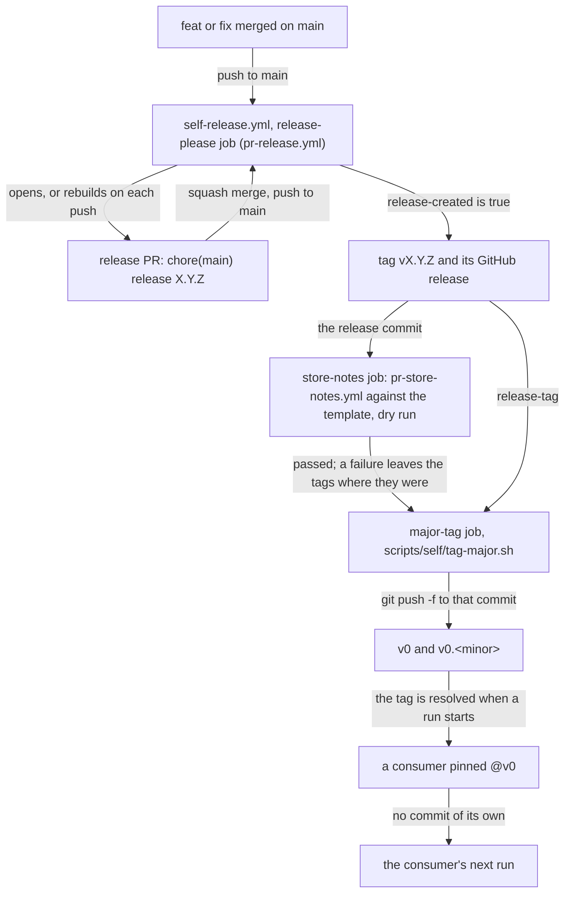
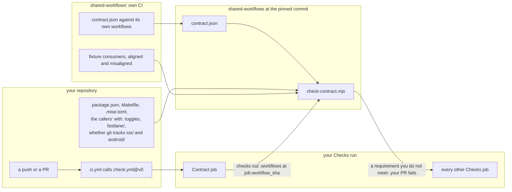
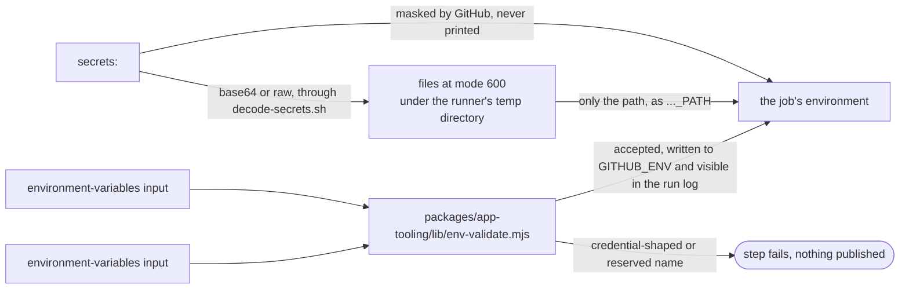
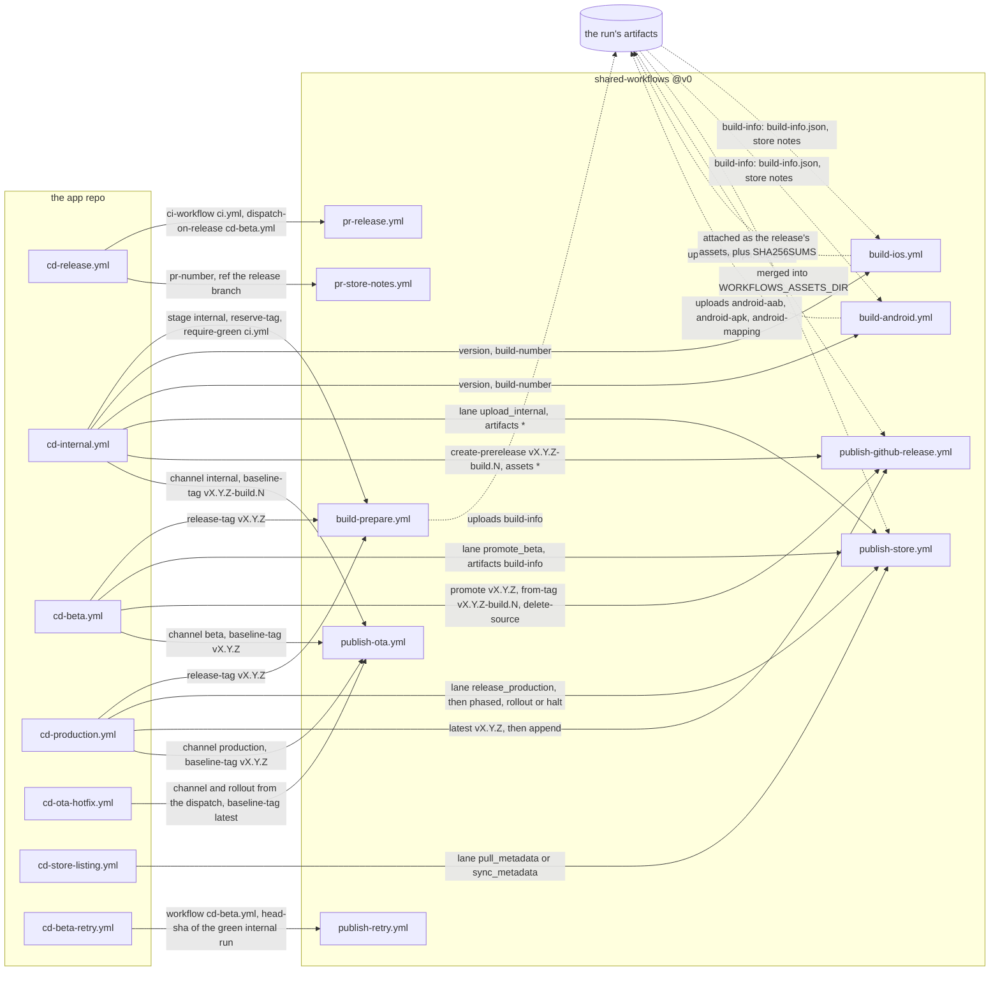
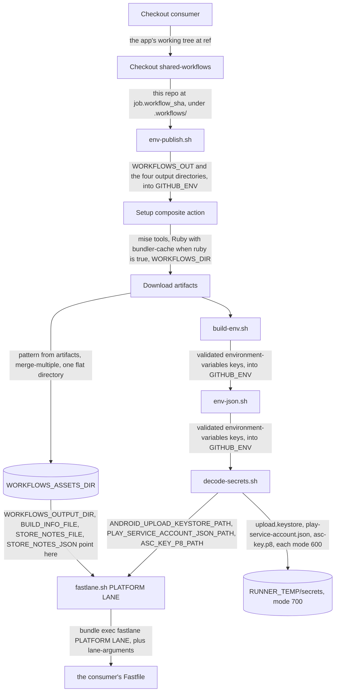

# Consumer guide

How a React Native (Expo) app consumes the reusable workflows and scripts in
this repo.

## 60-second start

0. Run `npx --package=@blinkbitcoin/app-tooling check-contract` in your
   repo to see what this family will need from it — see [The contract
   check](#the-contract-check). `check.yml` runs the same thing on every push.
   If your app was **not** generated from the template, start at
   [adopting-an-existing-repo.md](adopting-an-existing-repo.md) instead.
1. Add `.github/workflows/ci.yml` (below) to your app repo.
2. Make sure your `package.json` has the scripts listed in [Script
   contract](#script-contract). Most of the toggles that call them default to
   **on**, so "optional" means "you can switch the gate off in your caller", not
   "you can leave it out and nothing happens": a repository with none of them
   goes red on nine checks at once. Step 0 tells you which, and `--skeleton`
   prints both ways out.
3. Push. `checks` and `unit` run on every PR; `e2e` (Android by default) runs
   after them.
4. Add `ci-web.yml`, `ci-pr-closed.yml`, `ci-pr-title.yml` if you want those too (all
   three below). They call `build-web.yml`, `pr-closed.yml` and `pr-title.yml`.

That's it — every job self-checks-out this repo into `.workflows/` and reaches its
scripts through `$WORKFLOWS_DIR`; you never reference anything under `scripts/` or
`.github/actions/` directly.

## Versioning

Pre-1.0: this repo is versioned by
[release-please](https://github.com/googleapis/release-please) starting at
`0.1.0`, and the moving major tag is **`v0`** (moved to the tip of each
`0.x.y` release by `self-release.yml`'s `major-tag` job / `scripts/self/tag-major.sh`).
Pin callers to `@v0` (or a full tag, e.g. `@v0.3.1`, for maximum
reproducibility) until this repo reaches `1.0.0`, at which point `@v1` becomes
available and is the recommended pin going forward. `@v0` and `@v1` behave
identically in kind — both are moving tags re-pointed on release — the only
difference is which major line you're tracking.

A release here is five steps and one force-pushed tag:


```mermaid
flowchart TD
  merged["feat or fix merged on main"]
  release["self-release.yml, release-please job (pr-release.yml)"]
  pr["release PR: chore(main) release X.Y.Z"]
  tag["tag vX.Y.Z and its GitHub release"]
  notes["store-notes job: pr-store-notes.yml against the template, dry run"]
  major["major-tag job, scripts/self/tag-major.sh"]
  moving["v0 and v0.&lt;minor&gt;"]
  consumer["a consumer pinned @v0"]
  run["the consumer's next run"]
  merged -->|"push to main"| release
  release -->|"opens, or rebuilds on each push"| pr
  pr -->|"squash merge, push to main"| release
  release -->|"release-created is true"| tag
  tag -->|"the release commit"| notes
  notes -->|"passed; a failure leaves the tags where they were"| major
  tag -->|"release-tag"| major
  major -->|"git push -f to that commit"| moving
  moving -->|"the tag is resolved when a run starts"| consumer
  consumer -->|"no commit of its own"| run
```

**A `v0` move can change an app's next continuous-delivery run with nothing
committed on the app's side.** The pin is resolved when a run starts, so the
first consumer run after a release here executes the new code — a push that
touches one line of copy can fail in a build step that changed in this
repository an hour earlier. Two consequences worth acting on: after a release
here, the family watches the template's `CD / Internal` run, which is the first
real execution of the reusable release workflows (the one gate in this
repository that executes a reusable workflow is the dry run of
`pr-store-notes.yml`, which `v0` waits on; the build and publish workflows
run only inside a consumer — see `AGENTS.md`); and a repository that wants to
decide when it moves pins `@v0.<minor>` or a full commit sha instead of `@v0`,
and moves the pin as a reviewed commit.

### Moving to a version that added the docs gate

`check.yml`'s `docs` input defaults to **on**, and `run-script.sh` fails
hard when the named script is absent. So adopting a version of this repo that
carries it means one of two things in the consumer: add a `"check:docs"`
script to `package.json`, or pass `docs: false` in the caller. This is
the first default-on toggle whose script is not simply the tool's own command
(`check:types` is `tsc`, `check:spell` is `typos`), so it is the one worth
checking before you move the pin.

## The contract check

`check.yml`'s `Contract` job runs one script — `check-contract` — against
your repository and reports **everything** this family will need from it, before
any of the gates that would each die on their own.

It exists because the gates are good at explaining one failure and structurally
incapable of explaining nine. Each runs in its own job and stops at the first
thing it cannot find, so a repository that does not yet satisfy the contract
learns it serially: a screen of parallel reds, each correct, and then the next
missing piece one push later. The check collapses that into a single report.

```
FAIL  check:docs: no "check:docs" script in package.json. Fix: Add a "check:docs"
      script deciding what 'docs are in order' means for your repository, or pass
      docs: false in your caller.
warn  check:audit: no "check:audit" script in package.json. Fix: Without a
      "check:audit" script, shared-workflows runs its own scripts/checks/audit.sh,
      which is `pnpm audit` alone - no lockfile provenance check.
```

Two levels, and the difference matters:

- **blocked** — a gate you asked for cannot run. The job fails.
- **degraded** — this repo has a fallback, so the gate still runs, just not the
  one you defined. The job does not fail. `check:expo-health`, `check:audit`,
  `check:ci`, `check:secrets` and `check:generated` are the five that degrade; see
  [Script contract](#script-contract) for why that seam exists.

The same run also holds **every call your workflows make to this family** to
the interface the called workflow declares at the pinned version
(`packages/app-tooling/interfaces.json`, rendered from the workflows by
`scripts/self/render-interfaces.sh`): an input it does not declare, a required
input left out, a literal of the wrong type, an undeclared secret, or an output
it does not produce. Each is a blocked finding named by file and job, such as
`cd.yml: store -> publish-store.yml: does not pass version, which
publish-store.yml requires`. GitHub checks these only when a run starts, after
the change merged, and a renamed output never fails at all: it reads as empty.
A `with:` or `secrets:` written as an inline mapping is skipped, not guessed at.

**It is your repository that fails, never this one.** The check runs in your
CI, from the version of shared-workflows your caller pins, so moving to a new
`v0` is also when a new requirement starts to apply. shared-workflows' own CI
never checks out a consumer. It tests the checker against fixture consumers and
holds `contract.json` to its own workflows:


```mermaid
flowchart LR
  subgraph app["your repository"]
    pr["a push or a PR"]
    caller["ci.yml calls check.yml@v0"]
    tree["package.json, Makefile, .mise.toml,<br/>the callers' with: toggles, fastlane/,<br/>whether git tracks ios/ and android/"]
  end
  subgraph run["your Checks run"]
    contract["Contract job"]
    gates["every other Checks job"]
  end
  subgraph shared["shared-workflows at the pinned commit"]
    data["contract.json"]
    checker["check-contract.mjs"]
  end
  subgraph self["shared-workflows' own CI"]
    fixtures["fixture consumers, aligned and misaligned"]
    bind["contract.json against its own workflows"]
  end
  pr --> caller --> contract
  contract -->|"checks out .workflows at job.workflow_sha"| checker
  data --> checker
  tree --> checker
  checker -->|"a requirement you do not meet: your PR fails"| gates
  fixtures --> checker
  bind --> data
```

Beyond scripts and files, it holds two things together that only your
repository can see:

- **`make ci` and CI run the same gates**, in both directions. Every package
  script the check and test-unit workflows run for your caller must be reachable
  from `make ci`. Every target `make ci` reaches with a recipe of its own must
  be run by CI, named like a script CI runs or running only pnpm scripts CI
  runs. No `Makefile` or no `ci` target, and both are skipped.
- **Your lanes read only the `APP_REVIEW_*` names `publish-store.yml` passes.**
  A name it does not pass is always empty on a runner.

**It only reports what applies to you.** It reads your own `.github/workflows/`
first: a repository that never calls `test-e2e.yml` is not told it is missing
`.maestro/`, and a gate you passed `false` for is not a finding.

A toggle wired to an expression — `types: ${{ vars.TYPES }}` — is
neither. This job gates the nine gate jobs in `check.yml`, so blocking all of
them because a repository variable could not be read here would be a false
failure, and staying quiet would hide a real one. Such a finding is reported as
degraded and never blocks, with the reason saying so.

It runs **before** the `setup` action, which is the point: a missing `.mise.toml`
or `pnpm-lock.yaml` is exactly the kind of thing that otherwise surfaces as
`missing command: pnpm`, several steps away from its cause. So it uses nothing
but the runner's own node — no pnpm, no installed dependencies — and git, to
see which directories your repository tracks.

### Expo or bare React Native

The family serves two kinds of app, and some requirements belong to one of
them only. An **Expo** app generates `ios/` and `android/` with a prebuild and
never commits them; a **bare** React Native app commits them as source. Which
one your repository is, its *native stack*, is resolved the same way
everywhere — the contract check, `check.yml`'s `expo-health` gate, the
`bundle` and `mobile` scanners and the native build workflows:

1. the `native-stack` input, when your callers pass one (`expo` or `bare`);
2. otherwise `expo`, when `package.json` lists `expo` in `dependencies` or
   `devDependencies` **and** git tracks nothing under `ios/` (it is absent, or
   gitignored);
3. otherwise `bare`.

The report's first line says which it found and why — `native stack: bare (expo
is not a dependency in package.json)` — and so do the job summary and the
`--skeleton` output. A row of `contract.json` may carry `"stack": "expo"` or
`"stack": "bare"`. Rows without it apply to both; a row for the other stack is
reported as skipped, with the reason, the way a gate you switched off is.

| Stack | Rows only it is held to |
| --- | --- |
| `expo` | `check:expo-health` (the `expo-health` gate), an Expo config (`app.config.*` or `app.json`) for `test-e2e.yml` and the builds, `@expo/fingerprint` for the release |
| `bare` | `ios/` committed to git when `test-e2e.yml` builds iOS (`ios: true`) or you call `build-ios.yml`; `android/` committed when `test-e2e.yml` builds Android (its default) or you call `build-android.yml` |

The checker reads `native-stack` from your callers' `with:` blocks, and
`check.yml` also hands its own input to the check, which covers a value wired
to an expression. Two callers passing different literal values is an error: a
repository is one stack. Pass the input when the detection is wrong for you,
such as a bare app that keeps `expo` as a dependency for its modules but
commits no `ios/` yet.

The release rows read the Fastfile and the lanes from your callers'
`fastlane-directory` the same way (`fastlane` when none passes one, or only an
expression), so a `mobile/fastlane` is checked where the lanes run. Two callers
passing different literal values is an error too: a repository has one
Fastfile.

An app in a subdirectory is checked there. The checker reads your callers'
`working-directory` the same way (the repository root when none passes one, or
only an expression; trailing slashes dropped) and reads everything else under
it: `package.json`, the mise config, the Makefile, `pnpm-lock.yaml`, the files
and directories the requirements name, what git tracks under `ios/` and
`android/`, and the `fastlane-directory`, which is relative to it as in the
workflows. Only the callers themselves are read from the repository root, where
GitHub reads them. Two callers passing different literal values is an error: a
repository has one app directory.

### Running it yourself

It ships in [`@blinkbitcoin/app-tooling`](../packages/app-tooling), so you can get
the same report before you push:

```sh
pnpm add -D @blinkbitcoin/app-tooling
pnpm exec check-contract              # this repository
pnpm exec check-contract --skeleton   # ...and the package.json and
                                               #    caller changes that clear it
```

`--json` gives the same findings machine-readably. `--profile checks,unit`
overrides the workflows it infers from your callers, which is what to use before
you have written a caller at all. `--native-stack expo` or `--native-stack bare`
overrides the stack, as the input does.

### Trying it against a real run

`check-contract` predicts; the [Smoke](../.github/workflows/self-smoke.yml)
workflow in this repository actually runs. It takes any repository and ref, so
you can point it at yours before you have committed a caller at all:

```sh
gh workflow run self-smoke.yml -R blinkbitcoin/shared-workflows \
  -f repository=your-org/your-app -f ref=main -f contract-only=true
```

`contract-only=true` stops after the contract check — seconds, and no runners
spent on gates that cannot pass yet. Drop it for the full suite (Checks, Unit
and the Android E2E). A private target needs a `SMOKE_TOKEN` secret; see
[Secrets policy](#secrets-policy).

### The contract is data

Every requirement lives in
[`packages/app-tooling/contract.json`](../packages/app-tooling/contract.json) —
what wants it, which input switches it off, whether a fallback exists, and the
fix. The tables in this document and the checker read the same file, so a
requirement cannot be true in one and absent from the other.

### No copies of this family

Most requirements say what your repository must have. The `no-copy` ones say
what it must not: a file this family already ships, whether as a program in
`@blinkbitcoin/app-tooling` or as a script the workflows run. Nothing compares
a copy with its original, so a copy drifts, and the next fix lands upstream
and never reaches it. A copy blocks the contract check, and the fix names the
program to call instead.

Each `no-copy` requirement lists the paths a copy has had in a consumer. The
list grows as each copy is deleted, so a deleted copy cannot come back. It is
not a way to find copies nobody has named yet. The rule for those is the same:
anything that would serve a second app belongs in this repository, and a
consumer calls it. That includes the pipeline itself, not just scripts: which
jobs run, in what order, behind which gates, and what they are called.

### One commit everywhere

Every call pins shared-workflows to the same full commit SHA, with its
`# vX.Y.Z` beside it. `@blinkbitcoin/app-tooling` and any other package of this
family come in as git dependencies at that same commit:

```json
"@blinkbitcoin/app-tooling": "github:blinkbitcoin/shared-workflows#<sha>&path:/packages/app-tooling"
```

One commit covers both, so a laptop runs the same contract, tool table and
release scripts that CI runs. Dependabot moves the `uses:` pins and cannot move
the package with them, so on its pull request run `pnpm exec fix-tooling-pin`.
It moves every package to the pin and relocks. Until it runs, the contract's
`pin.one-commit` row blocks. The row takes the lockfile entry at that exact
commit with whatever peer suffix pnpm writes after it, a hash or the peers
themselves nested, so no `peersSuffixMaxLength` setting is needed for it.
`pnpm exec check-lockfile` allows exactly that one git source in the lockfile
and nothing else from outside the npm registry.

A caller on the `@v0` tag passes as long as every call uses it. A tag moves, so
no package can be held to it; pin a commit SHA to take packages from git.

## The app suites

The contract check asks whether what the workflows need is there. The app
suites ask whether it works: tests that live in `@blinkbitcoin/app-tooling`,
read your app's own files, and run this family's code against them. They
replace the copies an app made from the template used to carry, which nothing
compared with each other or with the code they tested.

Wire them up with a `"test:app": "test-app"` package script and
`app-suites: true` in your `check.yml` call.

`pnpm exec test-app --list` prints what would run and why each other suite
would not: a suite runs when it is for your app's native stack and the files it
needs are there. To turn one off, give the reason in `app-tooling.json`; it is
printed on every run:

```json
{ "appSuites": { "skip": { "fingerprint": "OTA is not used by this app" } } }
```

The suites move with the pin, like the workflows, so a Dependabot pull request
that changes one runs it against your app before it merges. The list of suites
and what each proves is in the
[package README](../packages/app-tooling/README.md#test-app).

## When something is missing

Two shapes of failure, and which one you get is deliberate.

**The contract check** above reports everything at once, before any gate runs.
That is the one to read first.

**A gate that fails on its own** carries the fix with it. Where the cause is
something your repository does not provide, the annotation has three lines:

```
::error::consumer package.json has no "check:docs" script, and no check:docs binary in node_modules/.bin
Fix: add a "check:docs" script, or switch the gate that calls it off in your caller - run
check-contract for which input that is, and for everything else this repository is missing
Contract: .../docs/consumer-guide.md#script-contract
```

Four places used to fail without any of that, and no longer do:

| Was | Now |
| --- | --- |
| No mise config: `jdx/mise-action` installs nothing and succeeds, so the first symptom was `missing command: pnpm` two steps later | The `setup` action checks for a mise config, a `package.json` and a `pnpm-lock.yaml` **before** mise-action, and names whichever is absent |
| A lockfile out of date with `package.json`: pnpm's own `ERR_PNPM_OUTDATED_LOCKFILE`, which names nothing about this family | The same error, wrapped with what to run and why CI installs frozen |
| A `pnpm-lock.yaml` this family cannot read (anything but v9 at the repository root): `native-hash.sh` hashed **nothing** and produced a cache key that no longer tracked dependency versions — silently | Fatal, naming the shape it expected. A native dependency bump restoring a stale build is not a failure anyone would notice |
| `.github/codeql/codeql-config.yml` absent: `codeql-action/init` failed on a path it could not read | The config file is passed only when it exists. CodeQL still runs, on its own defaults, and the contract check reports the difference as degraded |

**Lane inputs are checked at the start of the job, not inside the lane.** All
five of `APP_VERSION`, `APP_BUILD_NUMBER`, `IOS_BUNDLE_ID`, `IOS_SCHEME` and
`ANDROID_PACKAGE` are `required: true` inputs, and that is weaker than it reads:
a caller passes them as `${{ vars.IOS_BUNDLE_ID }}`, an unset repository
variable interpolates to the empty string, and an empty string satisfies
`required`. The only thing that rejected an empty value was your own Fastfile's
`before_all` — which a repository adopting these workflows may not have at all,
and which on the iOS lane only runs after prebuild and pod install, on a runner
billing at ten times the Linux rate. `build-ios.yml`,
`build-android.yml` and `publish-store.yml` now assert all five as their
first step, naming the repository variable to set.

## Consumer `ci.yml`

```yaml
name: CI
on:
  push:
    branches: [main]
    # No paths-ignore: it would be a second, narrower docs rule that already
    # disagrees with the classifier's (it misses LICENSE and the issue/PR
    # templates). check.yml's `changes` job is the single source - it
    # classifies pushes too, so a docs-only merge still skips unit and e2e.
  pull_request:
    types: [opened, synchronize, reopened, labeled]
  workflow_dispatch:
permissions:
  contents: read
concurrency:
  group: ci-${{ github.ref }}
  cancel-in-progress: ${{ github.ref != 'refs/heads/main' }}
jobs:
  checks:
    name: Checks
    uses: blinkbitcoin/shared-workflows/.github/workflows/check.yml@v0
  unit:
    name: Unit
    needs: checks
    # `!= 'false'`: an output that never arrived runs the suite. A docs-only
    # change is `false` here too.
    if: ${{ needs.checks.outputs.unit-changed != 'false' }}
    uses: blinkbitcoin/shared-workflows/.github/workflows/test-unit.yml@v0
  e2e:
    name: E2E
    # `unit` as well as `checks`: a failed unit run then never reaches E2E. A
    # *skipped* one must not stop it - a change to Maestro flows alone skips
    # unit and still has to run here - hence `!cancelled()` and the explicit
    # result check, in place of the implicit success() that `needs` adds.
    needs: [checks, unit]
    if: >-
      !cancelled() &&
      needs.checks.result == 'success' &&
      contains(fromJSON('["success", "skipped"]'), needs.unit.result) &&
      needs.checks.outputs.e2e-changed != 'false'
    uses: blinkbitcoin/shared-workflows/.github/workflows/test-e2e.yml@v0
    with:
      # iOS is opt-in because macOS bills at 10x on a private repo. On a
      # public repo standard runners are free, macOS included, so set the repo
      # variable E2E_IOS=true and take the coverage on every push to main. A
      # PR runs iOS only with the `e2e:ios` label (the `labeled` trigger above
      # is what makes the label alone start a run), so it waits for Android
      # alone, a third of the wall-clock. See docs/runners.md.
      ios: ${{ (github.event_name != 'pull_request' && vars.E2E_IOS == 'true') || contains(github.event.pull_request.labels.*.name, 'e2e:ios') }}
      macos-runner: ${{ vars.MACOS_RUNNER || 'macos-26' }}
      dev-client: true
      e2e-setup-script: scripts/e2e/ci-mock-api-up.sh
      e2e-teardown-script: scripts/e2e/ci-mock-api-down.sh
  badges:
    name: Badges
    needs: [checks, unit, e2e]
    # always(), so a red Unit still gets a red badge. A cancelled upstream job
    # says nothing about the branch, and a docs-only change never ran the jobs
    # the badges describe - in both cases the published badges stay as they are.
    # publish-badges.yml itself also skips release events and fork PRs (no push token).
    if: >-
      always() &&
      needs.checks.result != 'cancelled' &&
      needs.unit.result != 'cancelled' &&
      needs.e2e.result != 'cancelled' &&
      needs.checks.outputs.docs-only != 'true'
    permissions:
      contents: write # publish-badges.sh pushes the gh-pages branch
    uses: blinkbitcoin/shared-workflows/.github/workflows/publish-badges.yml@v0
    with:
      unit-result: ${{ needs.unit.result }}
      e2e-result: ${{ needs.e2e.result }}
      docs-only: ${{ needs.checks.outputs.docs-only }}
```

Notes:

- **No push+pull_request double trigger.** `push` is scoped to `branches:
  [main]` only — a PR from a branch in the same repo would otherwise fire
  both `push` (on every commit) and `pull_request` (on open/sync), running
  the whole suite twice for the same commit. Fork PRs only ever fire
  `pull_request`, so this asymmetry is intentional, not a gap.
- `pull_request: types: [opened, synchronize, reopened, labeled]` — `labeled`
  is there so adding the `e2e:ios` label to an already-open PR triggers a new
  run that picks it up (a label change is not `synchronize`).
- `concurrency` is the **caller's** job, not this repo's — none of the
  reusable workflows set it (a called workflow's `concurrency` would fight the
  caller's). Cancel in-flight runs on every branch except `main` (a `main`
  push after a merge should never be cancelled by the next one).
- `unit-changed` and `e2e-changed` (from `check.yml`'s `changes` job) let
  `unit` and `e2e` skip a change that cannot affect them: a Maestro flow edit
  skips `unit`, a unit test edit skips `e2e`, a docs-only diff skips both. See
  [the suite classes](#the-suite-classes) for what each one ignores. Gate on
  `!= 'false'`, never `== 'true'`, so an output that never arrived runs the
  suite. `docs-only` is still there; wire it into any other downstream job you
  add. A skipped job counts as passing for required checks, unlike a workflow
  that never ran — which is exactly why the classifier, not the trigger, does
  the skipping.
- **`e2e` must survive a skipped `unit`.** `needs: [checks, unit]` adds an
  implicit `success()`, and a skipped `unit` is not a success — so a flows-only
  change would skip `e2e` too, the one suite it can affect. Hence `!cancelled()`
  and the explicit `needs.unit.result` check: a failed `unit` still keeps a red
  run out of E2E, a skipped one does not.
- **No `paths-ignore` on `push`.** It used to be there, back when the
  classifier only ever saw `pull_request.base.sha` and so classified nothing on
  a push. `check.yml` now derives its base from `github.event.before` on a
  push, so one rule covers both events: a PR and the merge that follows it get
  the same answer. A `paths-ignore` list would be a second, narrower docs rule
  living next to it, and it already disagreed — it misses `LICENSE` and the
  issue/PR templates, both of which the classifier counts as docs. Two rules
  that disagree is worse than one rule, so the trigger fires on every push to
  `main` and the `changes` job decides. Widen the docs definition with
  `docs-patterns`, never with a second list. `test/consumer-contract.bats` holds
  your `ci.yml`'s trigger block to the fixture's, so a `paths-ignore` cannot
  come back unnoticed.
- **The `badges` job is the one that writes.** It runs under `always()` so a
  red Unit still gets a red badge, and it is the only job here that needs
  `contents: write` (granted on the job, not at the top of the file). What it
  publishes, what it skips and the GitHub Pages constraint that goes with it
  are in [`publish-badges.yml`](#publish-badgesyml).
- **What a docs-only change still costs.** Only `unit`, `e2e` and `badges` skip.
  `check.yml`'s own `code` job has no `docs-only` gate, so a documentation
  push to `main` still runs the type check, lint, format, unused-code check, spell, `check:docs`
  and audit — which is the point: those are the checks a documentation change
  can break (a typo, a reflowed table, a dead link in a doc knip tracks, a
  diagram that stopped parsing). Before this
  trigger lost its `paths-ignore` the workflow did not run at all on such a
  push, so it also never caught them.

## `build-web.yml`, `pr-closed.yml`, `pr-title.yml` callers

```yaml
# .github/workflows/ci-web.yml — only add this if the app has a web target
name: CI / Web
on:
  pull_request:
    types: [opened, synchronize, reopened]
  release:
    types: [published]
permissions:
  contents: read
concurrency:
  group: web-${{ github.ref }}
  cancel-in-progress: ${{ github.ref != 'refs/heads/main' }}
jobs:
  web:
    name: Export
    uses: blinkbitcoin/shared-workflows/.github/workflows/build-web.yml@v0
    permissions:
      contents: read
      # The called workflow's `deploy` job needs these; a called job can only
      # narrow the caller's token, never widen it, so they are granted here.
      pages: write
      id-token: write
    with:
      # PRs export a dev build (fast smoke); a published release exports the
      # production bundle that actually gets deployed to Pages.
      # The non-empty value MUST sit in the `&&` slot: GitHub's `&&` yields the
      # first falsy operand and `||` the first truthy one, so
      # `cond && '' || '--dev'` evaluates to '--dev' on BOTH branches (the empty
      # string is falsy) and would quietly deploy a dev bundle.
      build-arguments: ${{ github.event_name != 'release' && '--dev' || '' }}
      deploy: ${{ github.event_name == 'release' }}
```

Notes on the `build-web.yml` caller:

- **The deploy trigger is `release: published`, not a tag push.**
  `github.ref_type == 'tag'` is not a usable signal here: a `pull_request`- or
  `push`-triggered run never sets it to `tag`, and a bare tag push carries no
  release notes; keying on `github.event_name == 'release'` makes "what gets
  deployed" exactly "what was published".
- **The GitHub-expression pitfall.** In GitHub expressions `&&` yields its
  first falsy operand and `||` its first truthy one, and the empty string
  `''` is falsy — so the ternary idiom `cond && A || B` only works when `A`
  is truthy. `github.event_name != 'release' && '' || '--dev'` returns
  `'--dev'` on *both* branches. Always put the non-empty value in the `&&`
  slot and the empty one in the `||` slot, as above.
- **`permissions` on the job, not just the workflow.** A called workflow's
  jobs can only narrow the caller's token, never widen it, so `pages: write`
  and `id-token: write` (needed by `build-web.yml`'s `deploy` job) must be granted
  on the calling job. `contents: read` is repeated there because naming
  `permissions:` at all resets the unnamed scopes to `none`.

```yaml
# .github/workflows/ci-pr-closed.yml
name: CI / PR Closed
on:
  pull_request:
    types: [closed]
permissions:
  contents: write # required: pr-closed.yml's badges-cleanup job pushes the gh-pages branch
  actions: write # required: pr-closed.yml's cancel job needs this to cancel runs
jobs:
  pr-closed:
    name: Cleanup
    uses: blinkbitcoin/shared-workflows/.github/workflows/pr-closed.yml@v0
```

```yaml
# .github/workflows/ci-pr-title.yml
name: CI / PR Title
on:
  pull_request:
    types: [edited]
permissions:
  contents: read
jobs:
  pr-title:
    name: Title
    # `edited` also fires for a body-only edit; only re-lint when the title
    # itself changed (`opened`/`synchronize` are already covered by ci.yml's
    # check.yml `commits` toggle, which lints the same PR title).
    if: github.event.changes.title != null
    uses: blinkbitcoin/shared-workflows/.github/workflows/pr-title.yml@v0
```

`pr-closed.yml` is the one workflow in this family with no `inputs:` at all
(`on.workflow_call: {}`). Its `cancel` job only calls the GitHub API with data
from the `github` context and checks nothing out; its `badges-cleanup` job does
check the consumer out, because the gh-pages push goes through that checkout's
`origin` — which is what `contents: write` above is for.

## Secrets policy

Every workflow in this family that checks out a consumer accepts one optional
secret, `consumer-token` (declared as `secrets: consumer-token: required:
false`), and passes it to the consumer's `actions/checkout` step as `token: ${{
secrets.consumer-token || github.token }}`. For a **public** consumer
repository this is never needed — the default `github.token` has read access
and every example above omits `secrets:` entirely. It exists for
`self-smoke.yml`, whose target defaults to the public
`blinkbitcoin/react-native-mobile-template` but could point at a private
repository: in that case, add a repo secret (e.g. `SMOKE_TOKEN`, a PAT with
read access to the target repo) and pass it through:

```yaml
jobs:
  checks:
    uses: ./.github/workflows/check.yml
    secrets:
      consumer-token: ${{ secrets.SMOKE_TOKEN }}
    with:
      repository: your-org/private-app
```

`secrets: inherit` is never used anywhere in this family (Part B's release
workflows follow the same rule for their own, larger secret sets) — every
secret a reusable workflow needs is declared and passed explicitly.

Three separate channels carry configuration into a release job, and they are
not interchangeable:


```mermaid
flowchart LR
  secrets["secrets:"]
  buildenv["environment-variables input"]
  envjson["environment-variables input"]
  validate["packages/app-tooling/lib/env-validate.mjs"]
  refused(["step fails, nothing published"])
  laneenv["the job's environment"]
  files["files at mode 600<br/>under the runner's temp directory"]
  secrets -->|"masked by GitHub, never printed"| laneenv
  secrets -->|"base64 or raw, through decode-secrets.sh"| files
  files -->|"only the path, as ..._PATH"| laneenv
  buildenv --> validate
  envjson --> validate
  validate -->|"credential-shaped or reserved name"| refused
  validate -->|"accepted, written to GITHUB_ENV and visible in the run log"| laneenv
```

`environment-variables` and `environment-variables` are workflow inputs: GitHub neither masks nor hides
them, so their values are readable by anyone who can read the run. The
validator refuses any name whose last underscore-separated word is `KEY`,
`TOKEN`, `PASSWORD`, `PASSPHRASE`, `SECRET`, `CREDENTIAL` or `CREDENTIALS` —
the boundary is `^` or `_`, so `API_KEY` is refused and `MONKEY` is not — plus
four known credential names the
suffix rule alone would miss — `PLAY_SERVICE_ACCOUNT_JSON`,
`ASC_KEY_P8_BASE64`, `ANDROID_UPLOAD_KEYSTORE_BASE64` and
`MATCH_GIT_BASIC_AUTHORIZATION` — and it refuses the names the family and the
runner own (`WORKFLOWS_`, `GITHUB_`, `RUNNER_`, `ACTIONS_`, `LD_`, `DYLD_`,
`PATH`, `HOME`, `NODE_OPTIONS`). A refusal fails the step with the offending
key named, rather than publishing it.

## Configuring a feature

Configuration in this family has landed on one shape, worked out first for
security scanning and now the pattern every feature with more than an on/off
switch follows: the package's settings resolver
(`packages/app-tooling/lib/security-settings.mjs`) and its reference
`security-settings.json` (every key at its default, with a `$comment` beside
each option) are the reference implementation, not a one-off.

### The four rules

1. **One settings file per feature, in the consumer repository.** For security
   scanning that is `security-settings.json` at the consumer root. It holds
   every tunable the feature has — what is on, thresholds, allowlists,
   excludes — and it is committed. Lowering a bar is then a diff, in the
   repository that lowered it, that a reviewer can see and a `git blame` can
   find later. A setting that instead lived only in a repository variable
   would change with no PR, no diff and no reviewer.
2. **Environment variables override it, key for key.** `SECURITY_CODE=false`
   beats `jobs.code.enabled` in `security-settings.json`. The same name works
   two ways with no translation: exported on a laptop before `make
   check-security`, or set as a repository variable read into the job's
   environment in CI. Nobody maintains a second mapping from "the CI knob"
   to "the file key" — they are the same word.
3. **An invalid value fails the run.** Never "reads as off." A value that is
   not one of the settings a scanner actually understands has to stop the
   run and name the offending value, because the alternative — silently
   dropping the check the value was supposed to configure — is worse than
   any finding the check would have reported. `SECURITY_FAIL_ON=deterministc`
   (one dropped letter) must fail loudly, naming `deterministc` as not a
   known engine class, rather than resolving to an empty `failOn` that blocks
   nothing while the run reports success. This rule earned its place during
   the security work rather than being designed in advance: an unrecognised
   severity, an unknown job name and an invalid `failOn` each independently
   turned out to silently disable blocking the first time they were tried,
   and each needed its own fix before the resolver actually failed closed.
   An **empty** `failOn` is not the same failure — `SECURITY_FAIL_ON=` or
   `"failOn": []` is a deliberate choice (advisory-only), so it is accepted,
   but the summary says so explicitly rather than letting the run read as an
   ordinary pass.
4. **Workflow inputs stay booleans.** An input may switch a whole layer on
   or off for a caller; it may never carry a threshold, a list or a
   free-form value. Numbers, allowlists and excludes live in the consumer's
   settings file, where they are versioned next to the code they cover, not in
   a `with:` block in a caller's workflow file.

### When a feature needs a settings file

A single on/off switch does not need one — a plain `type: boolean` workflow
input (rule 4) covers it, the same as `docs` or `commits` in
`check.yml` above. The line is what the feature has to tune beyond "on
or off": the moment a feature grows a threshold (`severity`), an allowlist or
excludes, or independent per-part switches (`jobs.dependencies`, `jobs.code`, ...),
those settings need a home that is diffable and reviewable in the consumer,
which a workflow input — read once per run, with no history of its own — is
not. Security scanning needed all three from the start, which is why it has
`security-settings.json`; a feature that only ever needs "is this on" does not
need one, and adding a settings file for it would be a file nobody reads that
duplicates a boolean already sitting in a caller.

### Naming

A feature is `<feature>`; its settings file is `<feature>-settings.json` at the
consumer's root; its environment twins are `FEATURE_*`, one name per key in
the file (`SECURITY_ENABLED` for `enabled`, `SECURITY_SEVERITY` for
`severity`, `SECURITY_FAIL_ON` for `failOn`, `SECURITY_<JOB>` for each
`jobs.<name>.enabled`). Where the family also exposes an on/off switch as a
workflow input for that feature, it carries the same name once more, in
kebab-case (`security-enabled`, not a different word for the same on/off
decision). One concept, one name, spelled three ways by three different
syntaxes — `enabled` / `SECURITY_ENABLED` / `security-enabled` — never three
concepts that happen to look related.

### The resolver is duplicated, and that is deliberate for now

`settings.mjs`'s reader — take a schema of defaults, resolve file then
environment then default, validate every value — is generic; nothing in it
is specific to security scanning. It is not, today, extracted into a shared
package that every feature and every consumer imports. `security-settings.json`
resolves through the copy that lives in the template alongside it, and a
second feature that wants the same behaviour (`test-settings.json`, agreed but
not yet built) is expected to copy the pattern rather than import it.

That is a deliberate choice, not an oversight: the template carries no
`@blinkbitcoin` dependency today, and GitHub Packages requires authentication
even for a public package, so adopting one means a scoped registry entry and
a token on every developer machine and in CI — for a resolver whose only
caller so far is the template itself. A baseline with one consumer is not a
baseline: extracting now would fix an interface before a second real
consumer exists to say which knobs it actually needs, and would couple the
template's `pnpm install` to this repository's release cadence for no
present benefit. The model above — the four rules — is the part worth fixing
now; which repository owns the code that enforces them is revisited once a
second consumer exists.

## Inputs, outputs and secrets per workflow

Every table below is read from the workflow's own `on.workflow_call` block —
`working-directory`, `linux-runner`, `macos-runner` and `native-cache-version`
are carried by every workflow that takes inputs at all (present even when
unused, "carried for input-set consistency across the family," so they share
one mental model). The exception is `pr-closed.yml`, which declares
`workflow_call: {}` and takes nothing.

### `check.yml`

| Input | Default | Meaning |
| --- | --- | --- |
| `repository` | `''` (caller's own) | Consumer repository to check out |
| `ref` | `''` (let checkout resolve it) | Consumer ref (PR merge ref, branch, tag) |
| `working-directory` | `.` | Consumer directory relative to `GITHUB_WORKSPACE` |
| `linux-runner` | `ubuntu-latest` | Runner for every job in this workflow |
| `macos-runner` | `macos-26` | Unused here |
| `native-cache-version` | `v1` | Unused here |
| `native-stack` | `''` (detect) | The app's native stack: `expo`, or `bare` for React Native with committed `ios/` and `android/`. Empty detects it — see [Expo or bare React Native](#expo-or-bare-react-native). Decides which contract rows apply and whether `expo-health` runs |
| `types` | `true` | Run `check:types` |
| `lint` | `true` | Run `check:lint` |
| `format` | `true` | Run `check:format` |
| `unused` | `true` | Run `check:unused` |
| `spell` | `true` | Run `check:spell` |
| `docs` | `true` | Run `check:docs` with `EVENT_NAME`, `BASE_REF` and `PR_AUTHOR` in the environment — the consumer's docs gate (freshness heuristic, command table, table widths, diagram parsing). `PR_AUTHOR` is what lets the consumer exempt a bot's dependency bump from a "docs not updated" warning |
| `generated` | `false` | Run the consumer's `check:generated`, or, when it ships none, `gen:i18n` and `gen:graphql` (whichever it has) + a clean-tree assertion over the paths below |
| `i18n-paths` | `''` (`src/i18n/locales`) | Space-separated pathspecs `gen:i18n` writes, which the `generated` fallback asserts are clean. Empty keeps the default. Unused when the consumer ships `check:generated` |
| `graphql-paths` | `''` (`src/graphql/generated`) | Space-separated pathspecs `gen:graphql` writes, as `i18n-paths` (a bare app's codegen may write `app/graphql/generated.ts`) |
| `expo-health` | `true` | Run the consumer's `check:expo-health`, or `scripts/checks/expo-health.sh` when it ships none: `expo install --check` as a warning, then `expo-doctor` with its version check off. **Expo stack only**: on a bare app the step passes with a notice naming the stack, so the default needs no change |
| `audit` | `true` | Run the consumer's `check:audit`, or `pnpm audit --prod` at `audit-level` when it ships none |
| `audit-level` | `high` | Minimum severity that fails the audit |
| `audit-soft-on-pr` | `true` | Make a failing audit advisory on a `pull_request` (`continue-on-error`). It stays blocking on `push`, `release` and `workflow_dispatch`. Set `false` to block PRs too |
| `commits` | `true` | Lint the PR title (skipped for `dependabot[bot]`) |
| `commits-all` | `false` | Also lint every commit's message in the PR |
| `ci` | `true` | Run the consumer's `check:ci`, or, when it ships none, lint its `.github/workflows` (actionlint) and its `scripts/` (shellcheck), and audit its `.github` with zizmor, offline, at medium severity and up: template injection, broad permissions, App tokens with blanket scope, dangerous triggers. Without a `zizmor.yml` of its own the consumer gets this family's policy, which allows tag pins. Either way the policy file is passed with `--config` (`.github/zizmor.yml` first, then a root `zizmor.yml`), so a run from a worktree nested in another checkout cannot pick up that checkout's policy |
| `secrets` | `true` | Run the consumer's `check:secrets`, or scan its **full git history** with gitleaks when it ships none. The Secrets job checks out with `fetch-depth: 0` for this. A `.gitleaks.toml` at the consumer's root is read either way |
| `licenses` | `true` | Run the consumer's `check:licenses` (the dependency license policy) |
| `app-suites` | `false` | Run the consumer's `test:app`: the [app suites](#the-app-suites), shared tests run against the app's own files. The `App suites` job is skipped outright while this is off |
| `prebuild` | `false` | Run the consumer's `check:prebuild`: prebuild both platforms into a temp dir and assert the config plugins produced what they should. **Minutes, not seconds** — enable it where the coverage earns the wall clock (on `main`, on a release, behind a label), not on every PR |
| `release` | `false` | Install Ruby (`ruby/setup-ruby@v1`, `bundler-cache: true`) and run the consumer's `check:release` script — the Fastfile/Gemfile and release configuration validation behind the template's `make check-release`. Off by default because a repo with no release setup has no such script |
| `contract-only` | `false` | Run the contract check and **nothing else** — for a repository still being wired up, it answers "would these workflows work here?" in seconds instead of runner-minutes. A run under this flag gates nothing, so it says so: the job logs a warning and the summary names it. Not a setting to leave on |
| `contract` | `true` | Report every unmet requirement of this family in one place, before the gates that would each die on their own — see [The contract check](#the-contract-check). `false` makes the step a no-op; the job itself still runs, because every other job in this workflow `needs:` it |
| `docs-only-detection` | `true` | Classify the change — docs-only, and whether it can affect the unit and E2E suites — on a `pull_request` **and** on a `push`. `false` leaves every output empty, which a `!= 'false'` gate reads as "run" |
| `docs-patterns` | `''` | Extra `\|`-joined POSIX ERE alternatives **added to** the built-in docs pattern (`^docs/\|\.md$\|(^\|/)LICENSE$\|^\.github/ISSUE_TEMPLATE/\|^\.github/PULL_REQUEST_TEMPLATE`), not a replacement for it. A changed `*.prompt.md` (an LLM prompt a gate reads) is never docs, so it never makes a change docs-only |
| `unit-ignore-patterns` | `''` | Extra `\|`-joined POSIX ERE alternatives for paths the unit suite never reads, **added to** the built-in list behind `unit-changed` (see [the suite classes](#the-suite-classes)) |
| `e2e-ignore-patterns` | `''` | Extra `\|`-joined POSIX ERE alternatives for paths the native E2E suite never reads, **added to** the built-in list behind `e2e-changed` |

Jobs: `Changes`, `Contract`, `Code`, `Generated`, `Docs`, `Dependencies`,
`App suites`, `Prebuild`, `Release`, `CI`, `Secrets`, `Commits` — grouped by
**who acts on a failure**, not by what is cheapest to run. A red `Dependencies` means a
vulnerability, a license problem or an SDK drift and belongs to whoever owns
operations; a red `Code` is a lint error and belongs to the author. They used to
share one box called `code`, where a CVE and a formatting nit looked identical
until you opened the log.

Each job pays its own checkout and install, roughly 30-45s, and they run in
parallel — so this costs runner time rather than wall clock. The five gates
inside `Code` stay together on purpose: same person, same fix (`make
check`), seconds each.

Outputs: `docs-only` (`'true'` when every changed file matched the docs
patterns), `unit-changed` and `e2e-changed` (`'false'` when no changed file can
affect that suite). All three are empty when detection is disabled. Secrets:
`consumer-token` (optional).

The base of the diff is `github.event.pull_request.base.sha` on a
`pull_request` and `github.event.before` on a `push`, so a PR and the merge
that follows it are classified the same way — which is why a caller's `ci.yml`
needs no `paths-ignore`. `LICENSE` matches anywhere in the tree, not just at
the root, so a per-package copyright bump is docs too.

The classifier **fails open**: when the range cannot be read at all — no base,
the all-zero base of a branch's first push, or a base made unreachable by a
force-push or a shallow clone — or a pattern does not compile, it emits
`docs-only=false` and every `*-changed=true`, and exits 0. The step stays green
and the full pipeline runs; an unreadable diff is never read as "nothing
relevant". A `*-patterns` input with an empty alternative (a stray leading,
trailing or doubled `|`) is the one hard failure: an empty alternative matches
every path, and would skip every job it gates.

#### The suite classes

Each suite class is **ignore-based**: it is `'true'` unless *every* changed
path is on that suite's irrelevant list — the docs pattern, the built-in
entries below, and the matching `*-ignore-patterns` input. A path nobody listed —
a new directory, a new config file — therefore runs the suite. Getting a list
wrong costs a needless run, never a skipped regression.

| Class | Built-in irrelevant paths, besides docs | Widened by |
| --- | --- | --- |
| `unit-changed` | `.maestro/`, `e2e/`, `playwright.config.*`, `fastlane/`, `Gemfile`, `Gemfile.lock` | `check.yml`'s `unit-ignore-patterns` |
| `e2e-changed` | `__tests__/`, `__snapshots__/`, `*.test.{js,ts,jsx,tsx,mjs,cjs,…}`, `jest.config.*`, `e2e/web/`, `playwright.config.*`, `fastlane/` | `check.yml`'s `e2e-ignore-patterns` |
| `web-changed` | `.maestro/`, `__snapshots__/`, `jest.config.*`, `fastlane/`, `Gemfile`, `Gemfile.lock` | `build-web.yml`'s `web-ignore-patterns` |

Nothing under `.github/` is on any built-in list: a changed caller workflow can
change how every suite runs. Test files are irrelevant to native E2E but not to
the web build, because Playwright's default `testMatch` takes `*.test.*` as well
as `*.spec.*`. `Gemfile` runs E2E only: CocoaPods runs under it in the iOS
build. A native change needs no class of its own — `test-e2e.yml`'s build jobs
already restore the app from a cache keyed on the native inputs, so a
JavaScript-only change reruns the suite without recompiling anything (a Debug
build loads its JavaScript from Metro).

#### The audit's failure policy

`pnpm audit` makes one request to the registry's advisories endpoint, and that
endpoint is the family's known staller — 5s to 102s for identical payloads has
been measured on a day it was otherwise healthy. Three things follow, and all
three are already set for you:

- The step carries `timeout-minutes: 5`, so a stall is ended by a named step
  rather than by a job-level cap that tells you nothing about which step hung.
- The step sets its **own** `PNPM_CONFIG_FETCH_TIMEOUT` (and, for anything in
  it that shells out to npm, `NPM_CONFIG_FETCH_TIMEOUT`) at `270000` — just
  under its own 5-minute bound. That belongs on the step, not on the workflow:
  a workflow-level fetch timeout is normally sized for an installer's cold
  path, and when a sibling repo set one to 60s it silently overrode this step's
  budget and turned `main` red at 61s with only `code undefined:` in the log.
  If you set a fetch timeout in your own `ci.yml`'s `env:`, it will not reach
  this step — that is deliberate.
- `audit-soft-on-pr` (default `true`) makes a failing audit advisory on a
  `pull_request` and blocking everywhere else. A new advisory published against
  a transitive dependency should not stop a review that has nothing to do with
  it, but it must still turn `main` red. Set it to `false` if your repo would
  rather block the PR.

A **soft** audit still prints its findings and still shows the step as failed
in the run's summary; it just does not fail the job. If you suppress an
advisory instead, suppress it where the dependency is — `auditConfig.ignoreGhsas`
in your `pnpm-workspace.yaml` — with a per-entry reason next to the id.

### `test-unit.yml`

| Input | Default | Meaning |
| --- | --- | --- |
| `repository`, `ref`, `working-directory`, `linux-runner`, `macos-runner`, `native-cache-version` | (as above) | — |
| `coverage` | `true` | Run `coverage-script` and upload `coverage/`; otherwise run `unit-script` |
| `unit-script` | `test` | Script run when `coverage` is off |
| `coverage-script` | `test:coverage` | Script run when `coverage` is on. Passing `coverage: true` with an **empty** `coverage-script` silently falls back to `unit-script` (`${{ inputs.coverage && inputs.coverage-script \|\| inputs.unit-script }}`) and then uploads an empty `coverage/`; leave the default or set a real script name |
| `scripts-script` | `test:scripts` | Script that tests `scripts/` itself; empty skips this step. `check-contract` follows it: empty skips its `test:scripts` row, another name is the script it requires |
| `coverage-artifact-retention-days` | `30` | Retention for the uploaded `coverage/` artifact |

No outputs. Secrets: `consumer-token` (optional).

### `test-e2e.yml`

| Input | Default | Meaning |
| --- | --- | --- |
| `repository`, `ref`, `working-directory` | (as above) | — |
| `linux-runner` | `ubuntu-latest` | Runner for the Android jobs |
| `macos-runner` | `macos-26` | Runner for the iOS jobs |
| `native-cache-version` | `v1` | Bump to invalidate every native cache at once |
| `default-branch` | `refs/heads/main` | Fully qualified ref of the branch allowed to **write** the Gradle cache; every other ref reads it. Set it if your default branch is not `main`, or the cache is never written and every run pays a cold Gradle |
| `native-extra-globs` | `''` | Space-separated consumer-relative shell globs whose file contents join the native dependency hash (see [`docs/cache-keys.md`](cache-keys.md)) |
| `native-stack` | `''` (detect) | `expo` or `bare`, for every job: prebuild, the identifiers, Metro, the prewarm, the launch and the cache key follow it — see [Expo or bare](#expo-or-bare). A bare app also passes `dev-client: false` |
| `ios-bundle-id` / `android-package` / `ios-scheme` | `''` (read from the app) | The identifiers of the app under test, exported to every job as `IOS_BUNDLE_ID`,<br>`ANDROID_PACKAGE` and `IOS_SCHEME` and used as given: the launch, the Maestro `APP_ID` and the Xcode build read them first.<br>Empty reads them from the Expo config, or from a bare app's committed projects — its `android-package` is then<br>`applicationId` plus the debug build type's `applicationIdSuffix`, the id `assembleDebug` installs. See [Expo or bare](#expo-or-bare) |
| `ios` | `false` | Run the iOS build + simulator suite. Default is off because macOS bills at 10x on a private repo; on a public repo it is free, so turn it on |
| `android` | `true` | Run the Android build + emulator suite |
| `xcode-version` | `''` | Xcode version to select (folded into the iOS cache key) |
| `android-api-level` | `34` | Emulator + system image API level |
| `maestro-version` | `2.10.0` | Maestro CLI version (kept equal to `scripts/lib/versions.sh`) |
| `maestro-sha256` | `''` | SHA-256 of `maestro-version`'s release archive. Empty for the pinned version, whose checksum `scripts/lib/versions.sh` holds; required for any other, because the install refuses bytes it cannot verify |
| `flows` | `.maestro` | Flows directory, consumer-relative |
| `include-tags` / `exclude-tags` | `''` | Passed to Maestro when non-empty |
| `suite-timeout-minutes` | `10` | Per-attempt bound; the step's own timeout is this plus 5 |
| `dev-client` | `true` | Launch via the `expo-development-client` deep link, Metro `--dev-client`. A bare React Native app has no dev-client launcher: pass `false`, and it is launched plainly |
| `ios-configuration` | `Debug` | Xcode configuration for the iOS E2E app.<br>`Release` embeds the JS bundle and leaves the dev launcher out, so the app runs on `simctl launch` alone -<br>no Metro, no deep link, no iOS "Open in <app>?" prompt. Forces `dev-client` off for the iOS jobs;<br>Android is unaffected. Changes the cache key, so the two configurations never share a build |
| `environment-variables` | `{}` | Flat JSON object of non-secret variables exported before the iOS prebuild, so the bundle embeds them.<br>A `Release` build resolves `.env.production` at build time and an exported variable wins over the dotenv file -<br>this is how you point an E2E build at a mock API. Folded into the iOS cache key, so two values never share a build |
| `mock-api-command` | `''` | Command that starts the app's mock API, run in the working directory with `MOCK_API_PORT` set to `mock-api-port`. Started in the background before the suite, waited for until it answers HTTP, and stopped after the suite, pass or fail. Empty starts none |
| `mock-api-port` | `8082` | Host port the mock API listens on: reversed into the Android emulator, and what `mock-api-command` is waited for on. `8082` is the family's port base (8080) plus the mock API's offset. Empty disables the reverse and the wait |
| `e2e-setup-script` / `e2e-teardown-script` | `''` | Consumer-relative hook scripts (setup: missing file is fatal; teardown: always runs) |
| `ios-artifact` | `ios-app` | Artifact name between `build-ios` and `ios` |
| `android-artifact` | `android-apk` | Artifact name between `build-android` and `android` |

Outputs: `ios-result`, `android-result` (`success`/`failure`/`cancelled`/`skipped`).
Secrets: `consumer-token` (optional).

### `build-web.yml`

| Input | Default | Meaning |
| --- | --- | --- |
| `repository`, `ref`, `working-directory` | (as above) | — |
| `linux-runner` | `ubuntu-latest` | Runner for every job |
| `macos-runner`, `native-cache-version` | (unused) | — |
| `e2e` | `true` | Run the web E2E suite (Playwright) against the export |
| `deploy` | `false` | Publish to GitHub Pages (pass `github.event_name == 'release'` from a `release: published` caller; the calling job must grant `pages: write` + `id-token: write`) |
| `base-url` | `''` | Baked into the export via `EXPO_PUBLIC_BASE_URL`, and exported under the same name to the Playwright suite so the consumer's preview server can serve the export under that path |
| `build-script` | `build:web` | Script that exports the web build |
| `build-arguments` | `''` | Extra flags appended to the export script |
| `output-directory` | `dist` | Consumer-relative export output directory |
| `e2e-script` | `test:e2e:web` | Script that runs the Playwright suite |
| `e2e-browsers` | `chromium` | Space-separated browsers for `playwright install` |
| `docs-patterns` | `''` | Extra `\|`-joined POSIX ERE alternatives added to the built-in docs pattern, same as `check.yml`; docs are irrelevant to the web class |
| `web-ignore-patterns` | `''` | Extra `\|`-joined POSIX ERE alternatives for paths the web build and its Playwright suite never read, **added to** the built-in list behind `web-changed` (see [the suite classes](#the-suite-classes)) |

Jobs: `Changes`, `Build`, `E2E`, `Deploy`. `Changes` runs the same classifier
as `check.yml`, with a byte-identical base-sha expression, and `Build` —
and with it `E2E` and `Deploy` — skips when `web-changed` is `'false'`. A
`release` event has no base, so it fails open: a release always builds and
deploys.

Outputs: `page-url` (empty unless `deploy` is true), `web-changed`. Secrets:
`consumer-token` (optional).

### `pr-title.yml`

| Input | Default | Meaning |
| --- | --- | --- |
| `repository`, `ref`, `working-directory`, `linux-runner`, `macos-runner`, `native-cache-version` | (as above) | — |

No outputs. Secrets: `consumer-token` (optional). Lints
`github.event.pull_request.title` against Conventional Commits on whatever
`pull_request` event the caller wires it to. `check.yml`'s `commits`
toggle already lints the same title on `opened`/`synchronize`, so the caller
above only adds `edited` (guarded by `github.event.changes.title != null`, since
`edited` also fires for a body-only edit).

### `pr-closed.yml`

`on.workflow_call: {}` — no inputs, outputs or secrets. The caller must grant
`permissions: actions: write` for the cancel step and `contents: write` for the
`badges-cleanup` job, which removes the closed branch's `badges/<branch>/`
directory from `gh-pages` (see [`publish-badges.yml`](#publish-badgesyml)). A fork PR skips the
cleanup job: its run has no token that could push to the base repository, and
`publish-badges.yml` skipped it on the way in for the same reason, so there is nothing
to remove.

### `publish-badges.yml`

Renders and publishes this branch's CI badges to the consumer's own `gh-pages`
branch, as `badges/<branch>/{unit,e2e,coverage,security}.svg` (plus a `.json` sibling per
badge, the shields.io endpoint shape). The README embeds `main`'s through
`raw.githubusercontent.com/<owner>/<repo>/gh-pages/badges/main/coverage.svg`,
the way a workflow-status badge takes `?branch=main`; every other branch gets
its own directory, and `pr-closed.yml` drops it when the PR closes.

**Rendering and publishing both live here.** The renderer is
`@blinkbitcoin/app-tooling`'s `gen-badges` program, which
`scripts/ci/gen-badges.sh` runs from this repository's own checkout, in the
consumer's root: the same commit as the workflow, so your repository needs no
script, no copy and no installed package for it. A consumer that draws its own
badges names its package script in `badges-script`, and that script runs
through `scripts/checks/run-script.sh` instead, with the environment below.
Publishing is `scripts/ci/publish-badges.sh` and the gh-pages mechanics behind
it (`scripts/ci/gh-pages-lib.sh`: orphan creation on the first publish; on a
rejected push, the badge write is re-applied onto the fresh tip rather than
replayed as a commit, because two publishes for one branch - or a PR-close
cleanup against that branch's in-flight publish - touch the same paths and no
merge of derived content can resolve that).

To render the same badges on a laptop, run the program from the installed
package with the same environment, after your coverage run:

```sh
BADGE_UNIT=success BADGE_E2E=skipped pnpm exec gen-badges   # into coverage/badge
```

`gen-coverage-badge` and `gen-status-badge` render one badge each, for a layout that
wants only one. A copy of the renderer in your repository (`scripts/badges/`,
where the template kept it) is a `no-copy` row in the contract check: see
[No copies of this family](#no-copies-of-this-family).

| Input | Default | Meaning |
| --- | --- | --- |
| `repository`, `ref`, `working-directory`, `linux-runner`, `macos-runner`, `native-cache-version` | (as above) | — |
| `unit-result` | **required** | The caller's `needs.unit.result` |
| `e2e-result` | **required** | The caller's `needs.e2e.result` |
| `docs-only` | `false` | `check.yml`'s `docs-only` output; `'true'` skips the job |
| `unit-label` / `e2e-label` | `Unit` / `E2E` | Text on the left half of each status badge |
| `security-verdict` | `''` | `check-security.yml`'s `verdict` output, as it is. Empty renders no security badge, so the published one stays |
| `security-label` | `Security` | Text on the left half of the security badge |
| `coverage-artifact` | `coverage` | Artifact holding the consumer's `coverage/` directory (`test-unit.yml` uploads it under this name). Downloaded only when `unit-result` is `success` |
| `badges-script` | `''` | Consumer script that renders the badges into `badge-directory` instead of `gen-badges`. Empty renders with `gen-badges`. The default used to be `badges:render`: pass that to keep a renderer of your own |
| `badge-directory` | `coverage/badge` | Consumer-relative directory the badges are rendered into and `publish-badges.sh` copies from |

No outputs. Secrets: `consumer-token` (optional). The calling job must grant
`permissions: contents: write` — this is the only job in the family that
writes, and the scope is declared on the job rather than at the top of the file
for exactly that reason.

**The environment the renderer is handed**, `gen-badges` or a
`badges-script` of your own: `BADGE_OUT_DIR`, `BADGE_UNIT`, `BADGE_E2E`,
`BADGE_UNIT_LABEL`, `BADGE_E2E_LABEL`, `BADGE_SECURITY` (empty, or the verdict
line to render `security.svg` from) and `BADGE_SECURITY_LABEL`. `gen-badges`
also reads `BADGE_COVERAGE` (`measure`, `failing`, `pending` or `skip`; derived
from `BADGE_UNIT` when unset) and `BADGE_COVERAGE_SUMMARY` (default
`coverage/coverage-summary.json`). `run-script.sh` runs `pnpm run NAME` with no
arguments, which is why everything variable arrives as environment.

**Guards.** The calling job runs under `always()`, so a *failed* Unit still
publishes a red badge. Five cases are excluded, two by the caller and three by
this workflow:

| Case | Why |
| --- | --- |
| an upstream job was `cancelled` | a cancelled run says nothing about the branch |
| the change was docs-only | the jobs the badges describe never ran |
| both `unit-result` and `e2e-result` are `skipped` | the same, for a change neither suite could see |
| `github.event_name == 'release'` | a release is not a branch |
| the PR came from a fork | its token cannot push to the base repository |

**Only a Unit *failure* writes a coverage placeholder.** A *skipped* Unit
renders no coverage badge at all, and `publish-badges.sh` copies only what was
rendered — so a docs-only PR leaves the branch's published coverage badge
exactly as it was instead of blanking it.

**A skipped suite's status badge is not published either.** When one suite
ran and the other was skipped by its class, `publish-badges.sh` drops the
skipped suite's `unit.*` or `e2e.*` from what it copies, whatever the
renderer drew for `skipped`. A flows-only merge to `main` then updates the E2E
badge and leaves the Unit badge showing the last run that looked.

**No security verdict, no security badge.** An empty `security-verdict` (the
caller skipped `check-security.yml` on a docs-only change) renders no
`security.svg`, and `publish-badges.sh` copies only what was rendered, so the
branch's published security badge stays as it was.

**Coexistence with GitHub Pages.** `build-web.yml`'s `deploy` job publishes the web
export through `actions/deploy-pages`, which is an *artifact* deploy and reads
no branch, and the badges are served from `raw.githubusercontent.com` rather
than from the Pages site. The two therefore do not collide — **provided the
repository's Pages source stays "GitHub Actions"**. Switching it to "Deploy
from a branch → gh-pages" would put every badge commit in a fight with every
web deploy and publish the badge directory as the site.

**Two repository settings** go with this, both one-time: keep that Pages
source, and exempt `gh-pages` from any ruleset that requires a pull request, so
the default `GITHUB_TOKEN` can push to it. The branch itself needs no
preparation — the first publish creates it as a true orphan (no parent, and
no copy of the consumer's source tree) — unless a ruleset blocks branch
creation outright.

### `check-code-scanning.yml`

| Input | Default | Meaning |
| --- | --- | --- |
| `repository`, `ref`, `linux-runner` | (as above) | — |
| `working-directory` | `.` | Unused: CodeQL reads the whole checkout, and the configuration file's `paths-ignore` is what scopes it |
| `macos-runner`, `native-cache-version` | (unused) | — |
| `languages` | `javascript-typescript` | Comma-separated CodeQL languages; also the `category` the SARIF is uploaded under |
| `configuration-file` | `./.github/codeql/codeql-config.yml` | Consumer-relative CodeQL configuration: query suite, packs, `paths-ignore` |
| `docs-patterns` | `''` | Extra `\|`-joined POSIX ERE alternatives **added to** the built-in docs pattern, same as `check.yml` |

Outputs: `docs-only` (`'true'` when nothing but docs changed, so no analysis
ran). Secrets: `consumer-token` (optional).

Two jobs. `changes` runs the **same** classifier `check.yml` does — the same
`scripts/ci/changed-class.sh`, from the same `.workflows/` self-checkout, with a
byte-identical `BASE_SHA` expression (`test/workflow-shape.bats` compares the
two). `analyze` is gated on `docs-only != 'true'` and runs
`github/codeql-action/init@v4` + `analyze@v4` with no build step: JS/TS is
extracted from source. Permissions escalate on `analyze` only — `actions: read`
for the workflow metadata and `security-events: write` for the SARIF upload,
with `contents: read` re-declared because naming `permissions:` at all resets
the scopes you do not name.

A `schedule` event has no base sha, so the classifier fails open with
`docs-only=false` and everything is analysed. That is the point of a weekly
cron: a query published since the last push gets to run against an idle `main`.

A caller wires it up like this — note the absence of `paths-ignore`, which would
be a second, narrower docs rule beside the `changes` job (the same defect the
family removed from `ci.yml`):

```yaml
# .github/workflows/ci-codeql.yml
name: CI / CodeQL
on:
  push:
    branches: [main]
  pull_request:
    branches: [main]
  schedule:
    - cron: '17 6 * * 1'
permissions:
  contents: read
concurrency:
  group: codeql-${{ github.ref }}
  cancel-in-progress: true
jobs:
  codeql:
    name: Analyze
    # A called workflow can only NARROW the caller's token, so the analyze job's
    # `security-events: write` has to be granted here or the run dies as a
    # startup_failure before any job begins.
    permissions:
      contents: read
      actions: read # workflow metadata for the SARIF upload
      security-events: write # upload the SARIF results
    uses: blinkbitcoin/shared-workflows/.github/workflows/check-code-scanning.yml@v0
```

The calling job needs no `permissions:` block of its own: a reusable workflow's
job-level `permissions:` is what the job actually gets, and this one declares
all three scopes it needs.

**Leave this out of the required-checks ruleset.** CodeQL here is
informational: a pack download that times out, or an org-level Advanced
Security toggle that is off, must not be able to block a merge. On a private
repository the analysis needs GitHub Advanced Security enabled at the org
level; on a public one it is free.

#### The config file, and why an inline marker beats a dismissal

The consumer owns `.github/codeql/codeql-config.yml`. Two entries carry the
weight:

```yaml
queries:
  - uses: security-and-quality
packs:
  - codeql/javascript-queries:AlertSuppression.ql
```

**If you pass more than one language**, two things in this shape stop being
right, and neither fails loudly:

- A **top-level `packs:` list is only valid for a single-language analysis**.
  With two or more languages CodeQL wants the list keyed by language
  (`packs: {javascript: [...], python: [...]}`), and `AlertSuppression.ql` above
  is the *JavaScript* pack's query — each language needs its own.
- The workflow's upload `category` is `/language:${{ inputs.languages }}`, so a
  comma-separated input produces one category like
  `/language:javascript-typescript,python`. Code scanning expects one category
  per language, so a multi-language consumer should call this workflow once per
  language (a matrix in the caller) rather than passing a list.

The template passes one language and hits neither.

`AlertSuppression.ql` is what makes an inline

```ts
// Why this cannot happen here.
// codeql[js/some-rule-id]
const value = untrusted;
```

marker actually suppress one finding. A marker alone on its line covers that
line **and the one immediately below it**, so it has to be the last line before
the code: the reason belongs *above* the marker. Putting it between the marker
and the code makes the marker cover the reason, and the finding quietly stays
open. **Without that pack the marker is ignored either way**: the comment sits
in the file looking like it works while the alert keeps re-opening (esign lost
three rounds to the same JWT false positive that way).

Prefer a marker over dismissing the alert through the API or the UI. A
dismissal is keyed to the alert's fingerprint, so it evaporates the next time
the file moves or the surrounding lines shift, and it is invisible in review. A
marker travels with the code, is reviewed with the diff that adds it, and
silences exactly one site rather than the whole query — a real finding of the
same rule somewhere else still shows up.

### `check-security.yml`

Jobs: `Settings`, `Dependencies`, `Code`, `Policy`, `Bill of Materials`, `Bundle`,
`Mobile`, `Binaries`, `Review`, `Review codebase`, `Verdict`.

The family's security scanners, run in CI against your repository. Every
scanner, the settings resolver and the merge live **here**: the runners under
`scripts/security/`, the modules they call in `packages/app-tooling/lib/`.
`@blinkbitcoin/app-tooling` ships the same files, so running them on a laptop
is the package's program:

```bash
pnpm exec check-security              # every job your settings switch on, then the verdict
pnpm exec check-security code         # one scanner, then its own verdict
```

A green laptop and a green pipeline are the same claim. **You ship no scanner
code.** You keep `security-settings.json` (optional: without it the defaults
apply; `@blinkbitcoin/app-tooling/security-settings.json` is every key at its
default, ready to copy) and the files it names: your own Semgrep rules
(`jobs.code.rules`), and a `.mobsf` with reasoned mobsfscan suppressions if you
need one. A copy of the scanners in your repository is a `no-copy.security`
failure in the contract check.

**Every job installs your dependencies** (the `setup` action's
`pnpm install --frozen-lockfile`). The runners themselves come from the
`.workflows/` checkout and need only node, but the `Bundle` and `Mobile`
scanners call your `expo` (or, on a bare React Native app, your `react-native`)
out of `node_modules`, and one job shape for all of
them keeps the node every job resolves the settings with the same.

**What decides whether a scanner runs.** Two things, together. The input below is
what this *stage* allows, and `security-settings.json` in your repository is what
your repository wants; a caller may narrow and may never widen. A job-level
`if:` cannot read a file, so the `Settings` job runs the settings resolver over your
`security-settings.json` once and publishes the answer as job outputs the other jobs read. Values —
`severity`, `failOn` — are never inputs here: they live in
`security-settings.json`, with environment twins that win over it.

`"enabled": false` in `security-settings.json` (or `SECURITY_ENABLED=false`)
switches everything off, and every job then skips. A skipped job is green, so
`require-green-workflow` never waits on it. If the gate is on but every scanner
is off, the `Verdict` job fails rather than reporting a clean run: a pipeline
that scans nothing while reporting green is worse than one that is red.

| Input | Meaning |
| --- | --- |
| `repository`, `ref`, `working-directory`, `linux-runner`, `macos-runner`, `native-cache-version` | The family's common six. `macos-runner` and `native-cache-version` are unused here and carried for consistency |
| `dependencies` | Allow the dependency scanner (`check-security dependencies`, osv-scanner over the lockfile). Default `true` |
| `code` | Allow the source scanner (`check-security code`, Semgrep's TypeScript, secrets and OWASP packs plus your `jobs.code.rules`). Default `true` |
| `policy` | Allow the install-policy scanner (`check-security policy`, your `pnpm-workspace.yaml` install policy). Default `true` |
| `sbom` | Allow the bill of materials (`check-security sbom`). Also uploads `sbom.cdx.json` as the `security-sbom` artifact, kept 90 days. Default `false` |
| `native-stack` | `expo` or `bare`, for the two scanners below. Default empty: detected, as in [Expo or bare React Native](#expo-or-bare-react-native) |
| `bundle` | Allow the bundle scanner (`check-security bundle`), which reads what the JavaScript bundle gives away. Expo: `expo export` of every platform in `bundle.platforms`.<br>Bare: `react-native bundle` per platform, `--dev false`, minified only where the platform does not build with Hermes, as its release does. Default `false` |
| `mobile` | Allow the native project scanner (`check-security mobile`, mobsfscan). Expo: over a fresh prebuild in a temporary copy, never the working tree's `ios/` and `android/`.<br>Bare: over the committed `ios/` and `android/`, in place, with no prebuild and no installed dependencies needed. Default `false` |
| `binaries` | Allow the MASTG checks over the release's built binaries (`check-security binaries`). Needs `release-tag`. Default `false` |
| `review` | Allow the LLM review of the change (`check-security review`). Gets full history and, on a pull request, its base. Default `false` |
| `review-codebase` | Allow the LLM security review of the whole codebase, with OpenAnt (`check-security review-codebase`). The build is cached, keyed on the OpenAnt commit `scripts/security/review-codebase.sh` pins. Default `false` |
| `review-full-range` | Review everything since the last release tag rather than the pull request's diff. Default `false` |
| `release-tag` | The release whose `.apk`, `.aab` and `.ipa` assets `binaries` checks. Default empty; with `binaries` on and no tag, the job fails naming the fix |
| `environment-variables` | Non-secret environment for every job, as a flat JSON object: `SECURITY_LLM_PROVIDER`, `SECURITY_LLM_MODEL`, `SECURITY_LLM_EFFORT`, `SECURITY_LLM_EXTRA_PARAMS`,<br>`OPENAI_BASE_URL`, and any `SECURITY_*` twin of a `security-settings.json` setting. Default `{}` |
| `sarif-upload-enabled` | Upload the SARIF to code scanning, from the default branch only (see below). Default `true`. Off makes the run say so<br>with a warning and a summary line rather than go quiet, and the verdict still applies the threshold |

Secrets: `consumer-token`, only for a private consumer repository, and
`OPENAI_API_KEY` / `ANTHROPIC_API_KEY` for the two LLM jobs. The keys reach the
`Review` and `Review codebase` scan steps and no other step; without them those jobs
report skipped, never clean. There is no docs-only output: the caller already
has `docs-only` from `check.yml`, and a second docs classifier would be a
second rule that drifts.

**Output: `verdict`**, for a badge. One line of JSON, which
`publish-badges.yml`'s `security-verdict` input takes as it is:

| Value | When |
| --- | --- |
| `.security/verdict.json`, `{"verdict","highest","canBlock"}` | the `Verdict` job ran and the merge wrote the file |
| `{"verdict":"fail"}` | a scanner job failed (it reported nothing to the merge); the `Verdict` step failed, or never ran<br>because a step before it failed, without writing the file; or the configuration job failed (a broken `security-settings.json`) |
| `{"verdict":"disabled"}` | `security-settings.json` switches the gate off |
| empty | the merge succeeded but wrote no `verdict.json` |

`scripts/security/verdict-output.sh` sets it, in a step of its own at the end of
the `Verdict` job that runs even when the `Verdict` step failed on findings: that
run is the one a badge most needs to show. It is called by its `.workflows/`
path rather than `$WORKFLOWS_DIR`, so it still reports `fail` when Setup is what
failed.

**The three stages.** A scanner runs where what it reads exists. The template
calls this workflow three ways; the inputs say which scanners a stage allows,
and your `security-settings.json` still decides which of those actually run:

| Stage | Caller | Inputs on |
| --- | --- | --- |
| Every pull request, every push to `main` | `ci.yml` | `dependencies`, `code`, `policy`; `review` on pull requests |
| The release pull request (release-please's branch) | `ci.yml` | the above plus `bundle`, `review-codebase`, `review-full-range` |
| The production dispatch, before any store job | `cd-production.yml` | `binaries`, `mobile`, `bundle`, `sbom`, with `release-tag` and `ref` set to the tag |

**Call it once per workflow run.** Each scanner's SARIF travels as a run-scoped
artifact named after the scanner (`security-sarif-<job>`), so a second call in
the same run - two stages side by side in one workflow - has its verdict read the
first call's SARIF as well as its own. The template calls it once from `ci.yml`
and once from `cd-production.yml`, which are separate runs.

The release pull request's CI run is a `workflow_dispatch` on its branch, not a
`pull_request` event, so a caller recognises it by `github.ref_name` starting
with `release-please--`; `github.head_ref` is empty there. The production stage
carries no LLM environment: the family keeps model calls out of CD lanes.

**Permissions your caller must grant.** The `Verdict` job is the only one that
escalates, and it asks for `security-events: write` plus `actions: read`. A
called workflow can only narrow the caller's token, so a caller that grants less
does not get a failed step — the whole run dies as a `startup_failure` with no
jobs at all.

**Code scanning, from the default branch only.** Every SARIF upload makes code
scanning add a check of its own to the commit, one per tool, under GitHub's
fixed "Code scanning results" heading, which no repository can rename. On a pull
request those checks only repeated the `Security / *` jobs above them, so the
upload happens on the default branch alone: a push to `main`, or a dispatch from
it. A pull request is judged by the `Verdict` job, whose findings are
annotations on the change, and its summary says the findings were not uploaded,
without a warning, since that is the design. A pull request from a fork, whose
token is read-only whatever this workflow requests, falls under the same rule.

Before the upload, every run is named after its job (`Dependencies`, `Code`,
`Policy`, ...), so the Security tab's tool filter and the checks on `main` read
as the jobs do rather than as `osv-scanner` or `Semgrep OSS`. The verdict has
read the files by then, so nothing it reports changes.

```yaml
# .github/workflows/ci-security.yml
name: Security
on:
  push:
    branches: [main]
    # No paths-ignore: check.yml's `changes` job is this family's single
    # docs classifier, and a second, narrower copy of it here would drift from it.
  pull_request:
    types: [opened, synchronize, reopened]
permissions:
  contents: read
concurrency:
  group: ci-security-${{ github.ref }}
  cancel-in-progress: ${{ github.ref != 'refs/heads/main' }}
jobs:
  security:
    name: Security
    # The repository variable is the master switch, the same shape as
    # OTA_ENABLED and STORE_UPLOADS_ENABLED - except this one is opt-out, because
    # a generated app gets the deterministic scanners on. A skipped job is green,
    # so a repository that sets it to false never holds up a required check.
    if: ${{ vars.SECURITY_ENABLED != 'false' }}
    # A called workflow can only ever narrow the caller's token, never widen it.
    # check-security.yml's verdict job asks for security-events: write, so a
    # caller that grants less does not get a failed step - the whole run dies as
    # a startup_failure with no jobs at all, which is close to undebuggable from
    # the UI. That is not hypothetical: every CodeQL run on the first consumer
    # failed this way from the day the repository was pushed.
    permissions:
      contents: read
      actions: read
      security-events: write
    uses: blinkbitcoin/shared-workflows/.github/workflows/check-security.yml@v0
```

## Release workflows

Nine more reusable workflows cover the release path (and four [pipeline workflows](#pipeline-workflows) chain them for you): the release PR itself,
the store notes drafted into it, version/notes preparation, signed store builds,
arbitrary fastlane lanes, the GitHub release, OTA publishing, and a retry for a
promotion the green gate gave up on. They are strictly opt-in — nothing in `ci.yml` calls them — and
they follow every rule the workflows above do: `permissions: contents: read` at
the top, no `concurrency` (the caller owns it), self-checkout into `.workflows/`,
every `run:` a single `bash "$WORKFLOWS_DIR/scripts/..."` line, and **every secret
declared `required: false`** so a caller only passes the ones its stage needs.

The call graph, as the template's own callers wire it (solid edges are
`uses:` calls, labelled with what the call carries; dotted edges are artifacts
moving through the run):


```mermaid
flowchart LR
  subgraph app["the app repo"]
    releasepr["cd-release.yml"]
    internal["cd-internal.yml"]
    beta["cd-beta.yml"]
    prod["cd-production.yml"]
    hotfix["cd-ota-hotfix.yml"]
    listing["cd-store-listing.yml"]
    retryapp["cd-beta-retry.yml"]
  end
  subgraph shared["shared-workflows @v0"]
    prrelease["pr-release.yml"]
    prnotes["pr-store-notes.yml"]
    prepare["build-prepare.yml"]
    ios["build-ios.yml"]
    android["build-android.yml"]
    lane["publish-store.yml"]
    release["publish-github-release.yml"]
    ota["publish-ota.yml"]
    retry["publish-retry.yml"]
  end
  artifacts[("the run's artifacts")]
  releasepr -->|"ci-workflow ci.yml, dispatch-on-release cd-beta.yml"| prrelease
  releasepr -->|"pr-number, ref the release branch"| prnotes
  internal -->|"stage internal, reserve-tag, require-green ci.yml"| prepare
  internal -->|"version, build-number"| ios
  internal -->|"version, build-number"| android
  internal -->|"lane upload_internal, artifacts *"| lane
  internal -->|"create-prerelease vX.Y.Z-build.N, assets *"| release
  internal -->|"channel internal, baseline-tag vX.Y.Z-build.N"| ota
  beta -->|"release-tag vX.Y.Z"| prepare
  beta -->|"lane promote_beta, artifacts build-info"| lane
  beta -->|"promote vX.Y.Z, from-tag vX.Y.Z-build.N, delete-source"| release
  beta -->|"channel beta, baseline-tag vX.Y.Z"| ota
  prod -->|"release-tag vX.Y.Z"| prepare
  prod -->|"lane release_production, then phased, rollout or halt"| lane
  prod -->|"latest vX.Y.Z, then append"| release
  prod -->|"channel production, baseline-tag vX.Y.Z"| ota
  hotfix -->|"channel and rollout from the dispatch, baseline-tag latest"| ota
  listing -->|"lane pull_metadata or sync_metadata"| lane
  retryapp -->|"workflow cd-beta.yml, head-sha of the green internal run"| retry
  prepare -.->|"uploads build-info"| artifacts
  artifacts -.->|"build-info: build-info.json, store notes"| ios
  artifacts -.->|"build-info: build-info.json, store notes"| android
  ios -.->|"uploads ios-ipa, ios-dsym"| artifacts
  android -.->|"uploads android-aab, android-apk, android-mapping"| artifacts
  artifacts -.->|"merged into WORKFLOWS_ASSETS_DIR"| lane
  artifacts -.->|"attached as the release's assets, plus SHA256SUMS"| release
```

Nothing in the figure is a fixed order between the nine: each caller decides its
own `needs:` chain, and the three stages chain them differently. In
`cd-internal.yml` the store uploads run **before** the pre-release, and the
pre-release names the two build jobs directly rather than the uploads, so a
repository with store uploads off still publishes every artifact.
`cd-beta.yml` builds nothing at all: it promotes the binaries the internal
run already produced, then moves the release onto `vX.Y.Z` with
`mode: promote` and `from-tag` pointing at the build pre-release.
`cd-production.yml` adds the staged-rollout lanes (`phased`, `rollout`,
`halt`), each its own `publish-store.yml` call on the same tag — and, left out
of the figure because it is not a release workflow, a final `build-web.yml` call
that deploys the Pages site for the same tag. Three callers
never prepare anything: `cd-ota-hotfix.yml` calls only `publish-ota.yml`, with
`baseline-tag: latest` unless the dispatch names one, `cd-store-listing.yml`
calls only `publish-store.yml`, once per platform, and `cd-beta-retry.yml` calls
only `publish-retry.yml`, when an internal build goes green.

`build-prepare` is the only job that decides *what* the release is; every later
job is handed `version` / `build-number` and the `build-info` artifact rather
than recomputing them, so a re-run of a single stage can never disagree with
the stage before it.

### `build-prepare.yml`

Resolves the version and build number, computes both native fingerprints,
writes `build-info.json` and the store notes, and uploads them as the
`build-info` artifact.

| Input | Default | Meaning |
| --- | --- | --- |
| `repository`, `ref`, `working-directory`, `linux-runner`, `macos-runner`, `native-cache-version` | (as above) | The consumer checkout uses `fetch-depth: 0` — version resolution reads `v*` tags and counts first-parent commits, and both are empty in a shallow clone |
| `build-number-offset` | `1000` | Added to the first-parent commit count. Raise it, never lower it: App Store Connect and Play both permanently reject a build number that goes backwards |
| `native-stack` | `''` (detect) | `expo` or `bare`: which fingerprint the two `fingerprint-*` outputs and `build-info.json` carry — see [Expo or bare](#expo-or-bare) |
| `native-extra-globs` | `''` | Space-separated consumer-relative globs whose file contents join the **bare** stack's fingerprint, as they join the cache key in `test-e2e.yml` and `build-ios.yml`. The Expo fingerprint reads `fingerprint.config.js` instead |
| `store-notes-locales` | `''` | Locales handed to the [store notes](#store-notes) generator, and passed to it as `--locales`. **Store metadata locale names, not language codes** — App Store Connect and Play key their listings on the full form (`en-US`, `de-DE`, `pt-BR`); a bare `en` matches no listing. Empty lets the generator decide: one per locale directory under your `fastlane/metadata/ios` |
| `fastlane-directory` | `fastlane` | Where the store metadata lives, relative to `working-directory`: the generator reads the locales from its `metadata/ios` |
| `stage` | `internal` | Written to `build-info.json`'s `stage` |
| `release-body-file` | `''` | Consumer-relative file holding a release body; switches note generation to `--from-body` |
| `release-tag` | `''` | Existing release tag whose **body** becomes the store notes, fetched with `gh release view`. It also becomes the checked-out ref and the gated/stamped commit — see [Preparing from a release tag](#preparing-from-a-release-tag) |
| `environment-variables` | `{}` | Non-secret build environment — see [`environment-variables`](#environment-variables) |
| `require-green-workflow` | `''` | Workflow file name (e.g. `cd-internal.yml`) that must have concluded `success` for the **resolved target sha** (the `release-tag` commit when `release-tag` is set, else `github.sha`) before preparing. Empty disables the gate. The gate step runs **before** `Setup` (so a red upstream fails before anything is installed), which means it uses the `gh` and `yq` from the runner image — true of GitHub-hosted `ubuntu-latest`, not necessarily of a self-hosted `linux-runner` |
| `reserve-tag` | `false` | Create the `v<version>-build.<n>` tag at the target sha **in Prepare, before the green gate**, while the commit is still the default branch tip; `publish-github-release.yml` then creates the release on the existing tag. GitHub refuses `GITHUB_TOKEN` a *new* tag on a commit whose `.github/workflows/*` differ from the tip ("create or update workflow without `workflows` permission", surfaced by the releases API as a bare 403) - and by the time a build's release is published a later merge may have touched a workflow. Needs **`contents: write`** on the calling job. A red gate deletes the tag this run reserved |
| `require-green-dispatch` | `false` | With `require-green-workflow`: when the gated workflow has **no** run for the target sha, or its newest run was **cancelled** or **failed**, dispatch it once at `release-tag` and wait for that run instead of failing. Self-healing for a release whose internal build was lost (concurrency-group eviction, a flaky runner): the beta no longer waits for a human to dispatch by hand. A dispatched run that also fails is fatal; `skipped` is never dispatched. Needs `release-tag` and **`actions: write`** on the calling job. A promotion that still gives up is what [`publish-retry.yml`](#publish-retryyml) re-runs
| `build-info-artifact` | `build-info` | Artifact name for `build-info.json`, `store-notes.json`, `store-notes.txt`, `release-notes.md` |

Outputs: `version`, `build-number`, `fingerprint-ios`, `fingerprint-android` (each stack's own
fingerprint, under the same names), `sha` (the commit
the release was prepared from). Secrets: `consumer-token`, `ANTHROPIC_API_KEY`
and `OPENAI_API_KEY` (all optional — the two API keys are only needed when the
[store notes](#store-notes) are drafted with an LLM; the provider, model and
base URL are non-secret and belong in `environment-variables`).

> **Every caller of `build-prepare.yml` must grant `actions: read` on the calling
> job**, on top of `contents: read`:
>
> ```yaml
>   prepare:
>     uses: blinkbitcoin/shared-workflows/.github/workflows/build-prepare.yml@v0
>     permissions:
>       contents: read
>       actions: read
> ```
>
> The `prepare` job declares **no** job-level `permissions:`, and the workflow
> has no top-level block either (a block at either level replaces the caller's
> grant), so the job inherits the caller's. Every caller of `build-prepare.yml` must grant `actions: read` (for
> `gh run list` in the `require-green-workflow` gate), and `actions: write`
> when it sets `require-green-dispatch` (for `gh workflow run`). A static block
> cannot say "read, or write when asked", and a called job may never request
> more than the caller granted, so inheriting is what lets each caller grant
> exactly what it uses. A caller that grants too little fails in the gate step
> with a message naming the missing scope.

### `build-ios.yml`

Prebuild → pods → `fastlane ios build` → `fastlane ios verify`, on
`macos-runner`. The prebuild is the native stack's: `expo prebuild` for an Expo
app, a check of the committed `ios/` for a bare one.

| Input | Default | Meaning |
| --- | --- | --- |
| `repository`, `ref`, `working-directory`, `linux-runner`, `macos-runner`, `native-cache-version` | (as above) | `macos-runner` is the one that matters here |
| `native-extra-globs` | `''` | Extra globs folded into the native dependency hash (see [`docs/cache-keys.md`](cache-keys.md)) |
| `native-stack` | `''` (detect) | `expo` or `bare`: `expo prebuild`, or a check that the committed `ios/` is there and tracked — see [Expo or bare](#expo-or-bare) |
| `xcode-version` | `''` | Sets `DEVELOPER_DIR` to `/Applications/Xcode_<v>.app/Contents/Developer` and is folded into the Pods cache key |
| `environment` | `''` | GitHub Environment gating the build (secrets + approvals); empty means none |
| `version` / `build-number` | **required** | `APP_VERSION` / `APP_BUILD_NUMBER`; wire them to `build-prepare`'s outputs |
| `stage` | `internal` | Passed through as `WORKFLOWS_STAGE` |
| `fastlane-directory` | `fastlane` | The directory holding the Fastfile and the store metadata, relative to `working-directory`. It may sit deeper (`mobile/fastlane`) but must be named `fastlane` or `.fastlane`, the only names fastlane finds — see [Expo or bare](#expo-or-bare) |
| `ios-bundle-id` / `ios-scheme` / `android-package` | **required** | `IOS_BUNDLE_ID` / `IOS_SCHEME` / `ANDROID_PACKAGE`. All three are required **on the iOS build too** — see [The five Fastfile contract variables](#the-five-fastfile-contract-variables) |
| `ios-signing-enabled` | `true` | Sign the build and export an `.ipa`. **Off** archives without signing instead:<br>it still compiles and still runs the verify gate, but needs no Apple account and produces no `.ipa`,<br>so the `ios-ipa` upload is skipped too. This is the state a repository is in before its certificates exist |
| `verify` | `true` | Run the `ios verify` lane after `build`. Works in either signing mode —<br>the lane verifies the `.app` inside the archive when there is no `.ipa`, with the signature check reported as `skip` |
| `build-info-artifact` | `build-info` | Artifact downloaded for `build-info.json` and the store notes |
| `ipa-artifact` / `dsym-artifact` | `ios-ipa` / `ios-dsym` | Upload names |
| `environment-variables` | `{}` | Non-secret build environment, published before prebuild — see [`environment-variables`](#environment-variables) |

No outputs. Secrets (all optional): `consumer-token`, `MATCH_PASSWORD`,
`MATCH_GIT_URL`, `MATCH_GIT_BASIC_AUTHORIZATION`, `ASC_KEY_ID`,
`ASC_ISSUER_ID`, `ASC_KEY_P8_BASE64`.

### `build-android.yml`

Prebuild → `fastlane android build` → `fastlane android verify`, on
`linux-runner`. The prebuild is the native stack's, as in `build-ios.yml`.

| Input | Default | Meaning |
| --- | --- | --- |
| `repository`, `ref`, `working-directory`, `linux-runner`, `macos-runner`, `native-cache-version` | (as above) | — |
| `default-branch` | `refs/heads/main` | Fully qualified ref of the branch allowed to **write** the Gradle cache; every other ref reads it. Set it if your default branch is not `main`, or the cache is never written and every run pays a cold Gradle |
| `native-stack` | `''` (detect) | `expo` or `bare`: `expo prebuild`, or a check that the committed `android/` is there and tracked — see [Expo or bare](#expo-or-bare) |
| `environment` | `''` | GitHub Environment gating the build |
| `version` / `build-number` | **required** | `APP_VERSION` / `APP_BUILD_NUMBER` |
| `stage` | `internal` | `WORKFLOWS_STAGE` |
| `fastlane-directory` | `fastlane` | The directory holding the Fastfile and the store metadata, relative to `working-directory`. It may sit deeper (`mobile/fastlane`) but must be named `fastlane` or `.fastlane`, the only names fastlane finds — see [Expo or bare](#expo-or-bare) |
| `android-package` / `ios-bundle-id` / `ios-scheme` | **required** | `ANDROID_PACKAGE` / `IOS_BUNDLE_ID` / `IOS_SCHEME`. The two iOS ids are required **on the Android build too** — see [The five Fastfile contract variables](#the-five-fastfile-contract-variables) |
| `android-signing-enabled` | `true` | Sign with the upload keystore. **Off** falls back to the debug keystore,<br>which still produces the `.aab`, the universal `.apk` and the mapping file and needs no Play credentials.<br>Nothing signed that way can be uploaded to a store. The state a repository is in before its keystore exists |
| `verify` | `true` | Run the `android verify` lane after `build`. Works in either signing mode —<br>the signature check reports `skip` when `ANDROID_UPLOAD_CERT_SHA256` is unset |
| `build-info-artifact` | `build-info` | Artifact downloaded for `build-info.json` and the store notes |
| `aab-artifact` / `apk-artifact` / `mapping-artifact` | `android-aab` / `android-apk` / `android-mapping` | Upload names |
| `mapping-path` | `android/app/build/outputs/mapping/**/mapping.txt` | Consumer-relative glob for the mapping file. Override it when the consumer uses a non-default variant output directory — the upload is `if-no-files-found: warn`, so a wrong path yields a green build and permanently unreadable Play crash reports |
| `bundletool-version` | `1.17.2` | bundletool release downloaded before the lane runs (the `android build` lane derives the universal APK from the .aab with it, and no runner image ships it). Kept equal to `scripts/lib/versions.sh` by `scripts/self/check-version-pins.sh` |
| `bundletool-sha256` | `''` | Expected sha256 of the jar; empty skips verification. Google publishes no checksum file alongside the release, so pinning the bytes is opt-in |
| `environment-variables` | `{}` | Non-secret build environment, published before prebuild — see [`environment-variables`](#environment-variables). Put `ANDROID_UPLOAD_CERT_SHA256` here: the `android verify` lane forwards it to the package's `verify-android.sh` as `--cert-sha256`, which turns "the aab is signed" into "the aab is signed by the expected key" |

No outputs. Secrets (all optional): `consumer-token`,
`ANDROID_UPLOAD_KEYSTORE_BASE64`, `ANDROID_UPLOAD_KEYSTORE_PASSWORD`,
`ANDROID_UPLOAD_KEY_ALIAS`, `ANDROID_UPLOAD_KEY_PASSWORD`,
`PLAY_SERVICE_ACCOUNT_JSON`. The apk and the mapping file upload with
`if: !cancelled()` — without the mapping, every Play crash report for that
build is permanently unreadable, so it must survive a failed `verify`.

### `publish-store.yml`

One lane, one job. This is what every post-build store action goes through:
uploads, promotions, staged rollouts, halts.

| Input | Default | Meaning |
| --- | --- | --- |
| `repository`, `ref`, `working-directory`, `linux-runner`, `macos-runner`, `native-cache-version` | (as above) | The lane job runs on `linux-runner`, or on `macos-runner` when `macos-enabled` is `true` |
| `platform` | (required) | `ios` or `android` |
| `lane` | (required) | The fastlane lane to run - fastlane's word for a named task in the consumer's `Fastfile`; it never appears in a run graph, where this job shows as `<caller job> / Store`.<br>`ios build\|verify\|upload_internal\|promote_beta\|release_production\|phased\|upload_symbols`, `android build\|verify\|upload_internal\|promote_beta\|release_production\|rollout\|halt\|upload_huawei` |
| `lane-arguments` | `''` | Space-separated fastlane `key:value` arguments (e.g. `percentage:0.1`) |
| `dry-run` | `false` | Run the lane without touching a store - see [Dry-running a lane](#dry-running-a-lane) |
| `macos-enabled` | `false` | Run the lane on `macos-runner`: an iOS lane that touches Xcode needs macOS; a store-API-only lane does not |
| `environment` | `''` | GitHub Environment gating the lane (this is where a production approval belongs) |
| `environment-variables` | `{}` | Flat JSON object published into the lane's environment - see [`environment-variables`](#environment-variables). **Configuration only**; credentials belong in `secrets:`. Here, and only here, a key may be lower-case, because it reaches a fastlane lane whose own option names are |
| `artifacts` | `''` | Artifact name or glob pattern downloaded (merged) into `$WORKFLOWS_ASSETS_DIR` before the lane runs. The lane step then runs with **`WORKFLOWS_OUTPUT_DIR` = `$WORKFLOWS_ASSETS_DIR`**: the lanes read the binaries they upload out of `WORKFLOWS_OUTPUT_DIR`, and this workflow builds nothing, so the downloaded `.ipa`/`.aab` are what it has to point at. (The two build workflows leave `WORKFLOWS_OUTPUT_DIR` alone — there it is where the lane *writes*.) |
| `release-assets` | `''` | Glob of assets downloaded from the `release-tag` release into the same `$WORKFLOWS_ASSETS_DIR`, after `artifacts`. For a lane whose binary is not in this run: a promotion stage builds nothing, and `download-artifact` only sees the current run. A store with no promote endpoint (Huawei AppGallery) re-uploads the bundle on every stage, and this hands it the exact bytes the release carries, e.g. `release-assets: '*.aab'`. No matching asset is fatal |
| `release-tag` | `''` | The release `release-assets` come from; required when `release-assets` is set |
| `version` / `build-number` | **required** | `APP_VERSION` / `APP_BUILD_NUMBER` |
| `ios-bundle-id` / `ios-scheme` / `android-package` | **required** | All three on every lane, both platforms — see [The five Fastfile contract variables](#the-five-fastfile-contract-variables) |
| `fastlane-directory` | `fastlane` | The directory holding the Fastfile and the store metadata, relative to `working-directory`. It may sit deeper (`mobile/fastlane`) but must be named `fastlane` or `.fastlane`, the only names fastlane finds — see [Expo or bare](#expo-or-bare) |
| `ruby-enabled` | `true` | Install Ruby (leave on unless the consumer has no Gemfile) |
| `timeout-minutes` | `45` | Raise it for a lane that waits on App Store Connect processing |

No outputs. Secrets (all optional): `consumer-token`, the full iOS + Android
credential set listed under the two build workflows, and the App Review set —
`APP_REVIEW_EMAIL`, `APP_REVIEW_FIRST_NAME`,
`APP_REVIEW_LAST_NAME`, `APP_REVIEW_PHONE`,
`APP_REVIEW_DEMO_USER`, `APP_REVIEW_DEMO_PASSWORD`, `APP_REVIEW_NOTES`. Those
seven are **secrets, not `environment-variables` or `environment-variables` values**: a reviewer demo
login is a real credential, and both of those inputs are printed to the log.
`HUAWEI_CLIENT_ID` and `HUAWEI_CLIENT_SECRET` are the AppGallery Connect API
client the template's `android upload_huawei` lane reads; the numeric
`HUAWEI_APP_ID` is configuration and travels in `environment-variables`.

Their names are a contract — the package's lanes
(`packages/app-tooling/fastlane/lanes/shared.rb`) read them straight out of
`ENV` — so a rename on either side silently stops populating the App Store
review form: `deliver` and `pilot` just receive fewer keys, with no error.
`test/workflow-shape.bats` therefore derives the expected names from that file
and compares the two sets in both directions, so a rename on either side fails
here instead of in a store submission.

**Inside the job.** Nine steps, in this order; the labels are what each step
hands the next.


```mermaid
flowchart TD
  consumer["Checkout consumer"]
  shared["Checkout shared-workflows"]
  envpub["env-publish.sh"]
  setup["Setup composite action"]
  download["Download artifacts"]
  buildenv["build-env.sh"]
  envjson["env-json.sh"]
  decode["decode-secrets.sh"]
  fastlane["fastlane.sh PLATFORM LANE"]
  fastfile["the consumer's Fastfile"]
  assets[("WORKFLOWS_ASSETS_DIR")]
  secretsdir[("RUNNER_TEMP/secrets, mode 700")]
  consumer -->|"the app's working tree at ref"| shared
  shared -->|"this repo at job.workflow_sha, under .workflows/"| envpub
  envpub -->|"WORKFLOWS_OUT and the four output directories, into GITHUB_ENV"| setup
  setup -->|"mise tools, Ruby with bundler-cache when ruby is true, WORKFLOWS_DIR"| download
  download -->|"pattern from artifacts, merge-multiple, one flat directory"| assets
  download --> buildenv
  buildenv -->|"validated environment-variables keys, into GITHUB_ENV"| envjson
  envjson -->|"validated environment-variables keys, into GITHUB_ENV"| decode
  decode -->|"upload.keystore, play-service-account.json, asc-key.p8, each mode 600"| secretsdir
  decode -->|"ANDROID_UPLOAD_KEYSTORE_PATH, PLAY_SERVICE_ACCOUNT_JSON_PATH, ASC_KEY_P8_PATH"| fastlane
  assets -->|"WORKFLOWS_OUTPUT_DIR, BUILD_INFO_FILE, STORE_NOTES_FILE, STORE_NOTES_JSON point here"| fastlane
  fastlane -->|"bundle exec fastlane PLATFORM LANE, plus lane-arguments"| fastfile
```

Three details in there are the ones that bite. The shared checkout is pinned to
`job.workflow_sha`, so every script the job runs comes from the same commit as
the workflow file — a job can never straddle two versions of this repo.
`merge-multiple: true` is what keeps `$WORKFLOWS_ASSETS_DIR/<scheme>.ipa` at a
stable path no matter which artifact carried it, because a lane is given file
paths and not artifact names. And `decode-secrets.sh` never passes a decoded
secret onward as a value: it writes a `600` file under the runner's temporary
directory and publishes only that file's path, which is why
`ASC_KEY_P8_BASE64` is *also* handed to the lane step directly (the lanes read
the base64 key content, so a path alone would make the Fastfile's `ENV.fetch`
raise).

#### Dry-running a lane

`dry-run: true` sets `DRY_RUN=1` for the "Fastlane lane" step. That variable is
not this workflow's own invention: the package's `store_action` (`fastlane/lanes/shared.rb`)
helper already wraps every `deliver`/`pilot`/`supply`/AppGallery call a lane
makes, and under `DRY_RUN=1` it logs the call and returns canned data instead
of making it - `phased` and the `pull_metadata` lanes check the same variable
directly, for the one or two calls (Spaceship, `deliver`/`supply` commands)
that sit outside `store_action`. So a dry run walks the *same* lane a real
release does - credentials resolved, arguments built, metadata validated,
store notes computed - and stops only at the network call to App Store
Connect or Play.

This is also the variable the template's `cd-store-listing.yml` already
forwards through `environment-variables`'s `DRY_RUN` key (that workflow's own `dry_run`
dispatch input defaults to `true`, so a listing sync is a dry run unless
someone opts out). The two are OR'd in the Fastlane lane step's env
(`(inputs.dry-run || env.DRY_RUN == '1') && '1' || '0'`), not one replacing the
other: this input's default of `false` leaves an environment-variables-supplied `DRY_RUN`
alone, so `cd-store-listing.yml` keeps dry-running by default exactly as it did
before this input existed, and a caller may now set either the input or
`environment-variables`'s key - whichever reads better at the call site - and get the same
result.

### `publish-github-release.yml`

Creates or moves a GitHub release and attaches the fixed asset set.

| Input | Default | Meaning |
| --- | --- | --- |
| `repository`, `ref`, `working-directory`, `linux-runner`, `macos-runner`, `native-cache-version` | (as above) | This workflow never checks the consumer out, so only `repository` and `linux-runner` do anything |
| `mode` | (required) | `create-prerelease`, `promote`, `latest` or `append` |
| `release-tag` | (required) | Release tag to create or move |
| `sha` | `''` | Commit the tag points at. **Creation only**: once the tag exists GitHub ignores a release's target commit, so a re-run after a force-push updates the release but leaves the tag where it was |
| `title` | `''` | Release title; empty keeps GitHub's default (the tag) |
| `release-notes-artifact` | `build-info` | Artifact carrying the release notes file |
| `release-notes-file` | `release-notes.md` | File inside that artifact used as the release body (or, in `append` mode, as the appended section) |
| `release-notes-text` | `''` | The release notes as text instead, winning over `release-notes-file`: for a caller whose section is a line it composes from its own inputs, such as a production stage, which would otherwise need a job of its own to upload that line as an artifact. `release-notes-artifact` is ignored for the release notes when this is set |
| `assets-artifacts` | `''` | Artifact name or glob pattern whose files are attached |
| `body-note` | `''` | Text placed at the top of the release body as a Markdown note admonition, at creation time. For a fact the notes cannot know — that store uploads were off and this build never reached a store, say. With no notes file of its own it is prepended to gh's generated notes rather than replacing them |
| `append-title` | `Update` | Heading for the section added in `append` mode |
| `from-tag` | `''` | `promote` only: pre-release tag (e.g. `v1.2.3-build.42`) whose assets are downloaded and re-uploaded to `release-tag`, so the promoted release ships **the exact binaries that were tested** rather than a rebuild. `SHA256SUMS` is regenerated over the merged set |
| `delete-source` | `false` | `promote` only: delete the `from-tag` pre-release **and its tag** (`gh release delete --cleanup-tag`) — after the upload succeeded, never before, so a failed upload cannot leave the binaries nowhere. A re-run whose source is already gone continues instead of failing |

Outputs: `url`. Secrets: `RELEASE_TAGGER_APP_ID`,
`RELEASE_TAGGER_APP_PRIVATE_KEY` (both optional). When they are set the job
mints a GitHub App token with `actions/create-github-app-token@v3`; otherwise
it uses the caller's `GITHUB_TOKEN`. **That choice is not cosmetic**: a release
created with `GITHUB_TOKEN` does not trigger other workflows, so a downstream
`release: published` caller (e.g. `build-web.yml`'s Pages deploy) never fires. The
job declares `permissions: contents: write`, which the calling job must grant.

Assets attached in every mode, when present in the downloaded directory:
`build-info.json`, `store-notes.json`, `store-notes.txt`, `release-notes.md`, `*.ipa`,
`*.aab`, `*.apk`, `*.dSYM.zip`, `dsyms.zip`, `mapping.txt`, plus a freshly
computed `SHA256SUMS`. The list is fixed on purpose — a release whose asset set
varies run to run cannot be verified by a downstream script.

### `publish-ota.yml`

Fingerprint gate → `expo export` → publish → manifest smoke check.

| Input | Default | Meaning |
| --- | --- | --- |
| `repository`, `ref`, `working-directory`, `linux-runner`, `macos-runner`, `native-cache-version` | (as above) | `ref` is the commit whose JS becomes the update |
| `ota-enabled` | `false` | Master switch; `false` skips the whole job. OTA is opt-in per consumer because an update reaches every installed app immediately and cannot be recalled |
| `channel` | (required) | Update channel/branch (`internal`, `beta`, `production`, …) |
| `rollout` | `0` | Rollout percentage 0–100 |
| `environment` | `''` | GitHub Environment gating the publish |
| `ota-cli-version` | `''` | Exact `eoas` version. Never leave this empty in a real caller: `scripts/ota/publish.sh` refuses to run unpinned |
| `baseline-tag` | `''` | **Required whenever `ota-enabled` is true.** Release tag whose `build-info.json` asset is the fingerprint baseline for this channel — see [The OTA fingerprint gate](#the-ota-fingerprint-gate). `latest` is the newest published release that is neither a draft nor a pre-release: the store build a hotfix lands on |
| `manifest-url` | `''` | Manifest URL fetched after publishing as a smoke check; empty skips it |
| `runtime-version` | `''` | Sent as the `expo-runtime-version` header in that check. Empty takes the baseline's iOS fingerprint: the gate only lets an update through when this commit fingerprints the same, and that fingerprint is the runtime version the update is served under |

No outputs. Secrets: `consumer-token`, `OTA_PUBLISH_TOKEN` (both optional).

What is published is the export `scripts/ota/export.sh` wrote to `$WORKFLOWS_OTA_DIR`
— the bytes the fingerprint gate vetted — not an export the CLI performs for
itself after the gate has run. That export is also uploaded as the
`ota-export-<channel>` artifact (90 days, `!cancelled()`), **source maps
included**: an OTA update is the one build whose crash reports cannot be
symbolicated from a store-side dSYM or mapping file, so those maps are the only
way to read a stack trace from it and they die with the runner otherwise.

> **Unverified against the CLI.** `scripts/ota/publish.sh` calls
> `npx eoas@$OTA_CLI_VERSION publish --branch CHANNEL --rollout-percentage N
> --input-dir $WORKFLOWS_OTA_DIR --skip-bundler --non-interactive`, with
> `OTA_PUBLISH_TOKEN` exported to the CLI as `EXPO_TOKEN`. The flags and that
> variable name come from the OTA runbook (`--input-dir` only takes effect with
> `--skip-bundler`, as in `eas-cli`) and could not be checked against the CLI
> offline. Confirm all of it against `npx eoas@<pinned version> publish --help`
> the first time `ota-cli-version` is pinned in a real environment, and fix the
> script and this note together. A wrong token name fails as an auth error, not
> as a flag error.

### `pr-release.yml`

Keeps release-please's release PR open (one per package with
`separate-pull-requests`), starts the caller's CI on each, and once a release is
cut starts the caller's follow-on workflows at its tag.

Both starts exist because of one GitHub rule: nothing that `GITHUB_TOKEN`
created starts a workflow. A release PR opened with it gets a `pull_request`
run that never has a job and is marked failed when the PR merges, and nothing
listening for `release: published` runs at all. `workflow_dispatch` is the one
exemption, so the caller's CI is started on each release PR branch, and the
follow-ons at the tag, by name. With the optional App secrets release-please
acts as the App instead, and the PR's own run is a real one; the dispatch still
happens, so that run is doubled, not replaced.

| Input | Default | Meaning |
| --- | --- | --- |
| `repository`, `ref`, `working-directory`, `linux-runner`, `macos-runner`, `native-cache-version` | (as above) | Carried for consistency: release-please acts on the caller's repository through the API, and no consumer is checked out |
| `configuration-file` | `release-please-config.json` | release-please's configuration, manifest mode. Release type, package names and changelog sections belong in it; the workflow passes nothing else, because an inline setting makes the action ignore the file |
| `manifest-file` | `.release-please-manifest.json` | release-please's manifest |
| `ci-workflow` | `ci.yml` | The caller's CI workflow file, started on each release PR branch the push created or updated; it needs a `workflow_dispatch` trigger. Empty starts none |
| `dispatch-on-release` | `''` | Workflows started at the new tag, one per line: `workflow.yml key=value ...`, with `{tag}` in a value replaced by the tag. Blank lines and lines starting with `#` are skipped, so marker comments can sit in the list. A malformed line fails before anything starts |

Outputs: `release-created` (`'true'` when the root package released),
`release-tag`, `paths-released` (a JSON array of the package paths released, for a
repository with several), `pr-number` and `pr-branch` (the root package's
release PR, when the push created or updated one). Secrets, all optional:
`RELEASE_TAGGER_APP_ID` and `RELEASE_TAGGER_APP_PRIVATE_KEY` (release-please as
the App, the same App `publish-github-release.yml` uses), and
`RELEASE_PLEASE_TOKEN` (used when there is no App; the caller's `github.token`
otherwise).

The caller triggers it on `push` to the default branch, owns the concurrency
(keep it out of any store queue: nothing here touches a store, and a shared
group would leave the release PR stale for the length of a build), and grants
the job's three writes:

```yaml
# .github/workflows/cd-release.yml
name: CD / Release
on:
  push:
    branches: [main]
  workflow_dispatch:
permissions:
  contents: read
concurrency:
  group: release-please-${{ github.ref }}
  cancel-in-progress: false
jobs:
  release-please:
    name: Release
    uses: blinkbitcoin/shared-workflows/.github/workflows/pr-release.yml@v0
    permissions:
      contents: write
      pull-requests: write
      actions: write # required: the CI and follow-on dispatches
    with:
      dispatch-on-release: |
        cd-beta.yml tag={tag}
  store-notes:
    name: Store notes
    needs: release-please
    if: ${{ needs.release-please.outputs.pr-number != '' }}
    uses: blinkbitcoin/shared-workflows/.github/workflows/pr-store-notes.yml@v0
    permissions:
      contents: read
      pull-requests: write
    with:
      pr-number: ${{ needs.release-please.outputs.pr-number }}
      ref: ${{ needs.release-please.outputs.pr-branch }}
```

The internal build of the release commit runs before its tag exists, so
`build-prepare.yml` reads the version from the commit's
`chore(main): release X.Y.Z` subject. A squash or rebase merge puts the PR
title there; a merge commit works too, through its second parent.

### `pr-store-notes.yml`

Drafts the store notes into a release-please PR body, once, for a
human to review with the version bump. The section it writes is what the
release lanes later ship: release-please builds the GitHub release body from
the text between the two `---` lines of the merged PR body, and
`build-prepare.yml` with `release-tag` reads the `## Store notes` section of
that body back verbatim (`gen-store-notes --body-section`), so beta and production
never regenerate what was reviewed.

| Input | Default | Meaning |
| --- | --- | --- |
| `repository`, `ref`, `working-directory`, `linux-runner`, `macos-runner`, `native-cache-version` | (as above) | Pass the release PR's head branch as `ref`, so the app's prompt addendum (`store-notes.prompt.md`) is the one under release. `macos-runner` and `native-cache-version` are unused here |
| `pr-number` | `''` | The release PR whose body receives the section: release-please's `pr` output, parsed in the caller's shell (`jq -r '.number // empty'`), never with `fromJSON()` in a step `env:` - the runner validates that even when the step's `if` is false, and the output is empty on a push that opens no PR. Required, except in a dry run with `body-file` |
| `dry-run` | `false` | Generate the section and edit no PR: the body a real run would write, and whether it would edit at all, go to the job summary. See [Dry-running the store notes](#dry-running-the-store-notes) |
| `body-file` | `''` | Path, relative to `working-directory`, of a release-please-shaped PR body to generate from instead of fetching the PR's. With `dry-run` the job needs no PR and calls no `gh`; without it, and with a `pr-number`, the edit writes this file's body plus the section to that PR |
| `section-title` | `Store notes` | Heading of the block. Must equal the `append-title` the release workflows use for the same section, so a later `publish-github-release.yml` `append` replaces the block in place |
| `store-notes-locales` | `''` | Locales handed to the [store notes](#store-notes) generator; store metadata locale names, not language codes. Empty lets the generator decide |
| `fastlane-directory` | `fastlane` | Where the store metadata lives, relative to `working-directory`: the generator reads the locales from its `metadata/ios` |
| `environment-variables` | `{}` | Non-secret environment for the generator: `STORE_NOTES_LLM_PROVIDER`, `STORE_NOTES_LLM_MODEL`, `STORE_NOTES_LLM_EFFORT`,<br>`STORE_NOTES_LLM_EXTRA_PARAMS`, `OPENAI_BASE_URL`, `STORE_NOTES_INCLUDE_CHANGELOG` - see [`environment-variables`](#environment-variables) |

Output: `section`, the rendered section as a multi-line string - the begin
marker, `## <section-title>`, a blank line, the notes, the end marker. It is
set in both modes, and also when the body was already current and nothing was
edited. Secrets: `consumer-token`, `ANTHROPIC_API_KEY` and
`OPENAI_API_KEY` (all optional; the two keys only matter when the notes are
drafted with an LLM, and without one the section is the generator's
deterministic notes). The job declares
`permissions: contents: read, pull-requests: write`, which the calling job
must grant - in a dry run too, which writes nothing with it: a dry run asks
for exactly what the real call asks for, so it fails where an under-granting
caller would.

The block is marker-delimited (`<!-- workflows:append:Store notes -->` …
`<!-- /workflows:append:Store notes -->`) and byte-identical to what
`publish-github-release.yml`'s `append` mode writes: both come from
`scripts/lib/body-section.sh`. It sits before the closing `---` of the PR
body, after the changelog, and a body without such a rule gets it appended.
Every run strips its own previous block before generating, so a stale draft
never feeds the next one, and a run whose result equals the current body edits
nothing. "Equals" ignores runs of blank lines and trailing ones: `gh pr view`
reads a stored body back with an extra newline, and compared raw that alone
made every run edit the PR. The generated text is refused - the job fails - if
it carries a line of dashes or an HTML tag, since either would change how
release-please splits the body.

Two consequences a caller signs up for:

- **Every push to `main` now rewrites the release PR.** release-please skips
  its update only when the regenerated body equals the existing one, and a
  body carrying this block always differs. A caller that also dispatches CI on
  the release PR will see that CI run on every push too.
- **A hand edit to the section survives only until the next push to `main`.**
  Edit the app's `store-notes.prompt.md` instead (the next push regenerates), or edit the
  GitHub release body after merging and before the beta run's Prepare reads it.

The template's `cd-release.yml` calls it as a second job:

```yaml
  store-notes:
    name: Store notes
    needs: release-please
    if: ${{ needs.release-please.outputs.pr-number != '' }}
    uses: blinkbitcoin/shared-workflows/.github/workflows/pr-store-notes.yml@v0
    permissions:
      contents: read
      pull-requests: write
    with:
      pr-number: ${{ needs.release-please.outputs.pr-number }}
      ref: ${{ needs.release-please.outputs.pr-branch }}
      environment-variables: >-
        {"STORE_NOTES_INCLUDE_CHANGELOG":"${{ vars.STORE_NOTES_INCLUDE_CHANGELOG }}",
         "STORE_NOTES_LLM_PROVIDER":"${{ vars.STORE_NOTES_LLM_PROVIDER }}",
         "STORE_NOTES_LLM_MODEL":"${{ vars.STORE_NOTES_LLM_MODEL }}",
         "OPENAI_BASE_URL":"${{ vars.OPENAI_BASE_URL }}"}
    secrets:
      ANTHROPIC_API_KEY: ${{ secrets.ANTHROPIC_API_KEY }}
      OPENAI_API_KEY: ${{ secrets.OPENAI_API_KEY }}
```

where the first job exposes `pr-number` and `pr-branch` from release-please's
`pr` output, parsed in the shell. Nothing downstream waits on this job: the
beta and web dispatches live in the first job, so a red `Store notes` job never
withholds a release, and `gh run rerun --failed` re-drafts the section.

#### Dry-running the store notes

A release PR exists only between a release-please push and its merge, so
without a dry run this workflow is first executed by the push that needs it.
`dry-run: true` with `body-file` runs the whole job - checkout at `ref`, the
setup action, `environment-variables`, the [store notes](#store-notes) generator and the
checks on what it produced - against a release-please-shaped body, then stops
before the edit:

- no PR is needed and `gh` is never called, so no token beyond the checkout's
  is used and a pull request from a fork runs it too;
- the body a real run would write, and whether a real run would edit at all,
  go to the job summary and the log;
- the `section` output carries the rendered block, for a later job to check;
- a generator that fails, or notes carrying a line of dashes or an HTML tag,
  fail the job exactly as they would on the release PR.

A consumer dry-runs it on its own pull requests with one more job in its CI
caller. The body file is release-please-shaped - a changelog entry, optionally
between the two `---` lines of a PR body; one without the rules gets the
section appended. It is read relative to `working-directory`, so a body of
your own works, and so does the one this repository keeps beside the generator,
from the `.workflows` checkout at your pin:

```yaml
  store-notes-dry-run:
    name: Store notes dry run
    uses: blinkbitcoin/shared-workflows/.github/workflows/pr-store-notes.yml@v0
    permissions:
      contents: read
      pull-requests: write
    with:
      dry-run: true
      body-file: .workflows/packages/app-tooling/fixtures/store-notes/release-body.md
```

A job that `needs: store-notes-dry-run` can then hold
`needs.store-notes-dry-run.outputs.section` to what a release PR must carry:
not empty, the begin marker as its first line and the end marker as its last.
Pass no secrets there unless the dry run should spend LLM tokens on every
pull request; without a key the generator drafts without the LLM pass. This
repository runs the same dry run against the template's `main`, with that
fixture, on every one of its own pull requests and before `v0` moves
(`self-store-notes.yml`). With a `working-directory` other than `.`, the
`.workflows` checkout is one level further up for each directory in it
(`../.workflows/...`).

### `publish-retry.yml`

The second line behind `build-prepare.yml`'s green gate. The gate waits for the
gated build and, with `require-green-dispatch`, starts a missing or red one
once. What it cannot fix is a promotion that gave up: one that timed out
waiting (`WORKFLOWS_GREEN_TIMEOUT_MINUTES`, 45 by default, against a build that
queued behind another), or whose dispatched build also failed and was re-run
green by hand. release-please starts the beta promotion exactly once, so such a
run stays failed with nothing to start it again.

This workflow re-runs it. The caller listens for its build workflow to
complete, and when it concluded `success`, this finds a concluded,
unsuccessful run of the promotion workflow for the build's head commit and
re-runs only its failed jobs (`gh run rerun --failed`), so nothing that already
succeeded runs twice. `cancelled` and `timed_out` runs count as blocked too.

| Input | Default | Meaning |
| --- | --- | --- |
| `repository`, `ref`, `working-directory`, `linux-runner`, `macos-runner`, `native-cache-version` | (as above) | `repository` names the repository whose runs are listed and re-run; the rest are carried for consistency, since the job checks out no consumer |
| `workflow` | (required) | The promotion's workflow file in the caller's repository, e.g. `cd-beta.yml` |
| `head-sha` | (required) | The commit whose promotion to retry: `github.event.workflow_run.head_sha` in the listener |

No outputs and no secrets. A matching run is found by that commit exactly: a
promotion dispatched at the release tag has the release commit as its head, and
so does the build of it. If another commit reached the build's branch in
between, nothing matches and the job does nothing, on purpose: matching more
loosely risks re-running a promotion of a different release.

The trigger has to live in the caller, and `workflow_run` matches the build
workflow's **display name**, not its file name: a rename of the build's
`name:` silently stops the listener.

```yaml
# .github/workflows/cd-beta-retry.yml
name: CD / Beta Retry
on:
  workflow_run:
    workflows: [CD / Internal]
    types: [completed]
    branches: [main]
permissions:
  contents: read
concurrency:
  group: release-retry-${{ github.event.workflow_run.head_sha }}
  cancel-in-progress: false
jobs:
  retry:
    name: Retry Beta
    if: ${{ github.event.workflow_run.conclusion == 'success' }}
    uses: blinkbitcoin/shared-workflows/.github/workflows/publish-retry.yml@v0
    permissions:
      contents: read
      actions: write # required: gh run rerun
    with:
      workflow: cd-beta.yml
      head-sha: ${{ github.event.workflow_run.head_sha }}
```

Keep its concurrency group per commit and out of the store queue: this has to
run promptly once the build goes green, and it calls no store.

### `environment-variables`

`build-prepare.yml`, `build-ios.yml`, `build-android.yml`,
`publish-store.yml` and `pr-store-notes.yml` take a `environment-variables` input: a flat JSON object of **non-secret**
environment variables, published to `$GITHUB_ENV` before prebuild, the lanes and
the consumer scripts run. It is the only way a caller can get a value into those
places — nothing else in the family forwards arbitrary environment.

```yaml
    with:
      environment-variables: >-
        {"OTA_ENABLED":"true",
         "EXPO_UPDATES_URL":"https://updates.example.com/api/manifest",
         "EXPO_PUBLIC_API_URL":"https://api.example.com",
         "ANDROID_UPLOAD_CERT_SHA256":"AA:BB:...",
         "STORE_NOTES_INCLUDE_CHANGELOG":"true",
         "STORE_NOTES_LLM_PROVIDER":"anthropic",
         "STORE_NOTES_LLM_MODEL":"claude-sonnet-4-5"}
```

Rules, enforced by `scripts/lib/build-env.sh`:

- Keys must match `^[A-Z][A-Z0-9_]*$`; values must be scalars (a JSON boolean or
  number is coerced to its string form).
- **A key that reads as a credential is refused**, not published: anything
  ending in `_KEY`, `_TOKEN`, `_PASSWORD`, `_PASSPHRASE`, `_SECRET`,
  `_CREDENTIAL(S)`, plus a short list of known credential names. `environment-variables` is a
  workflow *input*: GitHub does not mask it, it appears in the run's parameters,
  and anyone who can see the run can read it. Refusing loudly is the difference
  between noticing immediately and leaking quietly.
- **A key owned by the family or by the runner is refused**: anything matching
  `WORKFLOWS_*`, `GITHUB_*`, `RUNNER_*`, `ACTIONS_*`, `LD_*`, `DYLD_*`, plus `PATH`,
  `HOME` and `NODE_OPTIONS`. `environment-variables` is published *before* the fingerprint
  step, so `{"WORKFLOWS_FINGERPRINT_IOS":"…"}` would hand the OTA fingerprint gate a
  caller-supplied constant to compare its baseline against, and
  `WORKFLOWS_ASSETS_DIR` / `WORKFLOWS_RELEASE_META_DIR` would repoint the artifact paths
  mid-job. Use the dedicated input instead.
- **A value may contain anything, newlines included.** Values reach
  `$GITHUB_ENV` through the heredoc delimiter form (`KEY<<__workflows_eof_…`), never
  as a bare `KEY=value` line — a value carrying a newline would otherwise write
  a second line that the runner reads as *another* variable (`PATH=/evil` on the
  second line of an innocent-looking repo variable), in a job that also holds
  signing credentials.
- Only key names are logged, never values.

The same rules apply to `publish-store.yml`'s `environment-variables` input
(`scripts/release/env-json.sh`), except that its keys may be lower-case: they
reach a fastlane lane, whose own option names (`track`, `lane`) are lower-case.

"The same rules" is now one implementation rather than a promise:
`packages/app-tooling/lib/env-validate.mjs` is called by both, and the case difference above
is the only thing it parameterises. It used to be a promise, and the two had
drifted — `environment-variables` had no credential-name refusal at all, so a key like
`SENTRY_AUTH_TOKEN` was published into `$GITHUB_ENV` from an input GitHub does
not mask. Keys are upper-cased before the credential and reserved-name rules are
applied, so `sentry_auth_token` is refused exactly as `SENTRY_AUTH_TOKEN` is.

The [contract check](#the-contract-check) applies the same validator to every
`environment-variables` value your callers write out (a block or a quoted
literal), before anything runs: each `${{ toJSON(...) }}` is rendered as a JSON
string and every other expression as a bare word. So an unquoted
`"A":${{ vars.A }}`, a quoted `"${{ toJSON(vars.A) }}"` (which would arrive
double-encoded), a trailing comma or a credential-shaped key is reported on the
pull request that adds it, not by the release that would have failed on it.

So `STORE_NOTES_LLM_PROVIDER` / `STORE_NOTES_LLM_MODEL` /
`STORE_NOTES_LLM_EFFORT` / `STORE_NOTES_LLM_EXTRA_PARAMS` /
`OPENAI_BASE_URL` / `STORE_NOTES_INCLUDE_CHANGELOG` go in `environment-variables`, while
`ANTHROPIC_API_KEY` / `OPENAI_API_KEY` are declared secrets on
`build-prepare.yml` and `pr-store-notes.yml`.

### Preparing from a release tag

`build-prepare.yml`'s `release-tag` changes three things together, and they only
make sense together:

1. **The checkout ref** becomes the tag (`ref: ${{ inputs.release-tag || inputs.ref }}`).
2. **The gated and stamped commit** becomes that tag's commit, resolved by
   `scripts/release/target-sha.sh` (`git rev-parse "$TAG^{commit}"`, fetching the
   tag if the clone lacks it) and exposed as the `sha` output. `require-green-workflow`
   polls for *that* commit's run, and `build-info.json` records it.
   `github.sha` is the wrong value here: on a `release: published` event it is
   the default branch's tip when the event fired, which may already be ahead of
   the tag — so gating on it checks the wrong commit's CI and stamps the binary
   with a commit it was not built from.
3. **The store notes** come from that release's body (`gh release view TAG --json body`,
   written to `$WORKFLOWS_OUT/release-body.md`), passed to the [store notes](#store-notes)
   generator as `--from-body <file> --body-section`. An empty body is fatal rather than a
   silent fall back to commit subjects: the caller asked for this release's
   notes, and shipping a git log to the stores instead would look like success.

### Promoting a pre-release's assets

> **`publish-github-release.yml` runs no `Setup`.** That job installs nothing — it only
> talks to the GitHub API — so its steps use the literal `.workflows/scripts/…` path
> (`$WORKFLOWS_DIR` is published by the setup action and is empty there) and rely on the
> runner image for `gh`, `bash` and **`node`** (the `Merge platform build-info`
> step parses JSON with it). All three are on GitHub-hosted `ubuntu-latest`; a
> self-hosted `linux-runner` must provide them.

`publish-github-release.yml`'s `promote` with `from-tag` downloads every asset of the
pre-release and re-uploads it to the target tag (`--clobber`), regenerating
`SHA256SUMS` over the merged set. The point is that the promoted release ships
**the same bytes that were tested**, not a rebuild from the same source — a
rebuild is a different binary, with a different signature and a different
fingerprint, and the OTA gate downstream compares fingerprints.

**This run's files win.** The carried-forward assets are staged in a scratch
directory and copied in only where this run has no file of that name. Both
sides carry `build-info.json`, `store-notes.json`, `store-notes.txt` and
`release-notes.md`, and the source is by definition an earlier stage: promoting `vX.Y.Z`
from `vX.Y.Z-build.N` must keep the beta run's `"stage"` and its
release-body-derived notes, not the internal run's — the more so because the
same `build-info.json` becomes the OTA gate's fingerprint baseline downstream.

**A `from-tag` that carries none of the fixed asset set is fatal**, before
anything is uploaded, before the release leaves pre-release and before
`delete-source` can delete anything. That is what a `from-tag` pointing at a
release which never received its binaries looks like — most often because
`build-number-offset` changed between stages, so the computed pre-release tag
names a release that does not exist or is empty. The old behaviour was a
silently empty promoted release plus a deleted source.

`delete-source: true` then removes the pre-release and its tag, but only after
the upload succeeded: deleting first would leave no copy of the binaries
anywhere if the upload then failed. Re-running a promote whose source is already
gone logs that and continues, so a retried job is not blocked by its own first
attempt.

### `type: number` inputs and repo variables

`build-number-offset` (`build-prepare.yml`) and `rollout`
(`publish-ota.yml`) are `type: number`. A repository variable is always a
*string*, and an **unset** one is the empty string, which is not a number — so
`with: rollout: ${{ vars.OTA_ROLLOUT }}` fails the workflow with a type error on
any repo that has not set the variable. Wrap it:

```yaml
    with:
      build-number-offset: ${{ fromJSON(vars.WORKFLOWS_BUILD_NUMBER_OFFSET || '1000') }}
      rollout: ${{ fromJSON(vars.OTA_ROLLOUT || '0') }}
```

`||` yields the first truthy operand, so an unset (empty, falsy) variable falls
through to the quoted literal, and `fromJSON` turns whichever string won into a
number.

### The lanes: one import

The lanes are not yours to carry. `@blinkbitcoin/app-tooling` ships them in
`fastlane/` (`Fastfile` and `lanes/`), and your `fastlane/Fastfile` is one line:

```ruby
import '../node_modules/@blinkbitcoin/app-tooling/fastlane/Fastfile'
```

You keep `Appfile`, `Matchfile`, a `Pluginfile` with the Huawei plugin if you
upload there, the `Gemfile` that pins fastlane, and `metadata/` and
`screenshots/` under your fastlane directory (the `fastlane-directory` input
moves it). The Contract job follows that import: the lane rows read the
package's lanes as if they were yours, and hold them to the same App Review
secret names. An app that writes lanes of its own keeps the rows' requirements.

Expo or bare is the `native-stack` the workflows already resolve;
`fastlane.sh` passes it to the lanes. On `bare` the iOS build stamps the
release's version and build number into the committed Xcode project before the
archive, where Expo's prebuild wrote them; and `android/app/build.gradle` reads
the four `ANDROID_UPLOAD_*` gradle properties for its release signing config
and `APP_VERSION` / `APP_BUILD_NUMBER` for its version. The snippet is in the
package README, under "Fastlane lanes".

### The five Fastfile contract variables

The package's Fastfile (`@blinkbitcoin/app-tooling/fastlane/Fastfile`, which an
app's own `fastlane/Fastfile` imports) asserts, in `before_all`, for **every
lane on both platforms**:

```ruby
require_env!(%w[APP_VERSION APP_BUILD_NUMBER IOS_BUNDLE_ID IOS_SCHEME ANDROID_PACKAGE])
```

and it rejects a value that is empty after `strip`. So the iOS build must pass
`ANDROID_PACKAGE` and the Android build must pass `IOS_BUNDLE_ID` /
`IOS_SCHEME`, however odd that reads: a lane that never touches the other
platform still fails in `before_all` before its body runs. That is why all five
are **required inputs** on `build-ios.yml`, `build-android.yml` and
`publish-store.yml` — an empty default would look like "the Fastfile will work
it out" and fail on the first real run instead.
`test/workflow-shape.bats` asserts that every step calling `fastlane.sh`
receives all five, from the job env or its own.

Paths handed to a lane are made absolute by `scripts/release/fastlane.sh` before
`bundle exec` — `WORKFLOWS_OUTPUT_DIR`, `BUILD_INFO_FILE`, `STORE_NOTES_FILE`,
`STORE_NOTES_JSON`, `ANDROID_UPLOAD_KEYSTORE_PATH`,
`PLAY_SERVICE_ACCOUNT_JSON_PATH`, `ASC_KEY_P8_PATH`, `BUNDLETOOL_JAR`. fastlane
runs a lane with its working directory set to `fastlane/`, not the project root,
so a relative path silently resolves one directory too deep.

Credentials reach the lane as **both** forms: `decode-secrets.sh` writes the
file and exports its path, *and* the base64 secret itself is put in the lane
step's environment. The template's `shared.rb` reads
`ENV.fetch('ASC_KEY_P8_BASE64')` with `is_key_content_base64: true`, so passing
only the decoded path would raise `KeyError` on the first App Store Connect
lane. `test/workflow-shape.bats` asserts that every secret a lane workflow
declares reaches a `fastlane.sh` step's `env:`.

### The OTA fingerprint gate

`scripts/ota/fingerprint-gate.sh` compares the fingerprint of the commit being
published against `fingerprint.ios` / `fingerprint.android` in the channel's
baseline `build-info.json`, per platform, and **dies on any mismatch**. This is the most
important guard in the release path: an update whose JS expects a native module
the installed binary does not have does not fail loudly — it crashes on launch,
for every user on the channel, and the only fix is a new store build. A
`build-info.json` without a `fingerprint` block is treated as a failure, not a
pass.

**Where the baseline comes from.** `scripts/ota/baseline.sh` downloads the
`build-info.json` **asset of the release named by `baseline-tag`**
(`gh release download "$TAG" --pattern build-info.json`), not an artifact of the
current run. This is not a stylistic choice: `actions/download-artifact` can
only resolve artifacts produced by the run it executes in, so wiring the gate to
a same-run artifact would compare the current commit's fingerprint against
itself — the gate would pass unconditionally and stop guarding anything. A
missing tag, a missing release, or a release with no `build-info.json` asset is
fatal for the same reason; there is no silent pass. Point `baseline-tag` at the
release of the store build **currently installed on that channel**, or pass
`latest` for the newest published release that is neither a draft nor a
pre-release (the `-build.N` internal pre-releases never are). A hotfix wants
exactly that, and `latest` with no such release is fatal too.

The same file also answers the smoke check's question. Once the gate has
passed, this commit fingerprints exactly as the baseline does, and that
fingerprint is the runtime version the update is served under, so an empty
`runtime-version` sends the baseline's iOS fingerprint (the platform the smoke
check asks for). A caller no longer carries the fingerprint from a job of its
own; one that passes `runtime-version` still wins.

On the Expo stack, fingerprints are computed with the consumer's own `@expo/fingerprint`
devDependency: `npx --no fingerprint fingerprint:generate --platform <ios|android>`
run in the consumer root, so the consumer's `fingerprint.config.js` is picked
up automatically. `--no` (not `--yes`) is deliberate — the bin must come from
the consumer's lockfile, never from whatever npm package happens to be named
`fingerprint`. On the bare stack the fingerprint is a sha256 over the files git
tracks under `ios/` (or `android/`), `pnpm-lock.yaml` and the `native-extra-globs`
matches (`scripts/native/bare/fingerprint.sh`), in the same fields — see
[Expo or bare](#expo-or-bare).

### Release secrets and how they reach the lanes

`scripts/release/decode-secrets.sh` turns the base64 secrets into files under
`$RUNNER_TEMP/secrets` (mode `600` inside a `700` directory) and publishes
their paths through `$GITHUB_ENV`:

| Secret | File | Exported path variable |
| --- | --- | --- |
| `ANDROID_UPLOAD_KEYSTORE_BASE64` | `upload.keystore` | `ANDROID_UPLOAD_KEYSTORE_PATH` |
| `PLAY_SERVICE_ACCOUNT_JSON_BASE64` (or raw `PLAY_SERVICE_ACCOUNT_JSON`) | `play-service-account.json` | `PLAY_SERVICE_ACCOUNT_JSON_PATH` |
| `ASC_KEY_P8_BASE64` | `asc-key.p8` | `ASC_KEY_P8_PATH` |

It never echoes a value — only the variable name, the destination path and the
decoded byte count — and a value that decodes to zero bytes (a truncated
copy-paste, the classic failure) is fatal rather than silently producing an
empty key file. A raw (non-base64) `PLAY_SERVICE_ACCOUNT_JSON` is checked the
same way and additionally has to parse as JSON: a half-pasted service account
would otherwise only fail deep inside a Play lane, after the build.

The lanes themselves read: `APP_VERSION`, `APP_BUILD_NUMBER`,
`STORE_NOTES_FILE`, `STORE_NOTES_JSON`, `IOS_BUNDLE_ID`, `IOS_SCHEME`,
`ANDROID_PACKAGE`, `BUILD_INFO_FILE`, `WORKFLOWS_OUTPUT_DIR`, plus `ASC_KEY_ID`, `ASC_ISSUER_ID`,
`ASC_KEY_P8_BASE64`, `MATCH_PASSWORD`, `MATCH_GIT_URL`,
`MATCH_GIT_BASIC_AUTHORIZATION`, `ANDROID_UPLOAD_KEYSTORE_PASSWORD`,
`ANDROID_UPLOAD_KEY_ALIAS`, `ANDROID_UPLOAD_KEY_PASSWORD` and
`PLAY_SERVICE_ACCOUNT_JSON`.

### `build-info.json`

```json
{
  "sha": "…",
  "version": "1.2.3",
  "buildNumber": 1042,
  "stage": "internal",
  "fingerprint": { "ios": "…", "android": "…" },
  "expoSdk": "54.0.0",
  "reactNative": "0.81.0",
  "workflowRunId": "…",
  "artifacts": { "apkSha256": "…", "aabSha256": "…" }
}
```

Written by `scripts/release/build-info.sh`. Adding a key is fine; renaming one
is a breaking change for the OTA gate and the store lanes alike. `expoSdk` and
`reactNative` are the installed versions, read from each package's own
`package.json`, not the ranges your `package.json` declares; a package that is
not installed is `null`. On a laptop, `build-info.sh --standalone` from
`@blinkbitcoin/app-tooling` writes the same record, resolving the version and
computing the fingerprints itself. `stage` falls back to `development` when
`WORKFLOWS_STAGE` is unset; `build-prepare.yml`'s `stage` input defaults to
`internal` because a prepare run is by definition producing a build for at least
the internal track.

`artifacts` is empty as `build-prepare` writes it and is filled in later, by the
job that produces the binaries: `build-android.yml` runs
`scripts/release/artifact-hashes.sh` between the `build` and `verify` lanes,
which writes an enriched **copy** into `$WORKFLOWS_OUTPUT_DIR` carrying
`artifacts.apkSha256` / `artifacts.aabSha256`. The `verify` lane reads that copy
(`BUILD_INFO_FILE` points at it), so the `verify-android` your lane runs can compare
the universal apk against the digest recorded for it. The build-info copy is
never edited in place: both platform jobs download it, and two jobs must not
write one file.

**How the digests reach the release.** The copy that travels with the binaries
is uploaded as **`build-info.android.json`**, not `build-info.json`.
`publish-github-release.yml` stages several artifacts into one directory with
`merge-multiple: true`, and that merge has **no defined order** — two artifacts
carrying the same filename would make the release's record a coin toss, with
either the digests or the whole record losing, silently. With distinct names the
collision cannot happen, and a `Merge platform build-info` step
(`scripts/release/merge-build-info.sh`) folds every `build-info.<platform>.json`
into `build-info.json` after both downloads and before the upload. Only
`artifacts` is taken from those copies: a platform record is a mid-job snapshot
and must not be able to put a stale `sha` or `stage` back on the release.

### Store notes

The store notes come from `gen-store-notes`, a program in
`@blinkbitcoin/app-tooling`. `build-prepare.yml` and `pr-store-notes.yml` run
it through `scripts/release/gen-store-notes.sh`, from the `.workflows` checkout at your
pin, in your `working-directory`. You ship no generator of your own: a
`scripts/release/notes.mjs` is not run (the run warns), and the
`no-copy.gen-store-notes` row of the [contract check](#no-copies-of-this-family)
blocks it.

It renders grouped, plain-text notes (New, Improved, Fixed) that every store
accepts, and nothing it writes carries a link, a commit hash, a PR number, a
ticket key or markup:

- **Source.** A release body when there is one (`release-tag`,
  `release-body-file`, or the release PR's body): its changelog bullets, or its
  `## Store notes` section as written when it has one (`--body-section`).
  Otherwise the conventional commit subjects since the last `v*` tag; a
  `refactor` reaches the notes only with a `[user-visible]` marker.
- **Locales.** `store-notes-locales` when set, else one per locale directory under
  your `fastlane/metadata/ios`, else `en-US`.
- **Output.** `store-notes.json` (`{"<locale>": {"testflight", "play", "appstore"}}`,
  each cut to that store's limit) and `store-notes.txt`, which the lanes read.
  `STORE_NOTES_INCLUDE_CHANGELOG=true` appends the full changelog, chores
  included.
- **LLM pass (optional).** With `STORE_NOTES_LLM_PROVIDER` set to `anthropic`
  or `openai` and its key passed as a secret, a model rewrites the notes. The
  answer is used only when every locale passes the same checks; a missing key,
  an HTTP error or a rejected answer is a warning and the deterministic notes
  ship. `STORE_NOTES_LLM_MODEL` picks the model, `STORE_NOTES_LLM_EFFORT`
  the reasoning effort (`none`, `low`, `medium`, `high` or `max`, `max` when
  unset), `STORE_NOTES_LLM_EXTRA_PARAMS` a JSON object merged into the
  request (a `null` value removes that field), and `OPENAI_BASE_URL` points the
  `openai` provider at any compatible endpoint. A malformed effort or extra
  parameters fails the step rather than quietly drafting something else.

#### The prompt, and what your app adds to it

The model's system prompt is the package's `store-notes.prompt.md`, followed
by your `store-notes.prompt.md` at the root of `working-directory` when you
keep one. It used to be called `release-notes.prompt.md`; under that name it
is not read, and the run warns. The package's part holds everything the
generator depends on: the locales and the character limit it fills in, the
store limits, the tone every store listing wants, and the JSON answer it
validates. Yours says what only your app knows, and it is told to win wherever
it is more specific:

```markdown
## Product

- **Name:** Acme Wallet
- **Audience:** people paying and getting paid on their phone, not developers.

## Tone

Warm and brief. Say "you", never "the user".
```

It may use the same placeholders, `{{locales}}` and `{{limit}}`; any other
`{{name}}` fails the step, so a typo never reaches the model as literal braces.
It cannot change the answer's format: an answer that is not the JSON object the
package's part asks for is rejected and the deterministic notes ship. Without
the file, the package's part is the whole prompt.

On a laptop, the same program from the installed package:

```sh
pnpm exec gen-store-notes --from-commits --out -                          # since the last v* tag
pnpm exec gen-store-notes --from-body RELEASE_BODY.md --body-section --out dist/
pnpm exec gen-store-notes --tag v1.4.0                                    # a release's body, through gh
pnpm exec gen-store-notes --pr 67                                         # a release PR's body, through gh
```

`--tag` and `--pr` read the body with `gh release view` and `gh pr view` in
your repository, and imply `--body-section`, so a reviewed `## Store notes`
section is what you see. `--preview` picks the source itself: `--tag` or
`--pr` when given, else the `TAG` or `PR` environment variable, else the
commits since the last `v*` tag. That makes a preview target one line with no
shell in it, which `check-make-recipes` requires; make hands
`make gen-store-notes TAG=v1.4.0` to the recipe's environment:

```make
store-notes: ## Preview store notes for HEAD (TAG=vX.Y.Z uses that release body, PR=N that release PR's body)
	pnpm exec gen-store-notes --preview
```

Only `--preview` reads `TAG` and `PR`: they are common names, and a CI step
that happens to carry one must not change where its notes come from. Both set
at once, a pull request that is not a number, a missing `gh`, a tag or pull
request that does not exist and an empty body each fail with the reason.

The provider adapters it uses are exported for an app's own LLM calls:
`@blinkbitcoin/app-tooling/llm` (`adapterFor`, `KEY_ENV`, `EFFORTS`,
`parseEffort`, `parseExtraParams`) and `@blinkbitcoin/app-tooling/llm-request`
(`thinks`, `mergeRequest`, `unfence`). The release bodies and model answers its
tests use are in `packages/app-tooling/fixtures/store-notes/`, at
`$WORKFLOWS_DIR` in CI.

### Consumer-side release scripts

The workflows run your fastlane lanes, and your `verify` lanes run the release
verifiers this family ships. You ship none of them: the package carries them,
and a copy in your repository is a `no-copy.release-verify` failure in the
contract check.

| Package path | Called by | Checks |
| --- | --- | --- |
| `node_modules/@blinkbitcoin/app-tooling/release/verify-ios.sh <ipa-or-app> [--no-signing]` | your `ios verify` lane | The archive, its signing, its bundle and its OTA configuration |
| `node_modules/@blinkbitcoin/app-tooling/release/verify-android.sh <aab> <apk> [--cert-sha256 X]` | your `android verify` lane | The bundle and the universal APK, their signing and the digests `build-info.json` records |

Run them with `bash`, not through `node_modules/.bin`: they source
`lib/verify-common.sh` beside them. The originals are `scripts/release/` and
`scripts/lib/verify-common.sh` here.

A consumer may also ship its own `scripts/release/resolve-version.sh`.
`build-prepare.yml` uses **this repo's copy**, and the two must never *disagree*:
a tag build and an OTA build of the same commit resolving different versions is
the failure this guards against. They are **contract-identical, not
byte-identical** — this repo's copy sources `scripts/lib/common.sh`, while a
consumer's is standalone. **Neither writes `$GITHUB_ENV`**: resolving a version
and publishing it into a job's environment are two different jobs, and a
consumer's copy also runs on a developer machine under `make version`, where
`$GITHUB_ENV` does not exist. `build-prepare.yml` passes the two values to the
steps that need them from the resolve step's outputs, explicitly.

Both copies also reject a non-numeric `BUILD_NUMBER_OFFSET`. Bash reads `abc` as
`0`, which pushes the build number *below* the previous build's, and the stores
reject that permanently with a message naming neither the variable nor the
script.

What must match exactly is the contract: print
`APP_VERSION=X.Y.Z` and `APP_BUILD_NUMBER=N`, write `version` / `build-number`
to `$GITHUB_OUTPUT`, and resolve in this order, first match wins:

1. a stable `vX.Y.Z` tag pointing at HEAD;
2. a release-please release commit, `chore(<scope>): release X.Y.Z` — **the
   release build's only source**: on that commit the tag does not exist yet
   (release-please creates it from the same push), a `push` event carries no
   `$RELEASE_PR_TITLE`, and the PR is already closed, so without this the build
   was labelled with a patch bump of the *previous* tag. Both `HEAD` and
   `HEAD^2` are checked: a squash or rebase merge carries the release subject on
   HEAD itself, while a **merge commit**'s own subject is
   `Merge pull request #N from …` and the release commit is its second parent —
   so a repository whose merge button is set to "Create a merge commit" would
   otherwise fall silently back to the patch bump. Both are matched anchored, so
   a merge whose branch name quotes the subject is not a release commit.

   `<scope>` is the **release branch's name**, because that is what release-please
   scopes its commit with: `chore(main): …` on `main`, `chore(master): …` on
   `master`. It defaults to `$GITHUB_REF_NAME`, falling back to `main` outside
   Actions, and `WORKFLOWS_RELEASE_SCOPE` overrides it for a `release-please-config.json`
   whose scope is not the branch name. Hardcoding `main` meant a consumer
   releasing from any other branch matched nothing here and fell through to the
   patch bump at step 5 — a wrong version on a real release, with no error;
3. a version inside `$RELEASE_PR_TITLE`;
4. the open `autorelease: pending` PR's title (only when `GH_TOKEN` is set);
5. the newest **stable** `vX.Y.Z` tag with its patch component bumped;
6. `0.0.1` when the repository has no stable version tag at all.

Prerelease tags (`v1.2.3-rc.1`) are ignored at every step: they never win at
HEAD and never seed the bump, so a repository that has only ever cut release
candidates starts at `0.0.1` rather than regressing from them. The build number
is the first-parent commit count plus `BUILD_NUMBER_OFFSET` in both copies.

## Pipeline workflows

The release workflows above are the building blocks. Four more are whole
pipelines made of them: the job graph a caller used to write out in a `cd-*.yml`
file, so that file is only what a workflow's own file can hold: the **trigger**,
the **concurrency group**, the **permissions** and the **secrets**. A pipeline
calls its leaves with local `uses: ./.github/workflows/...` paths, which resolve
to the same commit as the pipeline itself, so one pin moves all of them. The
nesting is three levels (the caller, the pipeline, the leaf).

Rules that hold for all four:

- **Settings are inputs.** A pipeline never reads `vars`: the caller passes each
  toggle and identifier, so the contract check sees every one of them. An unset
  repository variable is the empty string, so a `number` input takes
  `fromJSON(vars.X || '1000')` and a `boolean` one takes `vars.X == 'true'`.
- **Secrets are explicit.** Every secret is declared `required: false`; the
  caller passes the ones its stage needs by name, and the pipeline forwards each
  leaf only the secrets that leaf declares.
- **The caller grants the union of the permissions** the pipeline's jobs ask
  for (stated per pipeline below): a called workflow can only narrow its
  caller's token.
- **The concurrency group stays in the caller**, because a reusable workflow
  cannot name one for its caller. The store jobs of `publish-internal.yml` join
  the shared `release` queue on their own, as they did as caller jobs.
- **`github.*` is the caller's.** `github.sha`, `github.event_name` and the run id
  are those of the run that called the pipeline, so a dispatch's own values
  (`tag`, `action`, `platforms`) are passed as inputs.
- **Callers keep their file names.** `require-green-workflow`, `dispatch-on-release`
  and a `workflow_run` listener name the caller's workflow files and display
  names, so renaming `cd-internal.yml` or its `name:` still breaks them.

### `publish-internal.yml`

Every commit on the default branch becomes a signed, uploaded internal build, in
one call: `build-prepare.yml` (with the green gate and the reserved build tag),
`build-ios.yml` and `build-android.yml`, the TestFlight and Play uploads (and
Huawei AppGallery when it is on), a `vX.Y.Z-build.N` pre-release carrying every
artifact, and an optional OTA publish on the `internal` channel. It is
`build-prepare` → builds → uploads → `publish-github-release` → `publish-ota`,
the chain a caller used to spell out as eight `uses:` jobs.

The caller keeps what only a workflow's own file can hold: the `push` trigger,
the **per-commit** concurrency group (`release-internal-${{ github.sha }}`, so
two quick pushes never evict a pending build while this one waits for CI), the
permissions, and the secrets. The store jobs, the OTA job, and nothing else,
join the shared `release` queue on their own. Uploads imply signing, so
`store-uploads-enabled` signs both builds even when the two signing inputs are
off. The pre-release names the two build jobs directly, so a repository with
store uploads off still publishes every artifact, and Huawei never holds it up.

| Input | Default | Meaning |
| --- | --- | --- |
| `repository`, `ref`, `working-directory`, `linux-runner`, `macos-runner`, `native-cache-version` | (as above) | Passed to every job the pipeline calls |
| `native-stack` | `''` | expo or bare, passed to every native job (empty detects it: expo when package.json has expo and git tracks nothing under ios/, else bare) |
| `fastlane-directory` | `fastlane` | The consumer's fastlane directory relative to working-directory |
| `ios-bundle-id` | (required) | iOS bundle identifier (a Fastfile contract variable, asserted for every lane on both platforms) |
| `ios-scheme` | (required) | Xcode scheme |
| `android-package` | (required) | Android application id |
| `build-number-offset` | `1000` | Added to the commit count to make the build number. A number, so a caller passes fromJSON(vars.X \|\| '1000') for an unset variable |
| `environment-variables` | `{}` | JSON object of non-secret variables for the prebuild, the lanes and the consumer scripts (APP_VARIANT, OTA_ENABLED, EXPO_UPDATES_URL, the EXPO_PUBLIC_* values). It is a workflow input, so unmasked: build-env.sh refuses a key that looks like a credential |
| `app-variant` | `production` | The APP_VARIANT value the store lanes run under |
| `green-workflow` | `ci.yml` | The caller's CI workflow file that must be green for this commit before anything builds |
| `stage-environment` | `internal` | The GitHub environment the build and store jobs run in |
| `xcode-version` | `''` | Xcode version for the iOS build (empty takes the runner image's default) |
| `ios-signing-enabled` | `False` | Sign the iOS build even when store uploads are off (uploads imply signing) |
| `android-signing-enabled` | `False` | Sign the Android build even when store uploads are off (uploads imply signing) |
| `testflight-internal-group` | `''` | TestFlight internal testing group the build is added to |
| `play-update-priority` | `''` | Google Play in-app update priority |
| `store-uploads-enabled` | `False` | Whether the store jobs run. Off, the pipeline still builds, verifies and publishes its artifacts, so a repository with no store credentials works |
| `huawei-uploads-enabled` | `False` | Whether the Huawei AppGallery job runs, on top of store-uploads-enabled. A repository shipping only to Apple and Google must not acquire a third submission by turning store uploads on |
| `huawei-environment-variables` | `{}` | JSON object of the non-secret variables the Huawei lane reads (HUAWEI_APP_ID, HUAWEI_UPLOADS_ENABLED, HUAWEI_SUBMIT_DELAY_SECONDS, HUAWEI_FEEDBACK_EMAIL, HUAWEI_TEST_DAYS), with APP_VARIANT |
| `ota-enabled` | `False` | Whether the OTA publish job runs |
| `ota-cli-version` | `''` | Pinned OTA CLI version (empty takes publish-ota.yml's default) |
| `manifest-url` | `''` | Update server manifest URL for the smoke check after a publish (empty skips it) |

Secrets, all optional: `consumer-token`, `MATCH_PASSWORD`, `MATCH_GIT_URL`, `MATCH_GIT_BASIC_AUTHORIZATION`, `ASC_KEY_ID`, `ASC_ISSUER_ID`, `ASC_KEY_P8_BASE64`, `ANDROID_UPLOAD_KEYSTORE_BASE64`, `ANDROID_UPLOAD_KEYSTORE_PASSWORD`, `ANDROID_UPLOAD_KEY_ALIAS`, `ANDROID_UPLOAD_KEY_PASSWORD`, `PLAY_SERVICE_ACCOUNT_JSON`, `HUAWEI_CLIENT_ID`, `HUAWEI_CLIENT_SECRET`, `OTA_PUBLISH_TOKEN`. The caller grants `contents: write` and `actions: read`.

```yaml
# .github/workflows/cd-internal.yml
name: CD / Internal
on:
  push:
    branches: [main]
concurrency:
  group: release-internal-${{ github.sha }}
  cancel-in-progress: false
permissions:
  contents: read
jobs:
  internal:
    name: Internal
    uses: blinkbitcoin/shared-workflows/.github/workflows/publish-internal.yml@v0
    permissions:
      contents: write
      actions: read
    with:
      ios-bundle-id: ${{ vars.IOS_BUNDLE_ID }}
      ios-scheme: ${{ vars.IOS_SCHEME }}
      android-package: ${{ vars.ANDROID_PACKAGE }}
      build-number-offset: ${{ fromJSON(vars.BUILD_NUMBER_OFFSET || '1000') }}
      environment-variables: >-
        {"APP_VARIANT":"production",
        "OTA_ENABLED":"${{ vars.OTA_ENABLED }}",
        "EXPO_UPDATES_URL":"${{ vars.EXPO_UPDATES_URL }}"}
      store-uploads-enabled: ${{ vars.STORE_UPLOADS_ENABLED == 'true' }}
      ota-enabled: ${{ vars.OTA_ENABLED == 'true' }}
      ota-cli-version: ${{ vars.OTA_CLI_VERSION }}
      manifest-url: ${{ vars.EXPO_UPDATES_URL }}
    secrets:
      MATCH_PASSWORD: ${{ secrets.MATCH_PASSWORD }}
      MATCH_GIT_URL: ${{ secrets.MATCH_GIT_URL }}
      ASC_KEY_ID: ${{ secrets.ASC_KEY_ID }}
      ASC_ISSUER_ID: ${{ secrets.ASC_ISSUER_ID }}
      ASC_KEY_P8_BASE64: ${{ secrets.ASC_KEY_P8_BASE64 }}
      PLAY_SERVICE_ACCOUNT_JSON: ${{ secrets.PLAY_SERVICE_ACCOUNT_JSON }}
      ANDROID_UPLOAD_KEYSTORE_BASE64: ${{ secrets.ANDROID_UPLOAD_KEYSTORE_BASE64 }}
      ANDROID_UPLOAD_KEYSTORE_PASSWORD: ${{ secrets.ANDROID_UPLOAD_KEYSTORE_PASSWORD }}
      ANDROID_UPLOAD_KEY_ALIAS: ${{ secrets.ANDROID_UPLOAD_KEY_ALIAS }}
      ANDROID_UPLOAD_KEY_PASSWORD: ${{ secrets.ANDROID_UPLOAD_KEY_PASSWORD }}
      OTA_PUBLISH_TOKEN: ${{ secrets.OTA_PUBLISH_TOKEN }}
```

### `publish-beta.yml`

Promotes the build internal already made, in one call. It never builds:
`build-prepare.yml` with `release-tag` waits for that exact commit's internal
pipeline to be green (and, with `require-green-dispatch`, starts it once at the
tag when it is missing or red), then the TestFlight external and Play beta
promotions, the move of the pre-release onto the `vX.Y.Z` release (`promote`,
`from-tag`, `delete-source`), Huawei open testing, the store notes appended to
the release body, and the OTA publish on the `beta` channel. Beta ships bytes
that were tested on internal.

The caller keeps the trigger (a `workflow_dispatch` with the tag), the
concurrency group (`release`) and the secrets. The store notes are taken from
the `build-info` artifact's `store-notes.txt`: `append` changes only the release
body and uploads nothing.

| Input | Default | Meaning |
| --- | --- | --- |
| `repository`, `ref`, `working-directory`, `linux-runner`, `macos-runner`, `native-cache-version` | (as above) | Passed to every job the pipeline calls |
| `native-stack` | `''` | expo or bare, passed to every native job (empty detects it: expo when package.json has expo and git tracks nothing under ios/, else bare) |
| `fastlane-directory` | `fastlane` | The consumer's fastlane directory relative to working-directory |
| `ios-bundle-id` | (required) | iOS bundle identifier (a Fastfile contract variable, asserted for every lane on both platforms) |
| `ios-scheme` | (required) | Xcode scheme |
| `android-package` | (required) | Android application id |
| `build-number-offset` | `1000` | Added to the commit count to make the build number. A number, so a caller passes fromJSON(vars.X \|\| '1000') for an unset variable |
| `environment-variables` | `{}` | JSON object of non-secret variables for the prebuild, the lanes and the consumer scripts (APP_VARIANT, OTA_ENABLED, EXPO_UPDATES_URL, the EXPO_PUBLIC_* values). It is a workflow input, so unmasked: build-env.sh refuses a key that looks like a credential |
| `app-variant` | `production` | The APP_VARIANT value the store lanes run under |
| `tag` | (required) | The `vX.Y.Z` release tag to promote. It becomes the checkout ref, the gated and stamped commit and the source of the store notes |
| `green-workflow` | `cd-internal.yml` | The caller's internal build workflow file, which must be green for the tag's commit and is started once at the tag when it is missing or red |
| `stage-environment` | `beta` | The GitHub environment the store jobs run in |
| `testflight-external-group` | `''` | TestFlight external testing group the build is promoted to |
| `store-uploads-enabled` | `False` | Whether the store jobs run. Off, the pipeline still builds, verifies and publishes its artifacts, so a repository with no store credentials works |
| `huawei-uploads-enabled` | `False` | Whether the Huawei AppGallery job runs, on top of store-uploads-enabled. A repository shipping only to Apple and Google must not acquire a third submission by turning store uploads on |
| `huawei-environment-variables` | `{}` | JSON object of the non-secret variables the Huawei lane reads (HUAWEI_APP_ID, HUAWEI_UPLOADS_ENABLED, HUAWEI_SUBMIT_DELAY_SECONDS, HUAWEI_FEEDBACK_EMAIL, HUAWEI_TEST_DAYS), with APP_VARIANT |
| `ota-enabled` | `False` | Whether the OTA publish job runs |
| `ota-cli-version` | `''` | Pinned OTA CLI version (empty takes publish-ota.yml's default) |
| `manifest-url` | `''` | Update server manifest URL for the smoke check after a publish (empty skips it) |

Secrets, all optional: `consumer-token`, `ASC_KEY_ID`, `ASC_ISSUER_ID`, `ASC_KEY_P8_BASE64`, `APP_REVIEW_EMAIL`, `APP_REVIEW_FIRST_NAME`, `APP_REVIEW_LAST_NAME`, `APP_REVIEW_PHONE`, `APP_REVIEW_DEMO_USER`, `APP_REVIEW_DEMO_PASSWORD`, `APP_REVIEW_NOTES`, `PLAY_SERVICE_ACCOUNT_JSON`, `HUAWEI_CLIENT_ID`, `HUAWEI_CLIENT_SECRET`, `OTA_PUBLISH_TOKEN`. The caller grants `contents: write` and `actions: write`.

```yaml
# .github/workflows/cd-beta.yml
name: CD / Beta
on:
  workflow_dispatch:
    inputs:
      tag:
        description: Release tag to promote (e.g. v1.2.3)
        type: string
        required: true
concurrency:
  group: release
  cancel-in-progress: false
permissions:
  contents: read
jobs:
  beta:
    name: Beta
    uses: blinkbitcoin/shared-workflows/.github/workflows/publish-beta.yml@v0
    permissions:
      contents: write
      actions: write
    with:
      tag: ${{ inputs.tag }}
      ios-bundle-id: ${{ vars.IOS_BUNDLE_ID }}
      ios-scheme: ${{ vars.IOS_SCHEME }}
      android-package: ${{ vars.ANDROID_PACKAGE }}
      build-number-offset: ${{ fromJSON(vars.BUILD_NUMBER_OFFSET || '1000') }}
      store-uploads-enabled: ${{ vars.STORE_UPLOADS_ENABLED == 'true' }}
      testflight-external-group: ${{ vars.TESTFLIGHT_EXTERNAL_GROUP }}
    secrets:
      ASC_KEY_ID: ${{ secrets.ASC_KEY_ID }}
      ASC_ISSUER_ID: ${{ secrets.ASC_ISSUER_ID }}
      ASC_KEY_P8_BASE64: ${{ secrets.ASC_KEY_P8_BASE64 }}
      PLAY_SERVICE_ACCOUNT_JSON: ${{ secrets.PLAY_SERVICE_ACCOUNT_JSON }}
```

### `publish-production.yml`

Acts on a release beta already promoted, in one call. It never builds. With
`action: release` it runs the binary-side security scanners (`check-security.yml`:
binaries, a fresh prebuild, the bundle and a bill of materials), releases to the
App Store with phased release and to Google Play at an initial staged-rollout
fraction (and to Huawei AppGallery when it is on), marks the GitHub release
latest, appends a stage note, publishes the OTA update on `production`, and with
`web` redeploys the Pages site. `rollout`, `halt`, `resume` and `complete` move
an existing rollout instead.

The store jobs that release wait on the security gate with `!failure() &&
!cancelled()`, so a gate that was switched off (`security-enabled: false`) does
not skip the release. The stage note is a line naming the action, the platforms,
the rollout and the run, appended as `release-notes-text`: nothing is uploaded.
The caller keeps the trigger (a `workflow_dispatch` carrying `tag`, `action`,
`platforms` and the rollout choices), the concurrency group (`release`) and the
secrets.

| Input | Default | Meaning |
| --- | --- | --- |
| `repository`, `ref`, `working-directory`, `linux-runner`, `macos-runner`, `native-cache-version` | (as above) | Passed to every job the pipeline calls |
| `native-stack` | `''` | expo or bare, passed to every native job (empty detects it: expo when package.json has expo and git tracks nothing under ios/, else bare) |
| `fastlane-directory` | `fastlane` | The consumer's fastlane directory relative to working-directory |
| `ios-bundle-id` | (required) | iOS bundle identifier (a Fastfile contract variable, asserted for every lane on both platforms) |
| `ios-scheme` | (required) | Xcode scheme |
| `android-package` | (required) | Android application id |
| `build-number-offset` | `1000` | Added to the commit count to make the build number. A number, so a caller passes fromJSON(vars.X \|\| '1000') for an unset variable |
| `environment-variables` | `{}` | JSON object of non-secret variables for the prebuild, the lanes and the consumer scripts (APP_VARIANT, OTA_ENABLED, EXPO_UPDATES_URL, the EXPO_PUBLIC_* values). It is a workflow input, so unmasked: build-env.sh refuses a key that looks like a credential |
| `app-variant` | `production` | The APP_VARIANT value the store lanes run under |
| `tag` | (required) | The `vX.Y.Z` release tag to act on |
| `action` | `release` | What to do with that release - release, rollout, halt, resume or complete |
| `platforms` | `both` | Which stores to act on - both, ios or android. `rollout` is Android-only, so choosing ios with it does nothing |
| `play-rollout-percent` | `10` | Play staged-rollout percentage (rollout and resume; release uses it as the initial fraction) |
| `ios-phased-release` | `True` | Use App Store phased release for action `release` |
| `stage-environment` | `production` | The GitHub environment the store jobs run in (its required reviewers gate the release) |
| `play-update-priority` | `''` | Google Play in-app update priority |
| `security-enabled` | `True` | Run the binary-side security scanners before a release. Off, the gate is skipped and the store jobs do not wait for it |
| `web` | `False` | Redeploy the web site to GitHub Pages after a release |
| `web-base-url` | `''` | Base path the web export is built for, `/<repo>` for a project Pages site and empty for a custom domain; use the same value as the CI web deploy |
| `store-uploads-enabled` | `False` | Whether the store jobs run. Off, the pipeline still builds, verifies and publishes its artifacts, so a repository with no store credentials works |
| `huawei-uploads-enabled` | `False` | Whether the Huawei AppGallery job runs, on top of store-uploads-enabled. A repository shipping only to Apple and Google must not acquire a third submission by turning store uploads on |
| `huawei-environment-variables` | `{}` | JSON object of the non-secret variables the Huawei lane reads (HUAWEI_APP_ID, HUAWEI_UPLOADS_ENABLED, HUAWEI_SUBMIT_DELAY_SECONDS, HUAWEI_FEEDBACK_EMAIL, HUAWEI_TEST_DAYS), with APP_VARIANT |
| `ota-enabled` | `False` | Whether the OTA publish job runs |
| `ota-cli-version` | `''` | Pinned OTA CLI version (empty takes publish-ota.yml's default) |
| `manifest-url` | `''` | Update server manifest URL for the smoke check after a publish (empty skips it) |

Secrets, all optional: `consumer-token`, `ASC_KEY_ID`, `ASC_ISSUER_ID`, `ASC_KEY_P8_BASE64`, `APP_REVIEW_EMAIL`, `APP_REVIEW_FIRST_NAME`, `APP_REVIEW_LAST_NAME`, `APP_REVIEW_PHONE`, `APP_REVIEW_DEMO_USER`, `APP_REVIEW_DEMO_PASSWORD`, `APP_REVIEW_NOTES`, `PLAY_SERVICE_ACCOUNT_JSON`, `HUAWEI_CLIENT_ID`, `HUAWEI_CLIENT_SECRET`, `OTA_PUBLISH_TOKEN`. The caller grants `contents: write`, `actions: read`, `security-events: write` and, with `web`, `pages: write` and `id-token: write`.

```yaml
# .github/workflows/cd-production.yml
name: CD / Production
on:
  workflow_dispatch:
    inputs:
      tag:
        type: string
        required: true
      action:
        type: choice
        default: release
        options: [release, rollout, halt, resume, complete]
      platforms:
        type: choice
        default: both
        options: [both, ios, android]
      play_rollout_percent:
        type: string
        default: "10"
concurrency:
  group: release
  cancel-in-progress: false
permissions:
  contents: read
jobs:
  production:
    name: Production
    uses: blinkbitcoin/shared-workflows/.github/workflows/publish-production.yml@v0
    permissions:
      contents: write
      actions: read
      security-events: write
    with:
      tag: ${{ inputs.tag }}
      action: ${{ inputs.action }}
      platforms: ${{ inputs.platforms }}
      play-rollout-percent: ${{ inputs.play_rollout_percent }}
      ios-bundle-id: ${{ vars.IOS_BUNDLE_ID }}
      ios-scheme: ${{ vars.IOS_SCHEME }}
      android-package: ${{ vars.ANDROID_PACKAGE }}
      build-number-offset: ${{ fromJSON(vars.BUILD_NUMBER_OFFSET || '1000') }}
      store-uploads-enabled: ${{ vars.STORE_UPLOADS_ENABLED == 'true' }}
    secrets:
      ASC_KEY_ID: ${{ secrets.ASC_KEY_ID }}
      ASC_ISSUER_ID: ${{ secrets.ASC_ISSUER_ID }}
      ASC_KEY_P8_BASE64: ${{ secrets.ASC_KEY_P8_BASE64 }}
      PLAY_SERVICE_ACCOUNT_JSON: ${{ secrets.PLAY_SERVICE_ACCOUNT_JSON }}
```

### `publish-store-listing.yml`

The store page, not a release, in one call: pushes the consumer's
`fastlane/metadata` tree to App Store Connect and Google Play, or pulls the
consoles' copy back and reports the difference. It uploads no binary, moves no
track and submits nothing for review. One `publish-store.yml` call per platform,
named by the direction ("Push iOS listing"), both gated on
`store-metadata-sync-enabled` so a fresh checkout cannot overwrite a live page
from a mistaken dispatch. The caller keeps the trigger, the concurrency group
(`release`, so a listing edit and a release submission are never open against
the same app) and the secrets.

| Input | Default | Meaning |
| --- | --- | --- |
| `repository`, `ref`, `working-directory`, `linux-runner`, `macos-runner`, `native-cache-version` | (as above) | Passed to every job the pipeline calls |
| `native-stack` | `''` | expo or bare, passed to every native job (empty detects it: expo when package.json has expo and git tracks nothing under ios/, else bare) |
| `fastlane-directory` | `fastlane` | The consumer's fastlane directory relative to working-directory |
| `ios-bundle-id` | (required) | iOS bundle identifier (a Fastfile contract variable) |
| `ios-scheme` | (required) | Xcode scheme |
| `android-package` | (required) | Android application id |
| `app-variant` | `production` | The APP_VARIANT value the lanes run under |
| `direction` | `push` | push writes the consoles from the consumer's tree; pull reports what they hold |
| `platforms` | `both` | Which stores to act on - both, ios or android |
| `dry-run` | `True` | Log every store call and change nothing |
| `stage-environment` | `production` | The GitHub environment the jobs run in (its required reviewers gate a push) |
| `store-metadata-sync-enabled` | `False` | Whether the jobs run at all. Off by default, so a fresh checkout cannot overwrite a live store page from a mistaken dispatch. The lane asserts the same switch itself |
| `ios-metadata-edit-live` | `''` | IOS_METADATA_EDIT_LIVE for the iOS lane - whether the live version's page may be edited |
| `play-metadata-track` | `''` | PLAY_METADATA_TRACK for the Android lane |

Secrets, all optional: `consumer-token`, `ASC_KEY_ID`, `ASC_ISSUER_ID`, `ASC_KEY_P8_BASE64`, `APP_REVIEW_EMAIL`, `APP_REVIEW_FIRST_NAME`, `APP_REVIEW_LAST_NAME`, `APP_REVIEW_PHONE`, `APP_REVIEW_DEMO_USER`, `APP_REVIEW_DEMO_PASSWORD`, `APP_REVIEW_NOTES`, `PLAY_SERVICE_ACCOUNT_JSON`. The caller grants `contents: read`.

```yaml
# .github/workflows/cd-store-listing.yml
name: CD / Store listing
on:
  workflow_dispatch:
    inputs:
      direction:
        type: choice
        default: push
        options: [push, pull]
      platforms:
        type: choice
        default: both
        options: [both, ios, android]
      dry_run:
        type: boolean
        default: true
concurrency:
  group: release
  cancel-in-progress: false
permissions:
  contents: read
jobs:
  listing:
    name: Store listing
    uses: blinkbitcoin/shared-workflows/.github/workflows/publish-store-listing.yml@v0
    permissions:
      contents: read
    with:
      direction: ${{ inputs.direction }}
      platforms: ${{ inputs.platforms }}
      dry-run: ${{ inputs.dry_run }}
      ios-bundle-id: ${{ vars.IOS_BUNDLE_ID }}
      ios-scheme: ${{ vars.IOS_SCHEME }}
      android-package: ${{ vars.ANDROID_PACKAGE }}
      store-metadata-sync-enabled: ${{ vars.STORE_METADATA_SYNC_ENABLED == 'true' }}
    secrets:
      ASC_KEY_ID: ${{ secrets.ASC_KEY_ID }}
      ASC_ISSUER_ID: ${{ secrets.ASC_ISSUER_ID }}
      ASC_KEY_P8_BASE64: ${{ secrets.ASC_KEY_P8_BASE64 }}
      PLAY_SERVICE_ACCOUNT_JSON: ${{ secrets.PLAY_SERVICE_ACCOUNT_JSON }}
```

## Script contract

Every toggle above calls `scripts/checks/run-script.sh NAME`, which does
`pnpm run NAME` when `package.json` has that script, else `pnpm exec NAME`
when `node_modules/.bin/NAME` exists, else fails with a message pointing back
to this doc. `commits` has its own small wrapper that shells out to commitlint
directly — its consumer-facing name is not configurable.

Every name follows one scheme: a gate's toggle is its stem (`types`), its
package script is `check:<stem>` (`check:types`), and the make target that runs
it locally is `check-<stem>` (`check-types`). Generators are `gen:<stem>`.

**Your script wins.** Five gates — `check:generated`, `check:expo-health`,
`check:audit`, `check:ci` and `check:secrets` — go through
`scripts/checks/run-consumer-or.sh NAME FALLBACK`: it runs your `NAME` script
when you ship one, and this repo's own implementation when you do not. Which
branch it took is in the run log.

That seam exists because the two implementations had already drifted. `audit.sh`
ran `pnpm audit` while the template's `check:audit` also checks lockfile
provenance, so that half ran on developer machines and in no CI job.
`checks/generated.sh` catches an untracked new catalog through `assert_clean_paths`
where the template's script, a bare `git diff`, did not. And the Expo health
check ran `expo-doctor` alone, and went red on an Expo patch published the same
day, where the template's script reported SDK drift as a warning and let
Expo doctor's other checks decide. The fallback now does exactly that, and
`@blinkbitcoin/app-tooling` ships it as `checks/expo-health.sh`, so a consumer's
`check:expo-health` can be that one script.

A gate you define and the gate CI runs have to be the same gate, or a green
`make check` is a claim about coverage CI does not have.

The scripts this family calls, and the template's copy of each once it adopts
these names:

| Script name | Called by | In the template |
| --- | --- | --- |
| `check:types` | `check.yml` (`types`) | yes (`tsc --noEmit`) |
| `check:lint` | `check.yml` (`lint`) | yes |
| `check:format` | `check.yml` (`format`) | yes |
| `check:unused` | `check.yml` (`unused`) | yes (`knip`). A script named for the stem, not the tool: a `package.json` script literally named `knip` fails `expo-doctor`'s package.json check |
| `check:spell` | `check.yml` (`spell`) | yes (`typos`) |
| `check:docs` | `check.yml` (`docs` toggle, on by default) | yes (`make check-docs`) — the consumer owns what "docs are in order" means; this family only decides when to ask |
| `check:generated` | `check.yml` (`generated` toggle, off by default) — preferred over `scripts/checks/generated.sh` | yes |
| `gen:i18n`, `gen:graphql` | `scripts/checks/generated.sh`, the fallback when a consumer ships no `check:generated`; each is run when present | yes |
| `check:expo-health` | `check.yml` (`expo-health` toggle) — preferred over `scripts/checks/expo-health.sh` | yes (the package's `checks/expo-health.sh`: SDK drift as a warning, then expo-doctor) |
| `check:audit` | `check.yml` (`audit` toggle) — preferred over `scripts/checks/audit.sh` | yes (`pnpm audit --prod` + lockfile provenance) |
| `check:ci` | `check.yml` (`ci` toggle) — preferred over `scripts/ci/check-ci.sh` | yes (`make check-ci`) |
| `check:secrets` | `check.yml` (`secrets` toggle) — preferred over `scripts/checks/secrets.sh` | yes (`make check-secrets`) |
| commitlint binary | `scripts/checks/commits.sh` (`commits` toggle, `pr-title.yml`) | n/a — `pnpm exec commitlint` when `@commitlint/cli` is a devDependency (it is), else `npx` with a pinned fallback config |
| `test` | `test-unit.yml` (`unit-script`, used when `coverage: false`) | yes |
| `test:coverage` | `test-unit.yml` (`coverage-script`, default path) | yes |
| `test:scripts` | `test-unit.yml` (`scripts-script`) | yes |
| `build:web` | `build-web.yml` (`build-script`) | yes |
| `check:licenses` | `check.yml` (`licenses` toggle, on by default) | yes |
| `check:prebuild` | `check.yml` (`prebuild` toggle, **off** by default) | yes — expensive, so the template does not enable the toggle |
| `test:app` | `check.yml` (`app-suites` toggle, off by default) | **opt-in** — `test-app` from the package; the template takes it with the toggle |
| `check:release` | `check.yml` (`release` toggle, off by default) | **opt-in** — only a consumer with a release setup ships it; the toggle stays `false` otherwise |
| `gen:badges` | `publish-badges.yml` (`badges-script`, empty by default) | **opt-in** — only for a consumer that draws its own badges and names the script in `badges-script`; by default `publish-badges.yml` renders with the package's `gen-badges` |
| `test:e2e:web` | `build-web.yml` (`e2e-script`) | yes (`bash scripts/e2e/web.sh`, which honors `PLAYWRIGHT_SKIP_EXPORT` — see [the web build / E2E contract](#the-web-build--e2e-contract)) |

The bundle scan is not a `check.yml` gate: `check-security.yml`'s `bundle` job
owns it. The template's other scripts (`fix:lint`, `fix:format`,
`test:e2e:ios`, `test:e2e:android`, ...) are local conveniences no workflow
here calls; the two E2E ones run the package's copies of the suite runners
([Running the suite on a laptop](#running-the-suite-on-a-laptop)).

## The web build / E2E contract

`build-web.yml`'s `build` job exports once (`build-script`) and uploads the result
as the `web-dist` artifact; the `e2e` job downloads that same artifact
into `output-directory` and runs `e2e-script` with `PLAYWRIGHT_SKIP_EXPORT=1` set in
its environment — **the point is to test the exact bytes that would be
deployed**, not a second, possibly-different export. This means the
consumer's `test:e2e:web` script must check that variable and skip its own
export when it's set:

The template implements this in `scripts/e2e/web.sh` (wired up as
`"test:e2e:web": "bash scripts/e2e/web.sh"`), which is the shape to copy —
a shell script rather than a one-liner, so the branch stays readable and the
extra arguments still pass through:

```bash
# scripts/e2e/web.sh
set -euo pipefail
cd "$(dirname "$0")/../.."

if [ -n "${PLAYWRIGHT_SKIP_EXPORT:-}" ]; then
  echo "PLAYWRIGHT_SKIP_EXPORT set - testing the existing dist/ export"
else
  pnpm build:web --dev
fi

exec pnpm exec playwright test "$@"
```

Skip the export unconditionally when the variable is set — including locally,
where `dist/` may be stale — rather than trying to be clever about freshness:
`build-web.yml` guarantees the artifact it downloads is the one its own `build` job
just produced.

The suite's preview server is the package's `serve-dist` program, which serves
the export the way GitHub Pages does: under `EXPO_PUBLIC_BASE_URL`, `/settings`
from `settings.html`, and `404.html` with a 404 for a path with no file. It
listens on `WEB_PREVIEW_PORT` and serves `dist/` in the current directory (or
the directory it is given). The `expo/playwright` preset starts it; a
configuration of your own names it as its web server's `command:
'pnpm exec serve-dist'`. A copy of it in your repository is a
`no-copy.serve-dist` failure in the [contract check](#no-copies-of-this-family).

## The E2E hooks contract

**The mock API needs no hook.** Pass `mock-api-command` (for the template,
`pnpm dev:api`) and `test-e2e.yml` starts it in the background right after Metro
on both platforms, waits until it answers HTTP on `mock-api-port` (any status is
an answer, so no health route is needed; a server that never comes up fails the
step with the tail of its own log), and stops it after the suite, pass or fail.
The command runs in your working directory with `MOCK_API_PORT` set, and in its
own process group, so the package manager's child is stopped with it. The hooks
below are for anything else an app needs around the suite.

`e2e-setup-script` / `e2e-teardown-script` are **consumer-relative file
paths**, not package.json script names, run via `bash` by
`scripts/e2e/run-hook.sh`:

- Setup runs once, right after `metro-start.sh` and before `metro-wait.sh`
  (both the iOS and the Android job); a **non-empty but missing path is
  fatal** (fails the job before the suite even attempts to run) — an empty
  string (`''`, the default) skips the step entirely.
- Teardown runs with `if: always()`, after the suite (pass or fail) and, on
  iOS, after the screen recording stops. On **both** platforms it is a normal
  workflow step on the runner host, not something the emulator-side script
  does: a host-side mock API has to be stopped on the host, and Android's
  suite runs inside `ReactiveCircus/android-emulator-runner`'s `script:`.
  (`ios-maestro.sh`/`android-maestro.sh` also honour the `WORKFLOWS_E2E_SETUP_SCRIPT`
  / `WORKFLOWS_E2E_TEARDOWN_SCRIPT` env variables, but nothing in CI sets those —
  they are the local-run path. Setting both the env var and the workflow input
  runs the hook twice.)
- `self-smoke.yml` wires these to
  `scripts/e2e/ci-mock-api-up.sh` / `scripts/e2e/ci-mock-api-down.sh` — the
  template ships both (its own mock GraphQL API server, started for the E2E
  suite and stopped after) and its own `ci.yml` passes the same two paths.
  A consumer that does not ship them must leave both inputs empty, or
  `test-e2e.yml` fails at the setup step (a non-empty but missing path is fatal).

### Running the suite on a laptop

`@blinkbitcoin/app-tooling` ships byte-identical copies of the scripts
`test-e2e.yml` runs on the device (`e2e/ios-maestro.sh`, `android-maestro.sh`,
`app-launch.sh`, `ios-simulator.sh`, `android-emulator.sh`,
`collect-forensics.sh`, `maestro-bound.sh`, with `lib/e2e-env.sh` and
`lib/expo-config.sh`), so a local run launches the app and runs the flows the
way CI does: the same deep link, the same retry, the same check that flows ran.
From the app's root, with the app built and installed and Metro running:

```bash
e2e=node_modules/@blinkbitcoin/app-tooling/e2e
bash $e2e/ios-simulator.sh pick && bash $e2e/app-launch.sh ios && bash $e2e/ios-maestro.sh [maestro arguments]
bash $e2e/android-maestro.sh [maestro arguments]   # installs the debug APK, reverses the ports, launches, runs
```

- **Ports and hooks** come from the environment (the table in
  `scripts/e2e/README.md`): `WORKFLOWS_METRO_PORT`, `WORKFLOWS_MOCK_API_PORT`,
  and `WORKFLOWS_E2E_SETUP_SCRIPT` / `WORKFLOWS_E2E_TEARDOWN_SCRIPT` for what
  your app needs around the suite (the template waits for its mock API). An app
  that derives its ports exports them first; the template's
  `scripts/e2e/maestro.sh` does exactly that and nothing else.
- **Metro you started yourself** writes no `metro.log`. When Metro answers on
  `WORKFLOWS_METRO_PORT`, `app-launch.sh` opens the deep link and leaves the
  proof that the app is up to the suite's first flow; with nothing answering it
  fails as it does in CI.
- **Extra arguments** go to `maestro test` last (`--include-tags smoke`).
- **Output** lands in `WORKFLOWS_OUT` (`${RUNNER_TEMP:-/tmp}/workflows`):
  the junit report, Maestro's debug output and, on Android, the recording and
  forensics. `android-maestro.sh` also quiets the emulator (animations off),
  as CI does.
- **Tools:** `maestro`, `jq` (`ios-simulator.sh pick`) and `node` (the
  stack resolver). The app id and scheme come from the native stack (see
  [Expo or bare](#expo-or-bare)) unless `WORKFLOWS_APP_ID` is set: `yq` with
  `pnpm` for `expo config`, nothing more for a bare app.

A copy of the runners in your repository is a `no-copy.e2e-suite` failure in
the [contract check](#no-copies-of-this-family).

## iOS opt-in

iOS E2E defaults to `false` in `test-e2e.yml` because macOS GitHub-hosted runners
bill at 10x on a private repo, and nothing on a public one. Two independent ways to opt in per the `ci.yml` example above:

- Set the repo variable `E2E_IOS=true` to run iOS on every push to `main` (and
  every manual run). The example keeps it off PRs even then: iOS takes about
  three times as long as Android, and a PR would otherwise wait for it.
- Add the `e2e:ios` label to a PR to run it on that PR, with or without the
  variable (needs `pull_request: types: [..., labeled]` in the caller so the
  label itself triggers a run). A new repo has no such label; create it once
  with `gh label create e2e:ios --description "Run the iOS E2E suite on this PR"`.

To run iOS on every PR as well, drop the `github.event_name != 'pull_request'`
term from the example's `ios:` expression.

`macos-runner` reads the repo variable `MACOS_RUNNER` when set
(`vars.MACOS_RUNNER || 'macos-26'`), falling back to `macos-26` —
`MACOS_RUNNER` is a convention documented here and in `docs/runners.md`,
not an input any workflow defaults on its own.

## Expo or bare

The native workflows — `test-e2e.yml`, `build-prepare.yml`, `build-ios.yml` and
`build-android.yml` — build either kind of app. Each takes a `native-stack`
input, and resolves it by the rule in
[Expo or bare React Native](#expo-or-bare-react-native): the input when it is
set (`expo` or `bare`; anything else fails), else `expo` when `package.json`
depends on `expo` and git tracks no `ios/`, else `bare`. The rule is one module,
`packages/app-tooling/lib/native-stack.mjs`; every native step asks it through
`scripts/lib/native-stack.sh`, which then runs that stack's own script under
`scripts/native/expo/` or `scripts/native/bare/`. The step's log names the
stack and why. Leave the input empty when detection is right; pass it when it
is not, or to keep an app on its path whatever its dependencies say later.

| Step | `expo` | `bare` |
| --- | --- | --- |
| Prebuild (`prebuild.sh`) | `expo prebuild --clean --no-install` for the platform | Nothing is generated; fails, with the fix,<br>unless `ios/` or `android/` is there and tracked by git |
| Identifiers (`app-config.sh`) | `expo config`: `ios.bundleIdentifier`, `android.package`, `scheme`,<br>and the Xcode scheme from the generated `ios/*.xcworkspace` | The committed projects: `xcodebuild -showBuildSettings -json`, else the `project.pbxproj`;<br>`applicationId` in `android/app/build.gradle(.kts)`, plus the debug build type's `applicationIdSuffix`<br>for the E2E build (a debug one); the URL scheme from `Info.plist` or the `AndroidManifest.xml`<br>(empty when there is none); the single `ios/*.xcworkspace`. The `ios-bundle-id`, `android-package`<br>and `ios-scheme` inputs win on both stacks, wherever a workflow takes them |
| Metro (`metro-start.sh`) | `expo start --port N`, `--dev-client` when `dev-client` is on | `react-native start --port N`; the same log, pid and process group |
| Bundle prewarm (`metro-wait.sh`) | The manifest's `launchAsset` | `index.bundle` for the platform |
| Launch (`app-launch.sh`) | The `expo-development-client` deep link, or a plain launch | A plain launch: pass `dev-client: false`, as a bare app has no dev-client launcher |
| Fingerprint (`fingerprint.sh`) | `@expo/fingerprint` | sha256 over the tracked `ios/` (or `android/`) files, `pnpm-lock.yaml`<br>and the `native-extra-globs` matches; the same `fingerprint-ios` / `fingerprint-android` outputs<br>and `build-info.json` fields |
| Native cache key (`native-hash.sh`) | Lockfile versions and the config, plugin and patch files | The same, plus every tracked file under `ios/` and `android/` |

Both stacks need pnpm and mise: the workflows install the toolchain from your
`.mise.toml` and read `pnpm-lock.yaml` before any install. The lanes run from a
root `fastlane/` by default; a Fastfile elsewhere is the `fastlane-directory`
input, which `build-ios.yml`, `build-android.yml`, `publish-store.yml`,
`build-prepare.yml` and `pr-store-notes.yml` take. fastlane itself only finds a
directory named `fastlane` (or `.fastlane`) beside its working directory, so the
lanes run from the directory that contains it: `mobile/fastlane` works,
`mobile/lanes` is refused with the fix. The store notes and the verify lanes'
metadata check read `<fastlane-directory>/metadata` too, and the contract check
looks for the Fastfile and the lanes there, under the callers' `working-directory`.

A bare app's callers, as `test/fixtures/consumer-bare/` holds them:

```yaml
# .github/workflows/ci.yml
name: CI
on:
  push:
    branches: [main]
  pull_request:
    types: [opened, synchronize, reopened, labeled]
  workflow_dispatch:
permissions:
  contents: read
concurrency:
  group: ci-${{ github.ref }}
  cancel-in-progress: ${{ github.ref != 'refs/heads/main' }}
jobs:
  checks:
    name: Checks
    uses: blinkbitcoin/shared-workflows/.github/workflows/check.yml@v0
    with:
      # The contract rows and the Expo health gate follow the stack; the gate
      # passes with a notice on a bare app.
      native-stack: bare
  unit:
    name: Unit
    needs: checks
    if: ${{ needs.checks.outputs.unit-changed != 'false' }}
    uses: blinkbitcoin/shared-workflows/.github/workflows/test-unit.yml@v0
  e2e:
    name: E2E
    needs: [checks, unit]
    if: >-
      !cancelled() &&
      needs.checks.result == 'success' &&
      contains(fromJSON('["success", "skipped"]'), needs.unit.result) &&
      needs.checks.outputs.e2e-changed != 'false'
    uses: blinkbitcoin/shared-workflows/.github/workflows/test-e2e.yml@v0
    with:
      # Detected anyway (no expo dependency, ios/ committed); saying it keeps
      # an app that later adds an expo package on the bare path.
      native-stack: bare
      # No dev-client launcher in a bare app: it is launched plainly and loads
      # index.bundle from the `react-native start` Metro.
      dev-client: false
      ios: ${{ (github.event_name != 'pull_request' && vars.E2E_IOS == 'true') || contains(github.event.pull_request.labels.*.name, 'e2e:ios') }}
```

```yaml
# .github/workflows/cd-internal.yml
name: CD / Internal
on:
  push:
    branches: [main]
  workflow_dispatch:
permissions:
  contents: read
concurrency:
  group: cd-internal
  cancel-in-progress: false
jobs:
  prepare:
    name: Prepare
    uses: blinkbitcoin/shared-workflows/.github/workflows/build-prepare.yml@v0
    permissions:
      contents: read
      actions: read
    with:
      native-stack: bare
      require-green-workflow: ci.yml
  ios:
    name: iOS
    needs: prepare
    uses: blinkbitcoin/shared-workflows/.github/workflows/build-ios.yml@v0
    with:
      native-stack: bare
      version: ${{ needs.prepare.outputs.version }}
      build-number: ${{ needs.prepare.outputs.build-number }}
      ios-bundle-id: ${{ vars.IOS_BUNDLE_ID }}
      ios-scheme: ${{ vars.IOS_SCHEME }}
      android-package: ${{ vars.ANDROID_PACKAGE }}
      # Unsigned until the store credentials exist; then pass them as secrets.
      ios-signing-enabled: false
  android:
    name: Android
    needs: prepare
    uses: blinkbitcoin/shared-workflows/.github/workflows/build-android.yml@v0
    with:
      native-stack: bare
      version: ${{ needs.prepare.outputs.version }}
      build-number: ${{ needs.prepare.outputs.build-number }}
      ios-bundle-id: ${{ vars.IOS_BUNDLE_ID }}
      ios-scheme: ${{ vars.IOS_SCHEME }}
      android-package: ${{ vars.ANDROID_PACKAGE }}
      android-signing-enabled: false
```

## `.workflows/` ignore list for consumers

Every job self-checks-out this repo into `.workflows/` at `$GITHUB_WORKSPACE/.workflows`
(see `docs/cache-keys.md` and the `setup` action, which also adds `.workflows/` to
`.git/info/exclude` so it never shows up as untracked locally). A consumer's
own local tooling still needs to ignore it explicitly wherever it walks the
whole tree:

| Tool | Where |
| --- | --- |
| Biome | `biome.json` → `files.includes` (or the older `ignore`) with `!**/.workflows` |
| ESLint | `eslint.config.mjs` → the flat-config `ignores` array, `.workflows/**` |
| tsconfig | `tsconfig.json` → `exclude`, add `.workflows` |
| knip | `knip.json` → `ignore` (or `project`/`entry` globs that don't reach into it) |
| typos | `typos.toml` → `[files] extend-exclude`, add `.workflows/**` |
| Jest | `jest.config.ts` → `testPathIgnorePatterns`, add `/\.workflows/`. This repo ships its own `*.test.mjs` under `packages/`, and a consumer's jest-expo project will collect them and die on `import.meta` - a red Unit job over a file the consumer does not own. `createJestConfig` from the Expo preset below covers it in `testPathIgnorePatterns`, `modulePathIgnorePatterns` and `coveragePathIgnorePatterns`, anchored to `<rootDir>` |
| Metro | `metro.config.js` → `resolver.blockList`, a pattern anchored to the project root. `withSharedMetroConfig` from the Expo preset adds it |
| git | `.gitignore` — not strictly required (`setup` uses `.git/info/exclude`
  instead, which is local-only and never committed), but recommended so a
  local `.workflows/` checkout is ignored by every clone, not just CI's |

The template carries all eight: `biome.json` (`files.includes` →
`"!**/.workflows"`), `eslint.config.mjs` (`ignores` → `'.workflows/**'`),
`tsconfig.json` (`exclude` → `".workflows"`), `knip.json` (**the second
answer**: its `project` and `entry` globs are all rooted — `src/**`,
`plugins/**`, `scripts/**/*.mjs` — so none of them reaches into a sibling
directory and there is nothing to exclude), `typos.toml`
(`[files] extend-exclude` → `".workflows/"`),
`jest.config.ts` and `metro.config.js` (both through the Expo presets below; the
contract check accepts a `biome.json`, `eslint.config.mjs` or `jest.config.ts` that
extends or calls its preset) and
`.gitignore` (`/.workflows`). Copy that set when bootstrapping a new consumer —
[`test/fixtures/consumer-min/`](../test/fixtures/consumer-min) carries it along
with every contract script as a no-op, which makes it the smallest repository
that satisfies this contract and the right thing to copy from. The contract
check reports any of the seven you are missing, and skips the ones whose config
file you do not have.

Jest joined the list the day this repo grew its first test files. The lesson
generalises: anything this repo adds under a path a consumer's tooling globs is
a change to the consumer contract, even though no input or output moved.

## Expo presets

[`@blinkbitcoin/app-tooling`](../packages/app-tooling) holds, under `expo/`, the
configuration every Expo app of this family runs, so an app's own files keep
only what is genuinely its own. They come with the rest of the package, the one
git dependency at the workflows pin that `fix-tooling-pin` moves (see
[One commit everywhere](#one-commit-everywhere)); each is imported as
`@blinkbitcoin/app-tooling/expo/<preset>`.

Every tool a preset names is an optional peer dependency the app already has;
nothing is bundled. Below is what each of the template's configuration files
becomes. Each file shown is `packages/app-tooling/fixtures/template/<tool>/future.*`,
and that preset's test evaluates it next to a byte-for-byte copy of the
template's file as it was (`today.*`) and compares what the two produce, so the
switch is behaviour-neutral by test, not by reading. `package.test.mjs` fails
when an example here stops being the tested file.

| Template file | Becomes | What changed |
| --- | --- | --- |
| `jest.config.ts` | `createJestConfig({ ... })` with the app's paths | Also deletes `src/test/console.ts`, its test, `src/test/setup.plugins.ts` and `src/test/mocks/` |
| `eslint.config.mjs` | `createEslintConfig({ ignores, nodeFiles })` | Nothing else |
| `biome.json` | `extends` the base, keeps its restricted imports and own overrides | Nothing else |
| `metro.config.js` | `withSharedMetroConfig(getDefaultConfig(__dirname))` | Nothing else |
| `playwright.config.ts` | `defineConfig(createPlaywrightConfig())` | Nothing else |
| `lefthook.yml` | `extends:` the shared hooks, keeps `post-merge` and `post-checkout` | Nothing else |
| `fingerprint.config.js` | `createFingerprintConfig()` | Deletes `.fingerprintignore` |
| `tsconfig.json` | `extends` Expo's base and this one, keeps its paths | Nothing else |
| `commitlint.config.mjs` | `extends` the base, keeps the scope list | Nothing else |

What the template runs is unchanged, and was checked on the template itself as
well as by the tests: with every file below in place, the Jest suite passed at
100% coverage in both projects, the console guard failed a noisy test in each
project and `allowConsole` still allowed a line, `tsc --showConfig` printed the
same configuration and file list, `biome check` read the same files with the
same findings, `eslint --print-config` gave the same rules for an app file, a
Node file and the mock server, `commitlint --print-config` the same rules,
`playwright test --list` the same tests, and `@expo/fingerprint` the same hash.

### Jest

```ts
import { createJestConfig } from '@blinkbitcoin/app-tooling/expo/jest';

// Everything generic - the two projects, the ignored directories, the transforms,
// the console guard, the Expo stand-ins and the 100% thresholds - is the
// preset's. This file holds this app's paths.
export default createJestConfig({
  setupFiles: ['<rootDir>/src/test/env.ts'],
  setupFilesAfterEnv: ['<rootDir>/src/test/setup.ts'],
  moduleNameMapper: { '^@/(.*)$': '<rootDir>/src/$1' },
  // Each entry is a claim that the file has no behaviour a test could assert.
  coveragePathIgnorePatterns: [
    // Jest setup files run before instrumentation, so they report 0%.
    '<rootDir>/src/test/(env|setup)\\.ts$',
    // Generated: GraphQL codegen output and the compiled Lingui catalogs.
    '<rootDir>/src/graphql/generated/',
    '<rootDir>/src/i18n/locales/',
    // Zero-statement route re-exports, each pinned by its own test.
    '<rootDir>/src/app/\\(tabs\\)/(index|settings)\\.tsx$',
    '<rootDir>/src/app/\\+native-intent\\.tsx$',
    // The requireNativeModule bindings; modules/*/index.ts is the tested wrapper.
    '<rootDir>/modules/[^/]+/src/',
  ],
});
```

The console guard (`src/test/console.ts`) and the three native stand-ins
(`src/test/mocks/`) move into the package. `createJestConfig` appends the
guard's setup file to both projects, after the app's own, so its `afterEach`
still runs last; the app's `src/test/setup.ts` stops calling
`installConsoleGuard`, and `src/test/setup.plugins.ts`, which did nothing else,
is deleted. A test that allows a line imports `allowConsole` from
`@blinkbitcoin/app-tooling/expo/jest/console`; one that reads a stand-in's store
imports it from `@blinkbitcoin/app-tooling/expo/jest/mocks/<name>` (typed, and the
same module instance Jest maps the native module to). `consoleGuard: false`
leaves the guard out, for an adopting repository whose suites are not silent
yet; `transformPackages` and `testPathIgnorePatterns` extend the generic lists,
and `collectCoverageFrom` replaces the generic one.

### ESLint

```js
// ESLint owns only React and Expo semantic rules; Biome owns the rest. The
// preset holds the split (see docs/quality.md); this file holds this app's paths.
import { createEslintConfig } from '@blinkbitcoin/app-tooling/expo/eslint';

export default createEslintConfig({
  ignores: ['src/graphql/generated/**', 'src/i18n/locales/**/messages.ts'],
  nodeFiles: ['mocks/server.ts'],
});
```

The preset imports `eslint/config`, `eslint-config-expo/flat.js` and `globals`
itself; they resolve to the app's copies. Ignore globs are order-free (none is
negated), and the blocks carry names for `eslint --inspect-config`.

### Biome

```json
{
  "$schema": "https://biomejs.dev/schemas/2.5.11/schema.json",
  "extends": ["@blinkbitcoin/app-tooling/expo/biome"],
  "files": {
    "includes": ["!src/graphql/generated", "!src/i18n/locales/**/messages.ts", "!**/*.po"]
  },
  "linter": {
    "rules": {
      "style": {
        "noRestrictedImports": {
          "level": "error",
          "options": {
            "paths": {
              "expo-secure-store": "Use the typed wrapper in src/lib/secure-store.ts",
              "expo-sqlite/kv-store": "Use src/lib/storage.ts"
            }
          }
        }
      }
    }
  },
  "overrides": [
    {
      "includes": ["src/lib/logger.ts"],
      "linter": { "rules": { "suspicious": { "noConsole": "off" } } }
    },
    {
      "includes": ["src/lib/secure-store.ts", "src/lib/storage.ts"],
      "linter": { "rules": { "style": { "noRestrictedImports": "off" } } }
    },
    {
      "includes": ["src/app/**"],
      "linter": {
        "rules": {
          "style": {
            "noRestrictedImports": {
              "level": "error",
              "options": {
                "paths": {
                  "expo-secure-store": "Use the typed wrapper in src/lib/secure-store.ts",
                  "expo-sqlite/kv-store": "Use src/lib/storage.ts"
                },
                "patterns": [
                  {
                    "group": [
                      "@apollo/client",
                      "@apollo/client/**",
                      "@/graphql/**",
                      "@/services/**",
                      "@/lib/**",
                      "../graphql/**",
                      "../services/**",
                      "../lib/**",
                      "../../graphql/**",
                      "../../services/**",
                      "../../lib/**",
                      "../../../graphql/**",
                      "../../../services/**",
                      "../../../lib/**"
                    ],
                    "message": "Route files only compose screens from src/features and src/components; data access, services and lib wrappers belong behind a feature or component. (src/app/_layout.tsx and src/app/+native-intent.tsx are exempt.)"
                  }
                ]
              }
            }
          }
        }
      }
    },
    {
      "includes": ["src/app/_layout.tsx", "src/app/+native-intent.tsx"],
      "linter": {
        "rules": {
          "style": {
            "noRestrictedImports": {
              "level": "error",
              "options": {
                "paths": {
                  "expo-secure-store": "Use the typed wrapper in src/lib/secure-store.ts",
                  "expo-sqlite/kv-store": "Use src/lib/storage.ts"
                }
              }
            }
          }
        }
      }
    }
  ]
}
```

How Biome 2 applies an `extends` from a package, measured with Biome 2.5.11:

- **`files.includes` in the base resolves against the project root**, the
  directory of the app's `biome.json`, not against `node_modules`. The base's
  `"!**/ios"` excludes the app's `ios/`.
- **Arrays are concatenated, the base's entries first**: `files.includes` and
  `overrides` alike. So the app lists only its extra exclusions, each starting
  with `!`, and never `**` again: a second `**` after the base's exclusions puts
  every excluded path back (Biome's `noBiomeFirstException` rule flags it).
- **Objects merge key by key**, the app's file winning. The app's
  `linter.rules.style.noRestrictedImports` sits beside the base's
  `useImportType` rather than replacing the `style` group.

The base's tooling override (`noConsole` off for `scripts/**`, `plugins/**`,
`mocks/**`, `*.config.*`, `codegen.ts`) therefore comes before the app's
overrides instead of after them, which changes nothing while no app override
names a tooling path. The base pins no `$schema`; the app's file does.

### Metro

```js
// Expo's default Metro config, plus the shared worktree and .workflows blocks and the web fixes.
const { getDefaultConfig } = require('expo/metro-config');
const { withSharedMetroConfig } = require('@blinkbitcoin/app-tooling/expo/metro');

module.exports = withSharedMetroConfig(getDefaultConfig(__dirname));
```

`withSharedMetroConfig` changes the configuration it is given and returns it:
the worktree block, anchored to `config.projectRoot`, and, unless
`{ web: false }`, the `wasm` asset extension and the web-only `tslib`
resolution. An app with no web target passes `{ web: false }` rather than
deleting lines.

### Playwright

```ts
// WEB ONLY
// The web suite against the exported site and the mock API. Ports and base
// path come from the environment `make test-e2e-web` exports.
import { createPlaywrightConfig } from '@blinkbitcoin/app-tooling/expo/playwright';
import { defineConfig } from '@playwright/test';

export default defineConfig(createPlaywrightConfig({ mockApiCommand: 'pnpm dev:api' }));
```

`createPlaywrightConfig` reads `WEB_PREVIEW_PORT`, `EXPO_PUBLIC_API_URL` and
`EXPO_PUBLIC_BASE_URL` from `process.env` (or an `env` option) and fails naming
the variable that is missing, as before. `testDir`, `mockApiCommand` and
`previewCommand` override the template's defaults.

### lefthook

```yaml
# Git hooks. Installed by `pnpm install` (prepare script). The shared hooks
# come from @blinkbitcoin/app-tooling/expo; this file adds this app's own.
extends:
  - node_modules/@blinkbitcoin/app-tooling/expo/lefthook.yml

# Both hooks pass git's own arguments straight through: the script works out
# which two revisions to compare (lefthook's `{1}` templating expanded inside
# `HEAD@{1}`, which made git reject `HEAD@0` on every merge).
post-merge:
  commands:
    install:
      run: bash node_modules/@blinkbitcoin/app-tooling/hooks/install-if-lockfile-changed.sh post-merge {1}
post-checkout:
  commands:
    install:
      run: bash node_modules/@blinkbitcoin/app-tooling/hooks/install-if-lockfile-changed.sh post-checkout {1} {2} {3}
```

lefthook merges an `extends` file **over** the app's own: an app adds hooks and
commands, and may add a key a shared command does not set (`skip: true` turns
one off), but a key the shared file sets wins. `lefthook-local.yml` is still
applied last. The path goes through `node_modules`, so the hooks exist once the
app has installed its dependencies, which is also when `prepare` installs them.

knip's lefthook plugin reads only the app's own `lefthook.yml`, not the file it
extends, so it no longer sees the `commit-msg` hook run `commitlint`: add
`@commitlint/cli` to `ignoreDependencies` in `knip.json`. `pr-title.yml` and
the hook still use it.

### Fingerprint

```js
// Fingerprint (runtimeVersion policy "fingerprint") inputs: the shared source
// skips and ignore paths. Replaces .fingerprintignore as well. Guarded by
// scripts/release/fingerprint.test.mjs.
const { createFingerprintConfig } = require('@blinkbitcoin/app-tooling/expo/fingerprint');

module.exports = createFingerprintConfig();
```

`.fingerprintignore` is deleted: `@expo/fingerprint` appends that file's lines
to the configuration's `ignorePaths`, so the preset's list is the same set and
the file has nothing left to say. `ignorePaths` adds an app's own.
`@expo/fingerprint` swallows a configuration file that fails to load and falls
back to its defaults, so the app's own test that loads `fingerprint.config.js`
for real stays.

### TypeScript

```json
{
  "extends": ["expo/tsconfig.base", "@blinkbitcoin/app-tooling/expo/tsconfig.base.json"],
  "compilerOptions": {
    "ignoreDeprecations": "6.0",
    "baseUrl": ".",
    "paths": { "@/*": ["src/*"] }
  },
  "include": [
    "**/*.ts",
    "**/*.tsx",
    "modules/**/*.ts",
    ".expo/types/**/*.ts",
    "expo-env.d.ts",
    "src/global.d.ts"
  ],
  "exclude": ["node_modules", "ios", "android", "dist", ".workflows", "rules", ".claude/worktrees"]
}
```

A path in a `tsconfig.json` resolves against the file that declares it. Were
`include`, `exclude`, `baseUrl` or `paths` in the base, they would point into
`node_modules/@blinkbitcoin/app-tooling/expo/`, so they stay in the app, and so
does `ignoreDeprecations`, whose value depends on the app's TypeScript. The
`extends` array (TypeScript 5.0 and later) is applied in order, then the app's
own options.

### commitlint

```js
// Conventional Commits with a closed scope list. PR titles are linted with
// the same config in CI because squash merges take the title as the message.
export default {
  extends: ['@blinkbitcoin/app-tooling/expo/commitlint'],
  rules: {
    'scope-enum': [
      2,
      'always',
      [
        'app',
        'ui',
        'i18n',
        'graphql',
        'native',
        'plugins',
        'config',
        'tooling',
        'ci',
        'release',
        'deps',
        'deps-dev',
        'docs',
        'e2e',
        'web',
      ],
    ],
  },
};
```

commitlint resolves a base's own `extends` from the base's directory, which is
why `@commitlint/config-conventional` is a peer dependency: pnpm links the
app's copy into this package.

### What the template's own checks need

A few of the template's tests read these files and follow the switch in the
same pull request: `scripts/worktree-ignores.test.mjs` (the worktree entries
now come from the presets), `scripts/release/fingerprint.test.mjs` (the ignore
list moves from `.fingerprintignore` to the configuration), `scripts/init.test.mjs`
(a web-less app passes `{ web: false }` to `withSharedMetroConfig` rather than
losing the resolver lines), and `knip.json`, which names `jest.config.ts`.

The contract check reads these files as text, before anything is installed.
`@blinkbitcoin/app-tooling`'s `check-ignored-directories` goes further for a
consumer's own `make check`: it asks Jest, Metro and ESLint themselves, through
the consumer's configuration and node_modules, whether they skip `.workflows/`
and `.claude/worktrees/` (Claude Code's checkouts of the repository), and holds
Biome, tsc, knip, typos, git, Semgrep and CodeQL to the same pair. See
[its README](../packages/app-tooling/README.md#repository-guards).

## The store-release plugin

Getting an app from the unsigned builds these workflows produce to a submittable
App Store Connect and Google Play listing is forty-odd console steps and a dozen
credentials. `plugins/store-release` is a Claude Code plugin that walks it: four
skills (`store-setup`, `store-consoles`, `store-credentials`, `store-metadata`) that
keep one resumable checklist in the app's `.store-setup/state.json`, give the exact
console click-paths (driven in the browser or handed to a person), validate each
credential locally before it is pushed to GitHub through stdin, and fill and sync the
store listing. Nothing in it is copied into the app.

Opt in from the app's committed `.claude/settings.json`:

```json
{
  "extraKnownMarketplaces": {
    "shared-workflows": {
      "source": { "source": "github", "repo": "blinkbitcoin/shared-workflows", "ref": "v0" }
    }
  },
  "enabledPlugins": { "store-release@shared-workflows": true }
}
```

`ref` takes a tag, a branch or (with `sha`) a commit. The skills run against the app
you are in and expect what these workflows already expect of it: a `fastlane/`
directory (set `FASTLANE_DIRECTORY`, relative to the repository root, when it sits
elsewhere, as `fastlane-directory` does for the workflows), the five Fastfile contract
variables, and `gh` logged in to the repository. The identifiers gate compares the
`IOS_BUNDLE_ID` and `ANDROID_PACKAGE` variables with the app's own configuration:
`app.config.*` or `app.json` on Expo, the Xcode project and `android/app/build.gradle`
on a bare app.

The skills' own suites run in this repository (`test/store-release-plugin.bats`). Two
comparisons need more than the plugin has: the variable and secret names
`push-to-github.sh` lists against an app's runbook and workflows, and the lists in the
metadata scripts against the app's lanes and the fastlane gem. They run when
`APP_REPO_ROOT=<an app checkout>` is set (or, for the metadata ones, when this
repository's own lanes and the gems `make test-fastlane` installs are found), and
the suites report them as skipped, by name, otherwise.

## Gotchas encoded

Hard-won CI/E2E lessons (mostly from `blinkbitcoin/esign`), and exactly where
each one lives so a future edit doesn't quietly regress it.

| Lesson | Encoded in |
| --- | --- |
| A hung Maestro driver must never eat the job twice | `scripts/e2e/maestro-bound.sh` (`bounded_maestro`, exit `124`) + `ios-maestro.sh`/`android-maestro.sh` (retry only on a real failure, never on `124`) |
| The suite's own timeout must not race the step's `timeout-minutes` | `scripts/e2e/step-timeout.sh` (step timeout = `suite-timeout-minutes + 5`), consumed via `fromJSON(steps.timeout.outputs.minutes)` in `test-e2e.yml` |
| Killing Metro must kill its whole process group, not just the wrapper pid | `scripts/e2e/README.md` notes `kill -TERM -"$(cat "$WORKFLOWS_OUT/metro.pid")"` (leading `-`), which `metro-start.sh` also logs when it starts Metro; nothing kills Metro itself — the job teardown reaps the process group |
| The first app launch must not race a cold Metro bundle | `scripts/e2e/metro-wait.sh` pre-warms `/.expo/.virtual-metro-entry.bundle?platform=...` before `app-launch.sh` runs |
| The native dependency hash must be computable before `pnpm install`, or a cache lookup blocks on an install | `scripts/ci/native-hash.sh` reads `pnpm-lock.yaml` directly via `yq` instead of `pnpm list` |
| `android-emulator-runner`'s `script:` can only run once per invocation and must be a single line | `test/workflow-shape.bats` ("every android-emulator-runner script: is a single 'bash ...' line"); `android-maestro.sh` does prepare→record→launch→suite→forensics itself for exactly this reason |
| The AVD snapshot must have dialogs suppressed or the suite hangs on a first-boot dialog | `scripts/e2e/android-emulator.sh snapshot-bake` (`hide_error_dialogs 1`, `anr_show_background 0`), cache key suffix `-hidedialogs` documents the content, not a read value |
| A crash-report scan must not pick up a stale crash from a previous job on the same runner | `scripts/e2e/collect-forensics.sh` filters iOS `DiagnosticReports` to files newer than `$WORKFLOWS_RUN_START`, stamped once by `scripts/lib/e2e-env.sh` |
| `docs-only` classification must use merge-base semantics, not raw two-dot diff, so a target-branch advance doesn't retroactively flip a PR to non-docs-only | `scripts/ci/changed-class.sh` (falls back to two-dot only when `git merge-base` itself fails, with a warning) |
| One docs rule, not two: a caller's `paths-ignore` is a second, narrower list that drifts from the classifier's (it misses `LICENSE` and the issue/PR templates) | `check.yml` derives `BASE_SHA` from `github.event.before` on a push, so `scripts/ci/changed-class.sh` classifies pushes too and the caller's `ci.yml` carries no `paths-ignore` |
| An unclassifiable range must fail open, not abort the step under `set -euo pipefail` | `scripts/lib/changed-files.sh` guards an empty base, the all-zero base of a branch's first push and an unreachable base (`git cat-file -e`); `scripts/ci/changed-class.sh` then emits `docs-only=false` and every `*-changed=true`, and exits 0 |
| A suite class must never skip a path nobody thought about | `scripts/ci/changed-class.sh`'s classes are ignore-based: a suite runs unless every changed path is on its irrelevant list, so a new directory runs everything |
| `sudo`-based Linux-runner scripts (free disk, KVM) must no-op safely everywhere else (macOS, a laptop, self-hosted with different env) | `scripts/ci/free-disk.sh` / `scripts/ci/enable-kvm.sh` guard on `GITHUB_ACTIONS=true && RUNNER_OS=Linux`, overridable with `WORKFLOWS_FORCE_RUNNER_SCRIPTS=1` |
| Forensics collection must never fail the job it's diagnosing | `scripts/e2e/collect-forensics.sh` (`set -uo pipefail`, no `-e`; explicit `exit 0`) |
| E2E must never run against a production app id/scheme | `scripts/e2e/README.md`: "`APP_VARIANT` must not be `production` for E2E" |
| A reusable workflow must check out *itself* at the calling job's ref, not the caller's, or `$WORKFLOWS_DIR` scripts silently drift from the pinned version | Every job: `repository: ${{ job.workflow_repository }}`, `ref: ${{ job.workflow_sha }}` into `.workflows/`; enforced by `test/workflow-shape.bats` |
| A Playwright run against a web export should test the artifact that will actually deploy, not a fresh, possibly-different export | `build-web.yml`'s `e2e` job downloads the `build` job's `web-dist` artifact and sets `PLAYWRIGHT_SKIP_EXPORT=1` (see [above](#the-web-build--e2e-contract) for the consumer-side half of this contract) |
| Cancelling stale runs must not cancel the run doing the cancelling | `scripts/ci/cancel-runs.sh` excludes `$GITHUB_RUN_ID` from its own query |
| A build number must never go backwards (stores reject the build forever), so a merge of a long-lived branch must not jump it either | `scripts/release/resolve-version.sh` counts `git rev-list --count --first-parent HEAD`, plus a monotonic `BUILD_NUMBER_OFFSET`; pinned by `test/resolve-version.bats` |
| An OTA update whose native fingerprint differs from the installed binary crashes every user on the channel on launch | `scripts/ota/fingerprint-gate.sh` compares per platform and dies on any mismatch (and on a `build-info.json` with no `fingerprint` block); `test/fingerprint-gate.bats` |
| A promotion must not ship a binary whose own build never went green | `scripts/release/require-green-run.sh` (polls `gh run list`; failure, cancellation, skip and "no run at all" are each fatal); `test/require-green-run.bats` |
| A decoded signing secret must never be world-readable, and a truncated one must not silently become an empty key file | `scripts/release/decode-secrets.sh` creates each file `600` inside a `700` directory *before* writing, and dies on a zero-byte decode; `test/decode-secrets.bats` |
| A release created with `GITHUB_TOKEN` does not trigger the `release: published` workflows that depend on it | `publish-github-release.yml` mints an `actions/create-github-app-token@v3` token when `RELEASE_TAGGER_APP_ID`/`RELEASE_TAGGER_APP_PRIVATE_KEY` are set |
| An Android crash report is unreadable forever without that build's mapping file | `build-android.yml` uploads `android-mapping` (and the apk) with `if: !cancelled()`, so a failed `verify` still yields them |
| An OTA gate wired to a same-run artifact silently stops guarding, because `download-artifact` only sees the current run | `scripts/ota/baseline.sh` fetches the baseline `build-info.json` from the `baseline-tag` release's **assets** via `gh release download`; a missing tag or asset is fatal |
| A lane fails in `before_all` when any of the five contract variables is empty — including the other platform's ids | All five are required inputs on the three lane-running workflows; `test/workflow-shape.bats` asserts every `fastlane.sh` step receives them |
| fastlane runs a lane with cwd = `fastlane/`, so a relative path handed to a lane resolves one directory too deep | `scripts/release/fastlane.sh` absolutises every path variable before `bundle exec` |
| A secret decoded to a file is not the same as a secret in the lane's environment — the template's lanes read `ENV.fetch('ASC_KEY_P8_BASE64')` | Both forms are passed; `test/workflow-shape.bats` asserts every declared secret reaches a `fastlane.sh` step's `env:` |
| Re-running a failed release job must not duplicate the section it appended to the release body | `scripts/release/release-assets.sh` `append` strips any section with the same heading first; `test/release-assets.bats` asserts two runs give a byte-identical body |
| A bare `[[ ]]` assertion in a bats body cannot fail the test under macOS's bash 3.2, so a security control can silently stop checking | `test/test_helper.bash` (`fail`/`contains`/`not_contains`) and the `\|\| fail` form in every release test file |
| A promoted release must ship the bytes that were tested, not a rebuild (a rebuild has a different signature and fingerprint) | `publish-github-release.yml`'s `promote` + `from-tag` downloads the pre-release's assets and re-uploads them; `delete-source` runs only after the upload |
| `github.sha` on a `release: published` event is the default-branch tip, not the tag's commit | `scripts/release/target-sha.sh` resolves `TAG^{commit}` and feeds it to the green-run gate and `build-info.json`; exposed as `build-prepare`'s `sha` output |
| A renamed App Review env name breaks the review form silently - deliver and pilot accept a smaller hash without erroring | `test/workflow-shape.bats` derives the names from the package's `fastlane/lanes/shared.rb` and compares both directions |
| A non-secret value passed as a workflow input is public, so a credential smuggled through one leaks quietly | `scripts/lib/build-env.sh` refuses keys ending in `_KEY`/`_TOKEN`/`_PASSWORD`/`_SECRET`/… and logs key names only; `test/build-env.bats` (the key rules) and `test/lib-build-env.bats` (the library) |
| An unset repo variable is `''`, which a `type: number` input rejects outright | The guide's `fromJSON(vars.X \|\| '1000')` idiom for `build-number-offset` and `rollout` |
| No runner image ships bundletool, and the `android build` lane needs it to derive the universal APK | `build-android.yml` installs the pinned jar via `scripts/ci/bundletool-install.sh` before the lane runs (version kept equal to `scripts/lib/versions.sh` by `check-version-pins.sh`) |
| A Release E2E build resolves `.env.production` at bundle time, so `EXPO_PUBLIC_*` from a dotenv file never reaches it; an exported variable beats the dotenv file, `NODE_ENV` does not (`@expo/env` assigns it from `--dev`) | `test-e2e.yml`'s `environment-variables` input, published before `Prebuild (ios)`; the template passes its mock API URL there |
| A `.app` built against one `environment-variables` must not be restored for another, or the fix looks like it did nothing | `scripts/ci/native-keys.sh` folds a digest of `BUILD_ENV` into `ios-key` (`-env{8hex}`; empty leaves the key byte-identical); `test/native-keys.bats` |
| A Release iOS app never asks Metro for a bundle, so starting Metro for it is pure wall clock — and a launch script must not demand `metro.log` on that path | `test-e2e.yml` `ios` job gates `Start Metro`/`Wait for Metro` on `ios-configuration != 'Release'`; `scripts/e2e/app-launch.sh` requires `metro.log` only when it will read it, and a local Metro started outside `metro-start.sh` counts when it answers on its port; `test/app-launch.bats` |
| On an iOS cache hit the job must not install a dependency tree to produce a warning: the warm build was 1m57s against 13s for the same job in esign | `scripts/lib/e2e-env.sh` `workflows_ios_scheme` returns the workspace filename and cross-checks the Expo config only when it is already at hand; `test-e2e.yml` `build-ios` skips `Setup` and `Publish environment-variables` on a hit; `test/e2e-env.bats` |
| Skipping `Setup` skips the only step that published `$WORKFLOWS_DIR`, and every later `run:` is `bash "$WORKFLOWS_DIR/…"` — exit 127 on the first warm run | `test-e2e.yml` `build-ios` runs `scripts/ci/workflows-env.sh` as its own unconditional first step |
| The first `simctl openurl` of a simulator session puts up "Open in <app>?", and on a loaded runner the app acted on that first link ~40 s late — during the *next* flow; iOS remembers the choice, so every later open is alert-free and immediate | Consumer side: the template's `00-launch.yaml` opens a Home no-op link first (ADR 0010 there). Here: `ios-simulator.sh record start` streams the unified log so the alert and the `UIOpenURLAction` hand-off are in `forensics-ios` as `ios-unified.log` |
| A suite that only passes on the retry is a failure signal GitHub paints green: the artifact carries the retry's files | `ios-maestro.sh`/`android-maestro.sh` log `rerunning the suite once`; read the job log for it before trusting a green run (see `docs/forensics.md`) |
| The Maestro driver-startup timeout must be strictly below the suite bound, or a runner that fails to launch (`TEST EXECUTE FAILED`) burns the whole bound as exit 124 - which is never retried - and zero flows run | `scripts/lib/e2e-env.sh` `workflows_driver_startup_timeout` (validates, exports; 300000 default on both platforms), called by both maestro scripts; `test-e2e.yml` passes 300000; `test/driver-startup-timeout.bats` |
