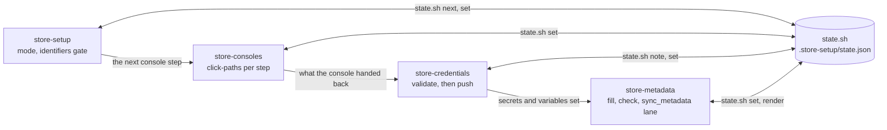

# store-release

A Claude Code plugin that takes an app on the family's shared release workflows
from unsigned builds to a submittable App Store Connect and Google Play listing
(and, optionally, Huawei AppGallery). It is four skills that hand off through one
resumable checklist.

## Install

In the app's committed `.claude/settings.json`, so every teammate is offered it:

```json
{
  "extraKnownMarketplaces": {
    "shared-workflows": {
      "source": { "source": "github", "repo": "blinkbitcoin/shared-workflows", "ref": "v0" }
    }
  },
  "enabledPlugins": { "store-release@shared-workflows": true }
}
```

`ref` is a tag or a branch; pin a full release tag, or a `sha`, to move on your own
schedule. The skills are then `store-release:store-setup`, `store-release:store-consoles`,
`store-release:store-credentials` and `store-release:store-metadata`.

The skills run the scripts that ship in the plugin (`${CLAUDE_PLUGIN_ROOT}/skills/...`)
against the app repository you are in. They expect what the shared release workflows
already expect of an app: a `fastlane/` directory (or `FASTLANE_DIRECTORY`, relative to
the repository root, when it sits elsewhere), the five contract variables, and `gh`
logged in to the repository.

The four store skills are:

- **store-setup**: The entry point. Picks the mode (guided, browser-pause, browser-full), keeps the resumable 49-step checklist in `.store-setup/state.json`, and holds the identifiers gate every console step waits on. The last eight steps are Huawei AppGallery, an optional extra store gated on `toggle-uploads`.
- **store-consoles**: The `apple-*`, `google-*` and `huawei-*` steps that can only happen inside App Store Connect, the Apple Developer portal, Google Play Console, Google Cloud or AppGallery Connect, as exact click-paths — driven in the browser or handed to the human.
- **store-credentials**: Creates and shape-validates every credential locally (the ASC API key, the match repo, the Android upload keystore, the Play service account JSON, the AppGallery Connect API client), then pushes each one to GitHub through stdin.
- **store-metadata**: Fills `fastlane/metadata`, places the images, writes the age-rating answers, and runs the `sync_metadata` lane. Apple and Google only — the AppGallery listing is console-only.

A worked example of the whole run, mode (a) start to finish, is
[`skills/store-setup/references/walkthrough.md`](skills/store-setup/references/walkthrough.md).

How they hand off. The checklist in `.store-setup/state.json` is the shared
thread: every skill reads the next step from it and records the result back,
which is what makes the whole run resumable and handed over mid-flight.



Each skill has an offline suite under `skills/<skill>/tests/run.sh`. This repository runs them in `make test-unit` (`test/store-release-plugin.bats`); to run one by hand:

```bash
bash plugins/store-release/skills/store-credentials/tests/run.sh
```

**Critical:** no skill file, and no file under `.store-setup/` in an app, may hold a credential (API key, token, secret, password, certificate). `state.sh note` refuses credential-shaped keys outright — credentials go to `gh secret set` only, through stdin.
